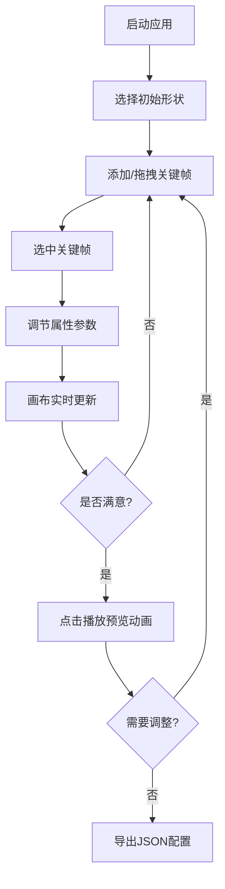

## 1. 产品概述

CSS动画序列设计器是一款面向前端开发者的交互式工具，帮助用户通过图形界面设计、预览和导出CSS动画序列，解决传统动画调试中缺乏即时视觉反馈、需要反复修改代码的痛点。

- 主要功能：通过可视化界面添加多个动画关键帧，在时间轴上调整帧的持续时间，实时预览动画效果，并支持JSON格式的导入导出
- 目标用户：前端开发者、UI设计师、动效设计师
- 产品价值：大幅提升CSS动画开发效率，降低动画调试的复杂度

## 2. 核心功能

### 2.1 功能模块

1. **画布区域**：形状选择、形状渲染、形状选中与编辑、网格背景
2. **时间轴面板**：关键帧添加/删除、关键帧拖拽、关键帧选中高亮、进度条显示
3. **属性编辑面板**：位置(X/Y)、旋转角度、缩放比例、透明度、颜色选择器
4. **播放控制器**：播放/暂停/重置、速度调节、进度显示
5. **数据管理**：JSON格式导出、JSON文件导入

### 2.2 功能详情

| 模块名称 | 子模块 | 功能描述 |
|----------|--------|----------|
| 画布区域 | 形状选择 | 支持圆形、正方形、三角形、五角星四种初始形状，默认位于画布中心，大小80px，颜色#4a90d9 |
| 画布区域 | 形状选中 | 点击形状选中，显示虚线边框和四个角控制锚点，支持拖拽调整大小 |
| 画布区域 | 形状删除 | 按Delete键删除当前选中的形状 |
| 画布区域 | 网格背景 | 线距20px，颜色#333355透明度0.3，边缘淡出效果 |
| 时间轴面板 | 关键帧管理 | 默认包含起始帧和结束帧，支持添加最多15个关键帧 |
| 时间轴面板 | 关键帧显示 | 菱形标记(12x12px)，显示帧序号和持续时间(100-5000ms)，帧间灰色线段连接 |
| 时间轴面板 | 关键帧交互 | 拖拽调整关键帧位置，选中时高亮#ff6b6b色并带发光效果 |
| 属性编辑面板 | 参数调节 | 位置X/Y(0-画布宽高)、旋转(0-360度)、缩放(0.1-3.0)、透明度(0.0-1.0)、颜色选择器 |
| 属性编辑面板 | 实时预览 | 参数调整时画布立即更新到该帧状态 |
| 播放控制器 | 播放控制 | 播放/暂停/重置按钮，速度滑块(0.5x/1x/1.5x/2x) |
| 播放控制器 | 进度显示 | 时间轴进度条从左向右移动，画布右上角显示进度百分比 |
| 数据管理 | 导入导出 | 导出所有关键帧参数和时间信息为JSON，支持导入JSON恢复动画 |

## 3. 核心流程

### 3.1 主流程描述

用户打开应用 → 选择初始形状 → 在时间轴上添加/调整关键帧 → 选中关键帧并在属性面板调整参数 → 点击播放预览动画效果 → 满意后导出JSON配置

### 3.2 流程图

## 4. 用户界面设计

### 4.1 设计风格

- **主题色系**：深灰色主题(#1e1e2e)，霓虹蓝(#00d4ff)和珊瑚橙(#ff6b6b)作为强调色
- **画布背景**：#2a2a3e，带网格线
- **面板背景**：右侧面板#25253a，底部时间轴#1a1a2e
- **按钮交互**：悬停0.2s淡入高亮，点击时轻微缩放(0.95)
- **滑块样式**：轨道#3a3a55，滑块渐变(#00d4ff到#4a90d9)

### 4.2 布局设计

| 区域 | 位置 | 尺寸/占比 | 背景色 |
|------|------|-----------|--------|
| 画布区域 | 左侧 | 约70%宽度 | #2a2a3e |
| 属性面板 | 右侧 | 固定320px宽 | #25253a |
| 时间轴面板 | 底部 | 高120px | #1a1a2e |
| 播放控制器 | 时间轴下方 | - | #1a1a2e |

### 4.3 响应式设计

- 桌面优先设计，支持1920x1080和1440x900分辨率自适应
- 最小宽度1024px，低于此宽度出现水平滚动条
- 画布区域随窗口大小自动调整，右侧面板宽度固定

### 4.4 性能要求

- 播放动画时实时帧率不低于55fps
- 参数调整后画布更新响应时间不超过16ms
- 关键帧数量最多支持15个时仍保持流畅交互
