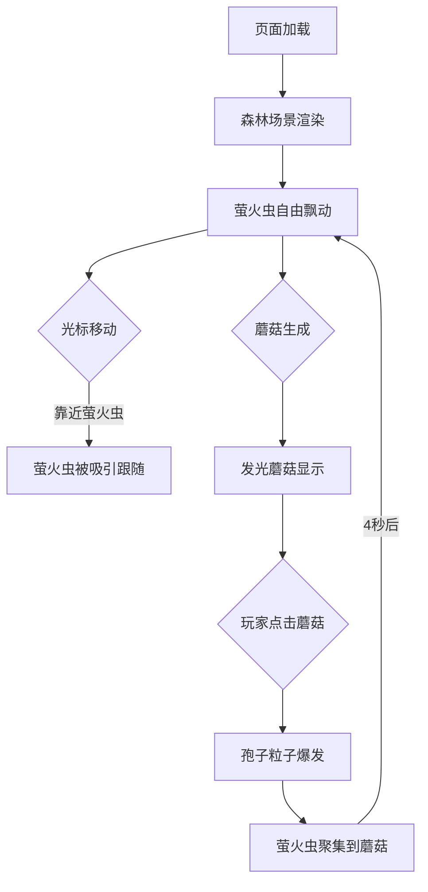

## 1. 产品概述
「萤火虫之森」是一款在浏览器中运行的舒缓探索体验应用，玩家通过光晕光标与夜晚森林中的萤火虫互动，营造治愈宁静的视觉氛围。
- 目标用户：追求放松体验、喜欢自然美学的浏览器用户
- 产品价值：通过精美的粒子动画和互动设计，提供沉浸式的减压体验

## 2. 核心特性

### 2.1 功能模块
1. **森林场景渲染**：俯视视角的森林背景，含渐变背景、碎石草丛、树干剪影、树冠层次
2. **萤火虫系统**：60只萤火虫的自主飘动、光标吸引跟随、闪烁辉光效果
3. **发光蘑菇系统**：随机生成的发光蘑菇、点击触发孢子粒子爆发、萤火虫聚集效果
4. **状态栏UI**：实时显示被吸引萤火虫数量、总数、当前时间、状态文字
5. **性能自适应**：帧率检测与自动降级渲染

### 2.2 页面详情
| 页面名称 | 模块名称 | 功能描述 |
|----------|----------|----------|
| 主页面 | 居中画布容器 | 800x600 Canvas 渲染森林场景与所有交互元素 |
| 主页面 | 底部状态栏 | 半透明背景条，显示吸引状态、萤火虫数量、系统时间 |

## 3. 核心流程
用户打开页面 → 森林场景加载，萤火虫开始自由飘动 → 玩家移动光晕光标 → 萤火虫被吸引并跟随光标闪烁 → 随机出现发光蘑菇 → 玩家点击蘑菇 → 孢子粒子爆发，萤火虫聚集到蘑菇位置 → 4秒后萤火虫恢复自由飘动

## 4. 用户界面设计

### 4.1 设计风格
- 主色调：深林绿渐变（#0b1f0e → #1a3a1f），深棕色树干（#3e2723）
- 强调色：萤火虫亮黄（#ffea00）、蘑菇荧光绿（#00e676 / #76ff03）
- 文字色：亮黄（#ffea00）、灰绿（#a5d6a7）、淡灰（#b0bec5）
- 字体：微软雅黑，14px粗体（数量显示）
- 视觉风格：暗调饱和、柔和光晕、自然有机

### 4.2 页面设计概述
| 页面名称 | 模块名称 | UI元素 |
|----------|----------|--------|
| 主页面 | Canvas画布 | 800x600居中，黑色页面背景突出森林暗调 |
| 主页面 | 底部状态栏 | 高度40px，#1a1a1a带0.8透明度，圆角8px，左右信息分布 |

### 4.3 响应式
- 桌面端优先，画布固定800x600像素居中显示
- 页面背景纯黑，适应任意屏幕尺寸
