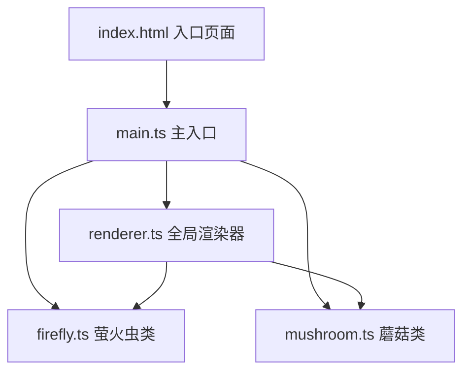

## 1. 架构设计


## 2. 技术描述
- 前端：TypeScript + Vite，纯 Canvas 2D 渲染，无外部框架依赖
- 构建工具：Vite 5.x，端口 5173，开启 HMR
- TypeScript：严格模式，target ES2020，module ESNext

## 3. 文件结构
| 文件路径 | 说明 |
|----------|------|
| package.json | 项目依赖与脚本配置 |
| tsconfig.json | TypeScript 编译配置 |
| vite.config.js | Vite 开发服务器配置 |
| index.html | HTML 入口，包含画布容器与状态栏结构 |
| src/main.ts | 应用入口，初始化画布、绑定事件、启动游戏循环 |
| src/firefly.ts | 萤火虫类，包含运动物理、吸引逻辑、辉光渲染 |
| src/mushroom.ts | 发光蘑菇类，包含生成、粒子系统、点击检测 |
| src/renderer.ts | 全局渲染管理，场景绘制、帧率检测、性能降级 |

## 4. 核心数据结构

### Firefly 萤火虫
```typescript
interface Firefly {
  x: number;
  y: number;
  vx: number;
  vy: number;
  angle: number;
  size: number;
  blinkPhase: number;
  isAttracted: boolean;
  attractTarget: { x: number; y: number } | null;
  wanderPhase: number;
}
```

### Mushroom 蘑菇
```typescript
interface Mushroom {
  x: number;
  y: number;
  spawnTime: number;
  isClicked: boolean;
  particles: Particle[];
  attractFireflies: boolean;
  attractEndTime: number;
}

interface Particle {
  x: number;
  y: number;
  vx: number;
  vy: number;
  size: number;
  life: number;
  maxLife: number;
}
```

### Renderer 渲染器状态
```typescript
interface RenderState {
  canvas: HTMLCanvasElement;
  ctx: CanvasRenderingContext2D;
  fireflies: Firefly[];
  mushrooms: Mushroom[];
  cursorX: number;
  cursorY: number;
  isCursorInCanvas: boolean;
  lastFrameTime: number;
  fps: number;
  performanceMode: 'high' | 'low';
  nextMushroomSpawn: number;
}
```

## 5. 性能策略
- 目标帧率：60 FPS
- 帧率检测：每帧计算 FPS，低于 45 FPS 自动降级
- 降级策略：萤火虫辉光从径向渐变渲染改为单色圆点，减少 Canvas 渐变开销
- 粒子上限：蘑菇粒子 30 个/次，蘑菇最多同时 3 个
