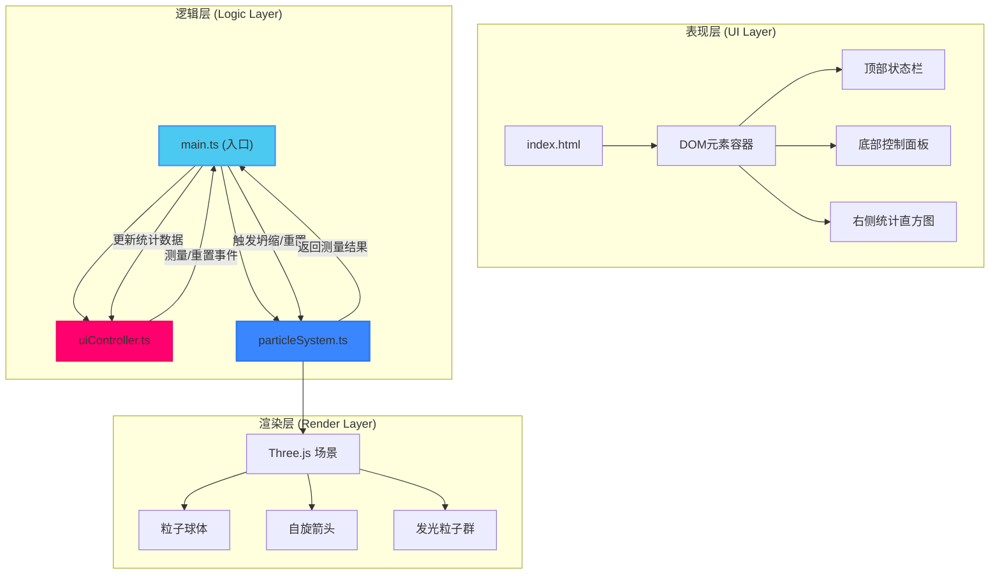
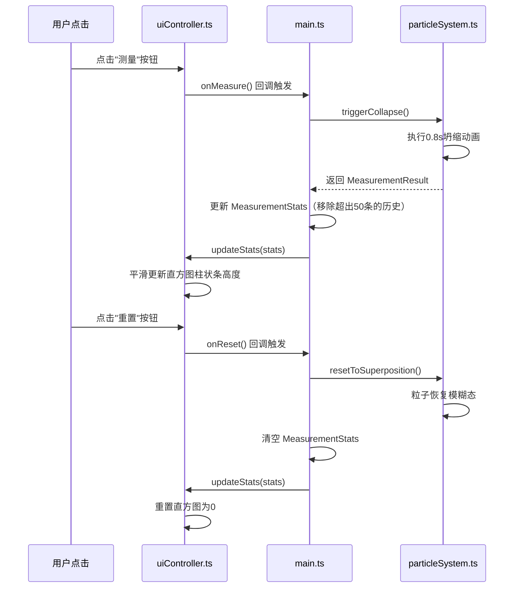

## 1. 架构设计



## 2. 技术描述

- **前端框架**：原生 TypeScript（无需React/Vue，用户明确要求使用Three.js + Vite + TS）
- **3D渲染引擎**：three@0.160.0
- **类型定义**：@types/three
- **构建工具**：Vite（开启HMR，端口5173）
- **语言标准**：TypeScript 严格模式，target ES2020，module ESNext
- **样式方案**：原生CSS + CSS变量，配合内联样式动态计算
- **动画方案**：CSS transition（UI元素）+ Three.js requestAnimationFrame + 自定义缓动函数（3D动画），避免引入额外动画库
- **后端**：无，纯前端可视化应用
- **数据持久化**：无，测量记录仅保存在内存中（最多50条）

## 3. 文件结构与职责

| 文件路径 | 职责 | 数据流向 |
|----------|------|----------|
| `package.json` | 项目依赖配置与启动脚本（npm run dev） | - |
| `vite.config.js` | Vite构建配置，端口5173，开启HMR | - |
| `tsconfig.json` | TypeScript编译配置，严格模式 | - |
| `index.html` | 入口页面，包含3D渲染容器#canvas-container、顶部状态栏#status-bar、底部控制面板#control-panel挂载点 | DOM → main.ts |
| `src/main.ts` | 场景初始化（Scene/Camera/Renderer）、创建ParticleSystem与UIController实例、主渲染循环、事件调度中心 | 接收uiController事件 → 调用particleSystem.update → 输出统计结果到uiController |
| `src/particleSystem.ts` | ParticleSystem类：管理红蓝粒子球体、自旋箭头、发光粒子群；实现坍缩动画、重置逻辑、测量结果查询 | 接收main.ts指令 → 更新粒子状态 → 返回MeasurementResult |
| `src/uiController.ts` | UIController类：动态创建底部控制面板DOM（测量/重置按钮、统计表格、时间线）；监听按钮点击并回调；渲染统计直方图；响应式布局 | 监听用户点击 → 触发main.ts回调 → 接收统计数据 → 渲染到DOM |

## 4. 核心数据模型

### 4.1 类型定义

```typescript
// 自旋方向
type SpinDirection = 'up' | 'down';

// 粒子标识
type ParticleId = 'A' | 'B';

// 单次测量结果
interface MeasurementResult {
  particleA: SpinDirection;
  particleB: SpinDirection;
  combination: 'up-up' | 'up-down' | 'down-up' | 'down-down';
  timestamp: number;
}

// 统计数据
interface MeasurementStats {
  'up-up': number;
  'up-down': number;
  'down-up': number;
  'down-down': number;
  total: number;
  history: MeasurementResult[]; // 最近50条
}

// 粒子状态
interface ParticleState {
  id: ParticleId;
  color: string;
  position: THREE.Vector3;
  isMeasured: boolean;
  currentSpin: SpinDirection | null;
  isAnimating: boolean;
}
```

### 4.2 数据流向



## 5. 动画实现方案

### 5.1 坍缩动画（0.8秒，分三阶段）
- **阶段1 (0-0.4s)**：自旋箭头快速绕Y轴旋转（角速度随时间递增），透明度保持100%
- **阶段2 (0.4-0.6s)**：旋转角速度衰减，箭头渐变为最终方向
- **阶段3 (0.6-0.8s)**：定格在最终方向，粒子球体轻微脉冲发光（scale 1.0→1.1→1.0），发光粒子群闪烁并重排

### 5.2 统计直方图动画
- 使用CSS `transition: height 0.4s ease-out, opacity 0.3s ease`
- 新增测量时：柱状条高度从旧值平滑过渡到新值，同时触发由下至上的渐显高亮（通过伪元素opacity动画实现）

### 5.3 按钮交互反馈
- 悬停：`transform: scale(1.05)` + `box-shadow` 增强，transition 0.2s
- 点击水波纹：动态创建绝对定位圆形span，从点击位置扩散并淡出，使用CSS animation

## 6. 性能优化策略

- **Three.js层面**：
  - 复用几何体（两个粒子球体共用SphereGeometry实例，仅材质不同）
  - 发光粒子使用Points / BufferGeometry统一绘制，避免30个独立Mesh
  - 材质使用transparent + opacity，避免alphaTest导致的排序问题
  - requestAnimationFrame中仅更新必要的变换矩阵，非动画时减少计算

- **UI层面**：
  - 统计数据更新使用requestAnimationFrame批量写入DOM，避免强制回流
  - CSS动画优先使用transform和opacity属性，触发GPU合成层
  - 直方图柱状条高度变化使用CSS transition，而非JS逐帧更新

- **帧率保障**：
  - 坍缩动画采用时间差（deltaTime）计算，确保不同刷新率设备上动画时长一致
  - 统计计算使用简单数组操作，O(1)复杂度更新计数
