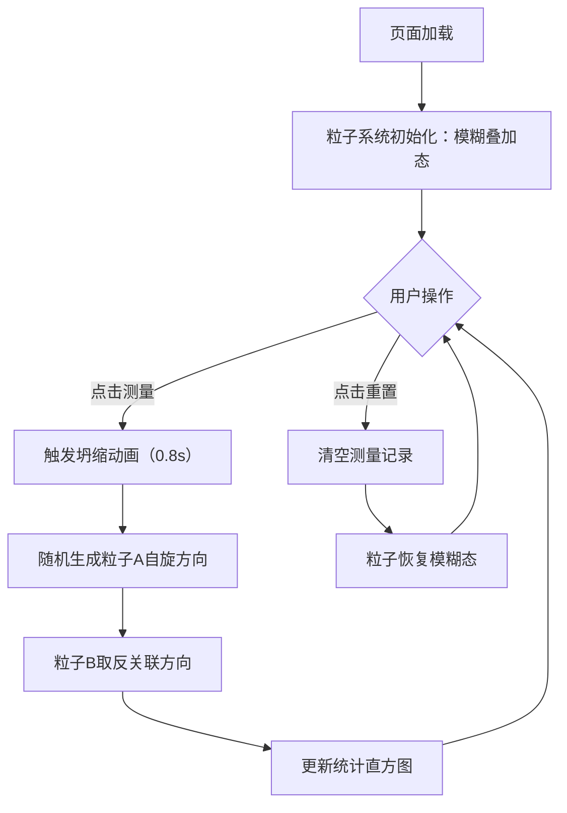

## 1. 产品概述

「双旋缠绕」是一个基于Three.js的交互式3D量子纠缠可视化工具，用于展示两个自旋1/2粒子在贝尔态下的纠缠行为、随机坍缩过程与测量统计分布。面向科幻设计师、物理教学演示者和量子物理爱好者，提供直观的量子力学微观世界可视化体验。

产品价值：将抽象的量子纠缠概念转化为可交互、可观察的3D视觉呈现，帮助用户理解量子态叠加、坍缩与反关联等核心概念。

## 2. 核心功能

### 2.1 功能模块
1. **3D量子粒子场景**：双粒子纠缠态可视化、自旋方向指示、坍缩动画、发光粒子氛围
2. **测量交互控制**：测量按钮触发坍缩、重置按钮恢复模糊态、动画反馈
3. **统计直方图面板**：记录最近50次测量结果分布、四种组合柱状图、平滑过渡动画
4. **响应式界面布局**：顶部状态栏、底部控制面板、右侧统计面板、横竖屏自适应

### 2.2 页面详情

| 页面名称 | 模块名称 | 功能描述 |
|-----------|-------------|---------------------|
| 主页 | 3D粒子场景 | 渲染红蓝双色半透明粒子球体，表面附自旋方向箭头，周围环绕发光粒子，支持测量坍缩动画 |
| 主页 | 测量控制面板 | 底部毛玻璃面板，包含"测量"和"重置"按钮，水波纹点击反馈，悬停缩放效果 |
| 主页 | 统计直方图 | 右侧显示四种测量组合（上上、上下、下上、下下）的频数分布柱状图，渐显高亮动画 |
| 主页 | 顶部状态栏 | 显示当前测量次数、纠缠态说明文字 |

## 3. 核心流程

用户进入页面 → 看到两个粒子处于模糊叠加态（上下箭头各半透明重叠）→ 点击"测量"按钮 → 两粒子同时触发坍缩动画（0.8秒旋转定格）→ 粒子A随机坍缩为上/下（各50%），粒子B自动取相反方向 → 统计直方图平滑更新对应组合的计数 → 用户可重复测量（最多保留最近50次记录）或点击"重置"清除所有记录并恢复模糊态。

## 4. 用户界面设计

### 4.1 设计风格
- **主色调**：深色科幻风，背景采用径向渐变（#0a0a1a → #1a1a2e）
- **粒子颜色**：蓝色粒子 #3a86ff、红色粒子 #ff006e
- **统计柱状条颜色**：上上 #f72585、上下 #b5179e、下上 #7209b7、下下 #560bad
- **按钮渐变色**：#4cc9f0 → #4895ef
- **按钮风格**：圆角矩形、悬停放大1.05倍、点击水波纹反馈
- **字体**：现代无衬线科幻感字体，层次分明
- **面板风格**：半透明毛玻璃效果（rgba(16,16,32,0.8)），1px白色微光边框，12px圆角
- **动效**：所有交互反馈配合0.2-0.5秒CSS过渡，柱状条由下至上渐显高亮

### 4.2 页面设计概述

| 页面名称 | 模块名称 | UI元素 |
|-----------|-------------|-------------|
| 主页 | 3D粒子场景 | 居中悬浮的红蓝球体（半径1.5，间距3），自旋箭头，30个随机分布的半透明发光粒子缓慢旋转 |
| 主页 | 底部控制面板 | 横向居中，含测量/重置按钮，毛玻璃背景，渐变色按钮，水波纹效果 |
| 主页 | 右侧统计直方图 | 四根柱状条（宽25px，间距8px），渐显高亮动画，标签与数值显示 |
| 主页 | 顶部状态栏 | 白色半透明文字，展示测量次数与状态说明 |

### 4.3 响应式
- 桌面端（横屏）：底部控制面板横向布局，统计直方图位于场景右侧
- 移动端（竖屏）：底部控制面板变为纵向布局，统计直方图调整至场景下方或自适应缩放
- 全局窗口resize事件：重新计算相机aspect比例与渲染器尺寸，保持3D场景正确显示比例

### 4.4 3D场景指导
- **环境与氛围**：深色径向渐变背景，无外部HDRI，营造神秘量子空间感
- **光照设置**：柔和环境光 + 两盏分别对应粒子颜色的点光源，突出粒子体积感与透明度
- **相机设置**：PerspectiveCamera，初始位置(0, 0, 8)，观察场景中心，支持轻微自动旋转
- **构图与焦点**：两粒子水平居中排列于场景中央（x=-1.5与x=+1.5，y=0），为视觉焦点
- **交互与动画**：
  - 模糊态：上下箭头各50%透明度缓慢浮动
  - 坍缩过程：0.8秒快速旋转 → 定格 → 轻微脉冲发光
  - 重置：淡出 → 恢复双箭头半透明叠加
  - 发光粒子：测量后短暂闪烁并重新随机分布
- **后期处理**：轻微泛光（Bloom）效果增强粒子发光感
- **性能预算**：粒子系统稳定60FPS，坍缩动画不低于30FPS
