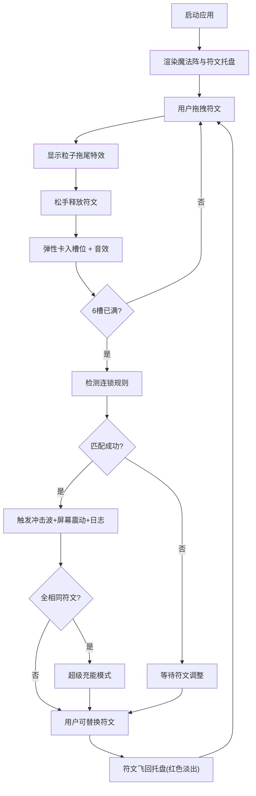

## 1. 产品概述

2D魔法阵模拟演示应用，通过鼠标拖拽排列符文触发元素连锁反应，解决游戏设计中技能组合可视化与连击逻辑测试的问题。

- 主要目的：为游戏设计师提供直观的符文组合与连锁反应可视化工具
- 解决的问题：技能组合效果难以直观预览、连击逻辑测试成本高
- 目标用户：游戏设计师、技能系统策划、前端特效开发者
- 产品价值：快速验证符文组合逻辑、直观展示元素连锁特效、降低技能系统调试成本

## 2. 核心功能

### 2.1 功能模块

1. **主界面**：六芒星魔法阵、6个符文槽位、阵眼光环、底部符文托盘、连锁日志区
2. **符文系统**：6种元素符文（火、水、风、土、光、暗）、拖拽交互、弹性镶嵌动画
3. **连锁系统**：8种预设连锁规则、实时检测、冲击波特效、超级充能模式
4. **特效系统**：拖拽粒子拖尾、镶嵌音效、连锁冲击波、屏幕震动、粒子效果

### 2.2 页面详情

| 页面名称 | 模块名称 | 功能描述 |
|-----------|-------------|---------------------|
| 主界面 | 六芒星魔法阵 | 中央显示青蓝色描边六芒星，带呼吸发光动画（透明度0.6-1.0循环） |
| 主界面 | 符文槽位 | 阵眼周围均匀分布6个槽位，可接收拖拽的符文 |
| 主界面 | 符文托盘 | 底部半透明毛玻璃面板，承载6种符文卡片，悬停放大1.1倍+彩色阴影 |
| 主界面 | 拖拽系统 | 符文跟随鼠标移动，带拖尾粒子特效 |
| 主界面 | 连锁检测 | 6槽填满后检测符文排列顺序，匹配预设规则触发连锁效果 |
| 主界面 | 连锁特效 | 对应颜色冲击波动画（400ms扩散）、屏幕轻微震动（80ms抖动） |
| 主界面 | 超级充能 | 所有符文相同时触发，阵眼持续旋转发光，每2秒发射小火焰弹 |
| 主界面 | 日志区 | 显示连锁激活记录，逐条淡入，最新一条高亮闪烁 |
| 主界面 | 符文替换 | 可替换已放置符文，原符文飞回托盘带红色淡出回收特效 |

## 3. 核心流程

### 3.1 用户操作流程

1. 用户打开应用，看到中央的六芒星魔法阵和底部的符文托盘
2. 用户从托盘中拖拽符文（带粒子拖尾）到任意槽位
3. 松手后符文弹性卡入槽位，播放镶嵌音效（Web Audio API生成短促和弦）
4. 重复操作直到填满6个槽位
5. 系统自动检测符文排列顺序，匹配预设连锁规则
6. 触发对应连锁特效：颜色冲击波、屏幕震动、日志输出
7. 用户可替换已放置的符文，系统实时重新计算连锁状态
8. 若所有符文相同，触发超级充能模式

### 3.2 流程图

## 4. 用户界面设计

### 4.1 设计风格

- **主色调**：深紫色渐变背景（#1a0a2e 到 #2d1b69）
- **强调色**：青蓝色（魔法阵描边）、各元素符文颜色
- **字体**：无衬线现代字体，标题加粗，正文常规
- **布局**：
  - 宽屏：阵眼居中、托盘在底边
  - 窄屏（<768px）：阵眼缩小至70%并上移，托盘横向滚动
- **动画曲线**：所有过渡使用 cubic-bezier 缓动曲线
- **视觉效果**：毛玻璃面板（backdrop-filter: blur(8px)）、呼吸发光、彩色阴影

### 4.2 页面设计概述

| 页面名称 | 模块名称 | UI元素 |
|-----------|-------------|-------------|
| 主界面 | 魔法阵区域 | 六芒星、青蓝色描边、呼吸发光动画、阵眼光环、6个槽位圆环 |
| 主界面 | 符文卡片 | 不同颜色和几何符号区分6元素、悬停放大1.1倍、彩色投影 |
| 主界面 | 符文托盘 | 半透明毛玻璃面板、底部固定、窄屏横向滚动 |
| 主界面 | 连锁特效 | 半透明圆环扩散400ms、屏幕抖动80ms、对应颜色粒子 |
| 主界面 | 日志区 | 逐条淡入动画、最新条高亮闪烁 |
| 主界面 | 超级充能 | 旋转阵眼、持续发光、火焰弹射 |

### 4.3 响应式设计

- **桌面端（>768px）**：阵眼居中显示，托盘位于底部固定区域，各元素按标准尺寸呈现
- **移动端（<768px）**：阵眼缩小至70%并上移，托盘变为可横向滚动，文字适配缩放

### 4.4 性能要求

- 帧率稳定在50fps以上
- 所有动画使用CSS transform和opacity属性，避免重排重绘
- 粒子系统通过Three.js高效渲染
