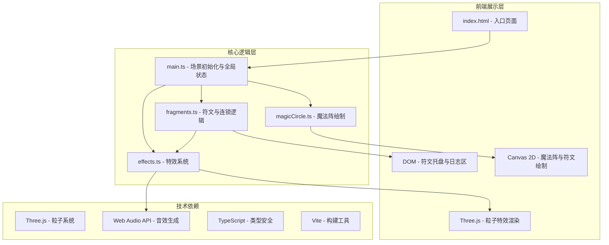

## 1. 架构设计



## 2. 技术描述

- **前端核心**：TypeScript + 原生 Canvas 2D + Three.js（仅用于粒子特效）
- **构建工具**：Vite 5.x（端口5173，无框架）
- **样式方案**：原生 CSS（无CSS框架）
- **音效系统**：Web Audio API（程序生成音效，无外部音频文件）

### 2.1 依赖清单

| 依赖 | 版本 | 用途 |
|------|------|------|
| three | ^0.160.0 | 粒子系统渲染 |
| @types/three | ^0.160.0 | Three.js类型支持 |
| vite | ^5.0.0 | 开发服务器与构建 |
| typescript | ^5.3.0 | 类型系统 |

## 3. 项目结构

```
e:\solo\VersionFast\tasks\auto30/
├── .trae/
│   └── documents/
│       ├── PRD.md
│       └── tech-architecture.md
├── src/
│   ├── main.ts              # 入口文件：场景初始化、全局状态管理
│   ├── magicCircle.ts       # 六芒星魔法阵、槽位绘制、呼吸发光动画
│   ├── fragments.ts         # 符文数据、拖拽逻辑、连锁规则检测
│   └── effects.ts           # 粒子系统、冲击波、屏幕震动、音效
├── index.html               # 全屏入口页面
├── package.json             # 依赖与脚本配置
├── vite.config.js           # Vite配置（端口5173）
└── tsconfig.json            # TypeScript配置（严格模式）
```

## 4. 核心模块设计

### 4.1 magicCircle.ts - 魔法阵模块

**职责**：
- 绘制六芒星（两个重叠的等边三角形）
- 绘制6个符文槽位（均匀分布在阵眼周围）
- 实现呼吸发光动画（透明度0.6-1.0循环）
- 提供更新接口供主循环调用

**核心类型**：
```typescript
interface SlotPosition {
  x: number;
  y: number;
  index: number;
}

interface MagicCircleState {
  centerX: number;
  centerY: number;
  radius: number;
  breathPhase: number;
  rotation: number;
  isSuperCharged: boolean;
}
```

### 4.2 fragments.ts - 符文与连锁模块

**职责**：
- 定义6种元素符文数据（颜色、几何符号）
- 管理符文拖拽逻辑
- 检测连锁规则（8种预设）
- 触发连锁事件

**符文类型**：
```typescript
type ElementType = 'fire' | 'water' | 'wind' | 'earth' | 'light' | 'dark';

interface Rune {
  id: string;
  element: ElementType;
  color: string;
  symbol: string;
  slotIndex: number | null;
  position: { x: number; y: number };
  isDragging: boolean;
  isAnimating: boolean;
}

interface ChainRule {
  id: string;
  name: string;
  pattern: ElementType[];
  effectColor: string;
  particleType: 'steam' | 'crystal' | 'miasma' | ...;
}
```

**预设连锁规则（8种）**：
1. 火+水 → 蒸汽（白色雾气粒子升腾）
2. 土+光 → 晶界（金色六边形护盾环绕）
3. 风+暗 → 瘴气（紫色毒雾扩散）
4. 火+风 → 烈焰风暴（橙红色火焰漩涡）
5. 水+土 → 泥浆（棕褐色泥土流动）
6. 光+暗 → 湮灭（黑白粒子对冲）
7. 水+风 → 寒冰风暴（冰蓝色冰晶飞舞）
8. 火+土 → 熔岩（赤红色岩浆翻涌）

### 4.3 effects.ts - 特效模块

**职责**：
- Three.js粒子系统管理
- 冲击波动画（半透明圆环扩散）
- 屏幕震动效果
- Web Audio API音效生成
- 超级充能模式火焰弹发射

**事件回调**：
- onChainTriggered(rule: ChainRule)
- onRunePlaced()
- onRuneRemoved()
- onSuperChargeStart()
- onSuperChargeEnd()

### 4.4 main.ts - 主入口

**职责**：
- 初始化Canvas和Three.js渲染器
- 创建全局状态管理
- 绑定DOM事件（鼠标/触摸）
- 主循环（requestAnimationFrame）
- 模块间通信协调

## 5. 渲染架构

采用双层渲染架构：
- **底层Canvas**：绘制静态魔法阵、符文几何图形（高性能）
- **上层Three.js**：渲染粒子系统、动态特效（利用GPU加速）
- **DOM层**：符文托盘UI、日志区（利用CSS过渡动画）

## 6. 性能优化

- 魔法阵使用离屏Canvas预渲染，每帧只绘制发光层
- 粒子对象池复用，避免频繁GC
- 使用requestAnimationFrame统一调度渲染
- CSS动画仅使用transform和opacity属性
- 窄屏设备自动降低粒子数量
