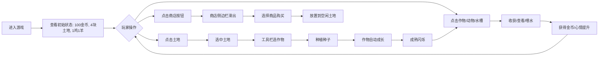

## 1. 产品概述

像素农场是一款在浏览器中运行的轻度策略经营游戏，玩家在有限土地和资源约束下，通过种植作物、养殖动物、升级设施来逐步扩张农场。

- 核心玩法：资源管理 + 时间规划 + 空间决策
- 目标用户：休闲游戏爱好者，喜欢像素风格和经营模拟的玩家
- 产品价值：提供轻松有趣的策略体验，考验玩家的资源调配和长期规划能力

## 2. 核心功能

### 2.1 功能模块
1. **农田系统**：5×6 网格化土地，解锁与种植管理
2. **作物系统**：5 种作物的种植、成长、收获全生命周期
3. **动物系统**：鸡和羊的养殖、产蛋/产毛、心情管理
4. **商店系统**：种子、设施、装饰三类商品购买
5. **设施系统**：自动洒水器、肥料桶、广播塔等增益设施
6. **经济系统**：金币收支、时间推进、游戏内天数

### 2.2 功能详情

| 模块名称 | 子功能 | 功能描述 |
|-----------|--------|----------|
| 农田系统 | 土地解锁 | 初始 4 块可耕种，荒地需花金币解锁 |
| 农田系统 | 土地选中 | 点击已解锁土地格选中，高亮显示 |
| 作物系统 | 种植 | 选中土地后从工具栏选作物种子种植 |
| 作物系统 | 成长阶段 | 种子→小苗→成熟三阶段，带进度条 |
| 作物系统 | 收获 | 成熟后金色闪烁，点击收获得金币 |
| 作物系统 | 5种作物 | 小麦(15s/10金)、胡萝卜(25s/20金)、向日葵(35s/30金)、草莓(50s/45金)、魔法玉米(70s/80金,10%双倍) |
| 动物系统 | 随机走动 | 动物在已解锁土地上缓慢随机移动 |
| 动物系统 | 生产 | 鸡每10秒产蛋(5金)，羊每20秒产羊毛(12金) |
| 动物系统 | 心情值 | 0-100，满心产量翻倍，低于30停止生产变灰 |
| 动物系统 | 喂水 | 中央水槽每30秒可点一次，每次+10心情，低于30需连续喂水3次恢复 |
| 商店系统 | 种子商店 | 5种种子，价格=售价×60%，无限库存 |
| 商店系统 | 设施商店 | 自动洒水器(300金，相邻4格+30%速度)、肥料桶(150金，10秒内所有作物+20%进度)、广播塔(500金，每60秒所有动物+20心情) |
| 商店系统 | 装饰商店 | 风车(80金)、栅栏(50金)、稻草人(100金)，纯视觉装饰 |
| 经济系统 | 金币 | 初始100金币，顶栏金色数字显示 |
| 经济系统 | 游戏时间 | 每10秒=1天，显示"第X天" |

## 3. 核心流程

## 4. 用户界面设计

### 4.1 设计风格
- **整体风格**：暖色调像素复古风格
- **主色调**：米黄色背景 #f5e6c8，深绿色土地 #4a7c3b，棕色网格 #8b6914，灰色荒地 #888888
- **辅助色**：金色金币 #ffd700，红色进度 #e74c3c，绿色进度 #2ecc71
- **字体**：像素风格等宽字体，营造复古游戏感
- **按钮风格**：像素化锯齿边框，悬停时放大+亮色
- **动画**：点击放大1.05倍，商店侧边栏0.3秒滑出，提示气泡2秒自动消失

### 4.2 页面布局

| 区域 | 位置 | UI元素 |
|------|------|--------|
| 顶部状态栏 | 屏幕顶部横条 | 金币余额(金色)、当前日期"第X天"、操作提示文字 |
| 主游戏区 | 中央 | 5×6农田网格(64px/格)、作物、动物、水槽、设施、装饰 |
| 底部工具栏 | 屏幕底部横条 | 5种作物选择按钮，选中土地后可点击种植 |
| 左侧商店 | 左侧滑出面板 | 三个选项卡：种子/设施/装饰，各商品带购买按钮 |
| 提示气泡 | 屏幕底部中央 | "金币不足""土地已满"等提示，2秒消失 |

### 4.3 交互反馈
- 可交互元素点击时：放大1.05倍 + 视觉"叮"效果（闪烁高亮）
- 商店按钮悬停：亮色 + 放大
- 成熟作物：金色闪烁动画
- 动物心情低于30：显示灰色

### 4.4 响应式
- 桌面端优先，固定画布尺寸（约 5×64×6 = 1920 宽方向适配）
- Canvas 居中显示，周围留米色背景
