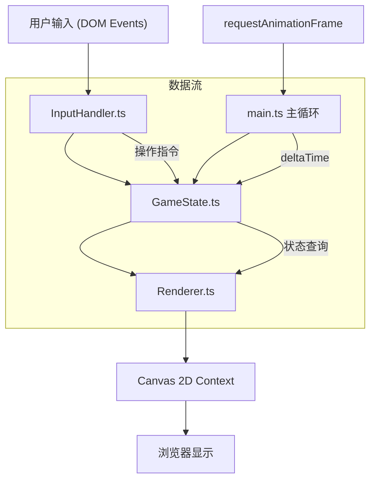

## 1. 架构设计



## 2. 技术描述

- **前端框架**：纯 TypeScript（无 React/Vue），使用 Canvas 2D 渲染
- **构建工具**：Vite 5.x（端口 5173，开启 HMR）
- **语言标准**：TypeScript 严格模式，target ES2020，module ESNext
- **渲染方式**：Canvas 2D API 手绘像素风格图形
- **游戏循环**：requestAnimationFrame，目标帧率 50+ FPS
- **无后端**：纯前端游戏，状态保存在内存中

## 3. 文件结构

```
auto300/
├── package.json          # 依赖：typescript, vite；启动脚本 npm run dev
├── index.html            # 入口页面，含游戏容器、工具栏、状态栏
├── vite.config.js        # Vite 基础配置
├── tsconfig.json         # TS 严格模式，ES2020
└── src/
    ├── main.ts           # 游戏主循环与入口
    ├── GameState.ts      # 游戏状态管理（土地、作物、动物、金币、时间）
    ├── Renderer.ts       # Canvas 渲染器（网格、作物、动物、UI）
    └── InputHandler.ts   # 鼠标输入处理（坐标转换、交互分发）
```

## 4. 核心数据模型

### 4.1 类型定义

```typescript
// 土地类型
type TileState = 'locked' | 'unlocked' | 'occupied';
interface Tile {
  x: number;
  y: number;
  state: TileState;
  unlockCost: number;
  crop: Crop | null;
  facility: Facility | null;
  decoration: Decoration | null;
}

// 作物类型
type CropType = 'wheat' | 'carrot' | 'sunflower' | 'strawberry' | 'magicCorn';
type CropStage = 'seed' | 'sprout' | 'mature';
interface Crop {
  type: CropType;
  stage: CropStage;
  growthProgress: number; // 0-1
  growthSpeed: number; // 每秒进度
  mature: boolean;
  doubleYield: boolean; // 魔法玉米双倍标记
}

// 动物类型
type AnimalType = 'chicken' | 'sheep';
interface Animal {
  id: string;
  type: AnimalType;
  tileX: number;
  tileY: number;
  mood: number; // 0-100
  productionTimer: number;
  moveTimer: number;
  isGray: boolean;
  recoveryFeedCount: number;
}

// 设施类型
type FacilityType = 'sprinkler' | 'fertilizer' | 'broadcastTower' | 'waterTrough';
interface Facility {
  type: FacilityType;
  tileX: number;
  tileY: number;
  cooldownTimer: number;
  effectTimer: number;
}

// 装饰类型
type DecorationType = 'windmill' | 'fence' | 'scarecrow';
interface Decoration {
  type: DecorationType;
  tileX: number;
  tileY: number;
}

// 商店物品
interface ShopItem {
  id: string;
  name: string;
  category: 'seed' | 'facility' | 'decoration';
  price: number;
  description: string;
}
```

### 4.2 游戏状态类结构

```
GameState
├── 静态配置
│   ├── GRID_COLS = 6, GRID_ROWS = 5
│   ├── TILE_SIZE = 64
│   ├── CROP_CONFIGS: 5种作物配置
│   └── UNLOCK_COST = 50 金币/块
│
├── 运行时数据
│   ├── tiles: Tile[][] (5×6)
│   ├── animals: Animal[] (最多2只)
│   ├── gold: number
│   ├── day: number
│   ├── timeAccumulator: number
│   ├── selectedTile: {x, y} | null
│   ├── activeShopTab: 'seed' | 'facility' | 'decoration'
│   ├── shopOpen: boolean
│   ├── toastMessage: { text, timer } | null
│   └── clickEffects: { x, y, timer }[]
│
├── 更新方法 (update(dt))
│   ├── updateCrops(dt)        // 作物生长
│   ├── updateAnimals(dt)      // 动物走动+生产+心情衰减
│   ├── updateFacilities(dt)   // 设施效果/冷却
│   ├── updateTime(dt)         // 游戏内天数
│   └── updateEffects(dt)      // 视觉特效计时
│
└── 操作方法
    ├── unlockTile(x,y)        // 解锁土地
    ├── selectTile(x,y)        // 选中土地
    ├── plantCrop(type)        // 种植作物
    ├── harvestCrop(x,y)       // 收获作物
    ├── collectProduct(animalId) // 收取动物产品
    ├── feedWater()            // 水槽喂水
    ├── buyShopItem(itemId)    // 购买商店物品
    ├── placeFacility/Decoration(type) // 放置设施/装饰
    └── showToast(text)        // 显示提示
```

## 5. 性能保证策略

1. **固定时间步长更新**：逻辑更新与渲染解耦，使用固定步长（如20ms）更新游戏逻辑
2. **Canvas 局部重绘优化**：维护脏矩形区域，只重绘变化区域（初期可全量绘制验证性能）
3. **对象池模式**：点击特效等短暂对象复用，减少 GC
4. **像素化渲染**：禁用图像平滑 `imageSmoothingEnabled = false`
5. **高效更新循环**：单 Array 遍历更新所有实体，避免多层嵌套循环
6. **5×6 小规模**：网格极小（30格），所有计算量可忽略，50FPS 极易达成
