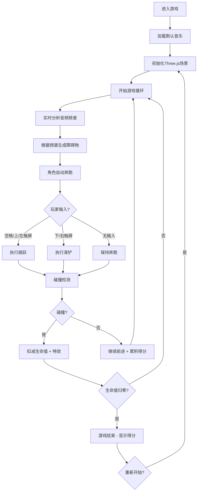

## 1. 产品概述

基于"声音可视化"的节奏跑酷游戏原型，玩家跟随音乐节拍控制角色跳跃和滑铲躲避障碍物，所有障碍物的出现与音乐频谱峰值对齐。面向独立游戏开发者和音乐游戏爱好者，提供沉浸式的赛博朋克风格音游体验。

## 2. 核心功能

### 2.1 用户角色

| 角色 | 注册方式 | 核心权限 |
|------|----------|----------|
| 玩家 | 无需注册，直接进入 | 游玩游戏、上传音乐、查看得分 |

### 2.2 功能模块

1. **主游戏场景**: 3D无限跑道、角色自动奔跑、实时障碍物生成
2. **音频分析系统**: 加载MP3、频谱分析、节拍检测、频率带分离
3. **角色控制系统**: 跳跃/滑铲状态管理、碰撞检测、生命值管理
4. **障碍物系统**: 三种障碍物类型、预警标记、碰撞特效
5. **UI界面**: 生命值显示、得分系统、频谱可视化、换曲功能
6. **特效系统**: 星光粒子、尘土粒子、碰撞扩散环、屏幕震动

### 2.3 页面详情

| 页面名称 | 模块名称 | 功能描述 |
|----------|----------|----------|
| 主游戏页面 | 3D场景渲染 | Three.js渲染无限跑道、角色、障碍物、粒子特效 |
| 主游戏页面 | 音频分析 | Web Audio API实时分析音乐频谱和节拍 |
| 主游戏页面 | HUD界面 | 生命值、得分、频谱柱状图、换曲按钮 |
| 主游戏页面 | 游戏结束层 | 显示最终得分，支持重新开始 |

## 3. 核心流程

## 4. 用户界面设计

### 4.1 设计风格
- **主色**: #0d0d1a（深空黑）
- **辅色**: #00f0ff（霓虹青）、#ff0066（霓虹粉）
- **按钮风格**: 霓虹灯管边框，半透明背景，发光悬停效果
- **字体**: Orbitron（霓虹灯管风格）， monospace 辅助
- **布局**: 全屏3D场景，HUD元素悬浮于四角
- **视觉风格**: 赛博朋克、暗色调、发光线条、毛玻璃面板

### 4.2 页面设计概述

| 页面名称 | 模块名称 | UI元素 |
|----------|----------|--------|
| 主游戏页面 | 3D场景 | 深空渐变天空盒、200颗星光粒子、发光跑道边缘、半透明发光障碍物 |
| 主游戏页面 | 角色 | 基础几何体拼接人形、脚下尘土粒子、跳跃/滑铲动画 |
| 主游戏页面 | HUD-左上 | 生命值（3颗霓虹心形图标），霓虹字体样式 |
| 主游戏页面 | HUD-右上 | 实时得分显示，霓虹字体 |
| 主游戏页面 | HUD-左下 | 频谱分析器，32条柱状图，毛玻璃背景，脉冲光晕 |
| 主游戏页面 | HUD-右下 | 上传音乐按钮，霓虹样式 |
| 主游戏页面 | 游戏结束层 | 居中半透明面板，最终得分，重新开始按钮 |

### 4.3 响应式
- Desktop-first设计，支持16:9和全屏模式
- 移动端触控适配：左半屏跳跃、右半屏滑铲
- HUD元素使用固定定位和百分比布局

### 4.4 3D场景指引
- **环境**: 深空渐变天空盒（#0d0d1a 到 #1a0d2e），缓慢旋转的200颗星光粒子
- **光照**: 环境光 + 两盏平行光（霓虹青和霓虹粉色调）
- **相机**: 第三人称跟随视角，轻微跟随晃动
- **构图**: 跑道居中延伸至远方，角色位于画面下方1/3处
- **交互动画**: 跳跃抛物线、滑铲压低身体、障碍物移动、碰撞扩散环
- **后期**: Bloom发光效果、屏幕震动
- **性能预算**: 粒子总数≤300，启用实例化渲染，目标60FPS
