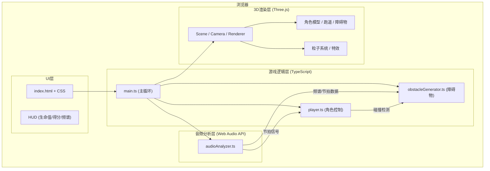

## 1. 架构设计



**数据流向说明**:
1. `main.ts` 驱动游戏循环，每帧调用各模块
2. `audioAnalyzer.ts` 被动读取，提供频谱和节拍数据
3. `player.ts` 接收用户输入 → 更新角色状态 → 向 obstacleGenerator 查询碰撞
4. `obstacleGenerator.ts` 根据频谱数据生成障碍物 → 通过回调通知碰撞事件
5. 所有3D对象由 `main.ts` 统一管理渲染

## 2. 技术栈描述

- **前端框架**: 原生TypeScript (无React/Vue，用户明确指定)
- **3D引擎**: Three.js ^0.160.0
- **构建工具**: Vite ^5.0.0
- **语言**: TypeScript ^5.0.0 (严格模式, target ES2020, module ESNext)
- **音频处理**: Web Audio API (原生)
- **初始化工具**: vite-init vanilla-ts 模板

## 3. 文件结构与职责

```
e:\solo\VersionFast\tasks\auto36\
├── .trae/documents/          # 项目文档
│   ├── PRD.md
│   └── Technical-Architecture.md
├── src/
│   ├── main.ts               # [入口] 场景初始化/游戏循环/事件总线
│   ├── audioAnalyzer.ts      # [音频] 加载/解码/频谱分析/节拍检测
│   ├── player.ts             # [角色] 状态机/跳跃滑铲/碰撞查询
│   └── obstacleGenerator.ts  # [障碍物] 生成逻辑/实例化管理/碰撞检测
├── index.html                # 全屏入口 + HUD UI结构
├── package.json              # 依赖: three, @types/three, vite, typescript
├── vite.config.js            # Vite配置 (端口5173, 输出dist)
└── tsconfig.json             # TS配置 (strict, ES2020, ESNext)
```

## 4. 核心类型定义

```typescript
// 障碍物类型
type ObstacleType = 'high_wall' | 'low_wall' | 'missile';

interface Obstacle {
  id: number;
  type: ObstacleType;
  mesh: THREE.Object3D;
  position: THREE.Vector3;
  z: number;              // 深度位置(向z负方向移动)
  warned: boolean;        // 是否已显示预警
  hit: boolean;           // 是否已碰撞
  velocityX?: number;     // 导弹左右飘移速度
}

// 角色状态
type PlayerState = 'running' | 'jumping' | 'sliding';

interface PlayerStateData {
  state: PlayerState;
  y: number;              // 高度(用于跳跃)
  height: number;         // 碰撞高度(用于滑铲)
  velocityY: number;
}

// 频谱数据
interface SpectrumData {
  low: number;    // 低音能量 0-1
  mid: number;    // 中音能量 0-1
  high: number;   // 高音能量 0-1
  bands: Float32Array;  // 32条频段数据
  onBeat: boolean;      // 是否节拍命中
}

// 游戏状态
interface GameState {
  health: number;        // 生命值 0-3
  score: number;         // 总分
  distance: number;      // 生存距离
  beatBonus: number;     // 节拍奖励
  isGameOver: boolean;
  isPaused: boolean;
}
```

## 5. 模块接口契约

### audioAnalyzer.ts
```typescript
class AudioAnalyzer {
  async loadAudio(file: File | ArrayBuffer): Promise<void>
  play(): void
  pause(): void
  stop(): void
  getSpectrum(): SpectrumData
  getCurrentBeat(): boolean   // 当前帧是否节拍点
  getFrequencyBand(band: 'low' | 'mid' | 'high'): number
  onEnded(callback: () => void): void
}
```

### player.ts
```typescript
class PlayerController {
  mesh: THREE.Group
  jump(): void
  slide(): void
  update(dt: number): void
  checkCollision(obstacles: Obstacle[]): Obstacle | null
  onHit(callback: () => void): void
  reset(): void
}
```

### obstacleGenerator.ts
```typescript
class ObstacleGenerator {
  obstacles: Obstacle[]
  update(dt: number, spectrum: SpectrumData, playerZ: number): void
  checkCollision(playerPos: PlayerStateData): Obstacle | null
  reset(): void
  getObstaclesAhead(): Obstacle[]  // 用于预警显示
}
```

## 6. 性能优化策略

1. **障碍物实例化**: 使用 `THREE.InstancedMesh` 复用三种障碍物几何体
2. **粒子池**: 星光粒子200颗 + 尘土粒子最多100颗 = 总量≤300
3. **批量渲染**: 跑道使用多段复用几何体，动态位移实现"无限"效果
4. **音频分析**: 每帧读取一次 FFT (32 bins)，缓存结果避免重复计算
5. **对象池**: 障碍物对象复用，避免频繁GC
6. **requestAnimationFrame**: 严格使用 RAF 驱动，分离逻辑更新与渲染
