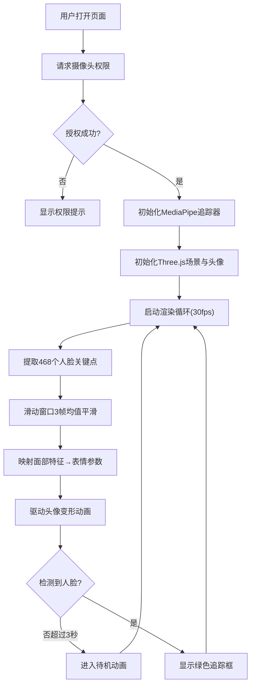

## 1. 产品概述

基于浏览器摄像头实时捕捉用户面部表情，驱动虚拟3D头像同步做出相应表情变化的交互式Web应用。用户通过眨眼、张嘴、皱眉、转头等动作控制虚拟头像，实现沉浸式的实时面部表情映射体验。

- 主要用途：娱乐互动、虚拟形象展示、表情演示
- 目标用户：普通Web用户，用于趣味互动、虚拟形象体验
- 市场价值：零门槛的Web端面部表情驱动技术展示，可作为元宇宙、虚拟主播、在线会议等场景的技术原型

## 2. 核心功能

### 2.1 功能模块

1. **实时面部追踪模块**：MediaPipe Face Landmarks检测468个人脸关键点，30fps提取特征数据
2. **3D虚拟头像渲染模块**：Three.js构建低多边形头像，独立控制眼睛、嘴巴、眉毛群组
3. **表情映射驱动模块**：将面部特征数据映射为3D模型的变形动画
4. **待机状态模块**：人脸丢失3秒后自动进入待机动画
5. **界面控制模块**：重置姿态、表情冻结、镜像模式三个交互按钮
6. **性能监控模块**：实时FPS显示与面部动作标签展示

### 2.3 页面详情

| 页面名称 | 模块名称 | 功能描述 |
|-----------|-------------|---------------------|
| 主界面 | 3D头像区域 | 居中展示虚拟3D头像，占桌面70%/移动端60%高度 |
| 主界面 | 面部追踪框 | 检测到人脸后四角淡入绿色追踪提示框 |
| 主界面 | 待机提示 | 人脸丢失3秒后中央显示"请面对摄像头"淡入淡出循环 |
| 主界面 | FPS计数器 | 左下方白色半透明实时帧率显示 |
| 主界面 | 动作标签 | 右下方显示当前检测到的面部动作量化值 |
| 主界面 | 控制按钮区 | 底部毛玻璃风格三按钮：重置姿态/表情冻结/镜像模式 |

## 3. 核心流程

用户打开页面 → 请求摄像头权限 → 授权成功后启动MediaPipe追踪 → Three.js渲染3D头像 → 逐帧提取面部特征 → 平滑滤波后映射为表情动画 → 用户通过按钮控制交互状态 → 人脸丢失自动进入待机模式。

## 4. 用户界面设计

### 4.1 设计风格

- **主色调**：深太空蓝 `#0a0a1a` 背景，配合微弱辉光
- **辅助色**：荧光绿 `#00ff88` 用于追踪框和激活状态，半透明白色用于文字
- **按钮风格**：毛玻璃效果（backdrop-filter: blur(10px)），1px白色半透明边框，圆角设计
- **交互动效**：悬停时 scale(1.05) 放大 + 亮度提升，平滑过渡动画
- **字体**：现代无衬线字体，支持数字等宽显示

### 4.2 页面设计概述

| 页面名称 | 模块名称 | UI元素 |
|-----------|-------------|-------------|
| 主界面 | 3D头像区域 | 深色背景衬托，柔和三点光源，头像居中，低多边形风格 |
| 主界面 | 追踪框 | 四角绿色线条，检测到人脸时淡入，丢失时淡出 |
| 主界面 | 控制按钮 | 底部横向排列，毛玻璃半透明，图标+文字组合 |
| 主界面 | FPS显示 | 左下角，12px白色半透明文字，monospace字体 |
| 主界面 | 动作标签 | 右下角，12px白色半透明文字，monospace字体 |
| 主界面 | 待机提示 | 屏幕中央，半透明大号文字，淡入淡出循环动画 |

### 4.3 响应式设计

- **桌面端**：头像占70%视口高度，按钮底部居中横向排列
- **移动端竖屏**：头像缩小至60%视口高度，控制按钮变为底部固定横向可滚动条
- **触控优化**：按钮最小触控区域48x48px，适配触摸操作

### 4.4 3D场景设计

- **环境**：纯深色 `#0a0a1a` 背景，无HDRI，营造赛博科技感
- **光照**：主光（Key Light）正面偏上45°，补光（Fill Light）侧面柔和，轮廓光（Rim Light）后方勾勒边缘
- **相机**：PerspectiveCamera，fov 45°，头像充满画面70%，轻微景深效果
- **材质**：MeshStandardMaterial，低粗糙度，微金属感，肤色偏暖调
- **后处理**：轻微泛光（Bloom）增强科技感，不使用复杂后期保证性能
- **性能预算**：总顶点数<2000，帧率≥40fps，检测延迟<120ms
