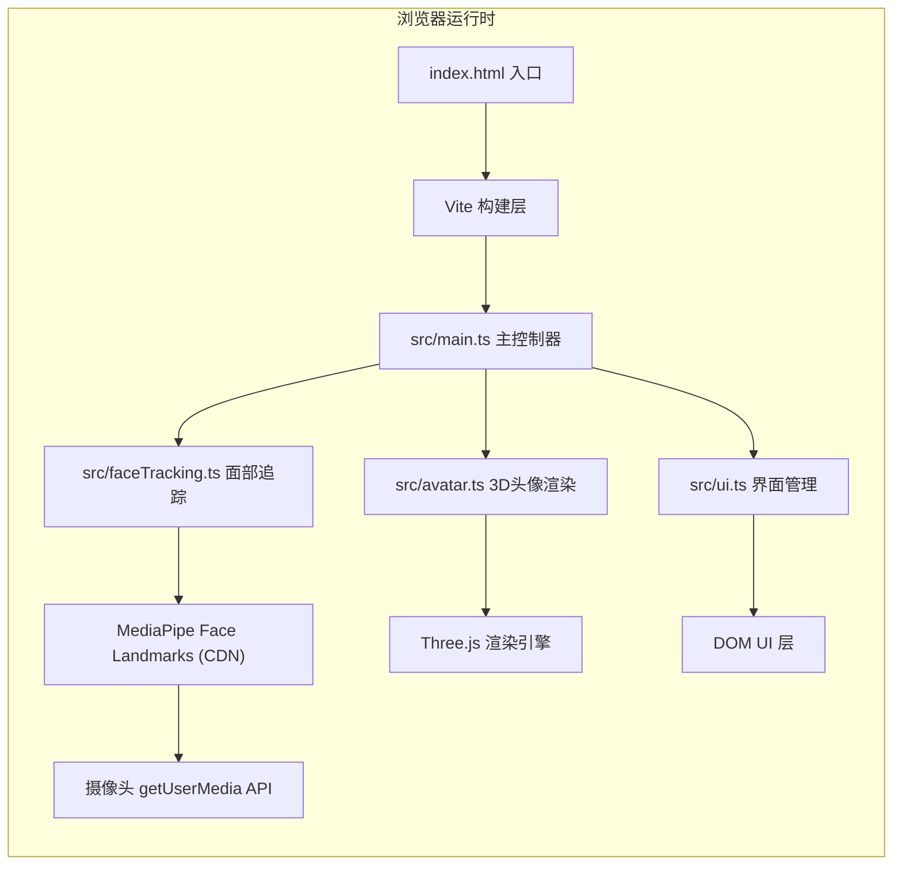
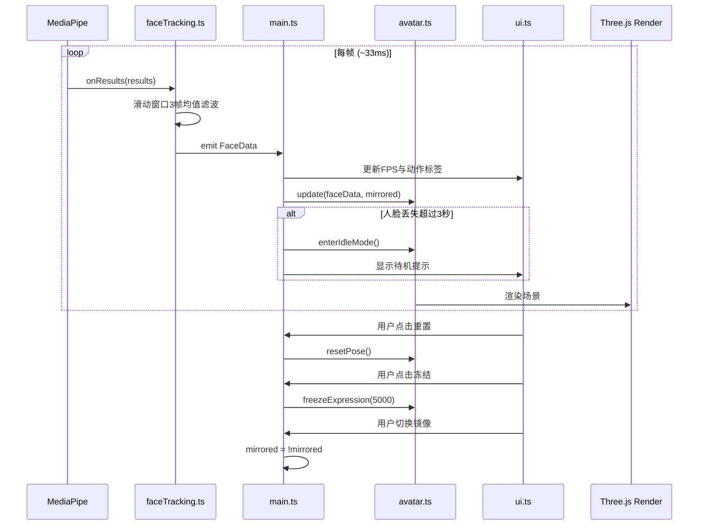

## 1. 架构设计



## 2. 技术选型说明

| 技术 | 版本 | 用途 |
|------|------|------|
| TypeScript | ^5.0 | 类型安全的开发语言 |
| Vite | ^5.0 | 前端构建工具与开发服务器 |
| Three.js | ^0.160.0 | 3D图形渲染引擎 |
| @types/three | ^0.160.0 | Three.js类型声明 |
| MediaPipe Face Landmarks | CDN最新版 | 实时人脸关键点检测(468点) |

- **前端框架**：原生TypeScript + Vite，无React/Vue依赖，保证最轻量运行时
- **初始化方式**：Vite vanilla-ts 模板创建，手动添加Three.js依赖
- **后端**：无后端，纯前端浏览器应用
- **数据库**：不使用

## 3. 文件结构定义

```
auto38/
├── index.html              # 入口HTML，含CDN加载MediaPipe脚本
├── package.json            # 依赖与启动脚本配置
├── vite.config.js          # Vite基础配置
├── tsconfig.json           # TypeScript严格模式配置
└── src/
    ├── main.ts             # 主入口：协调三大模块数据流
    ├── avatar.ts           # 3D头像构建与表情驱动
    ├── faceTracking.ts     # MediaPipe封装与平滑滤波
    └── ui.ts               # UI控制按钮、状态提示、FPS
```

## 4. 模块接口定义

### 4.1 面部数据输出结构 (faceTracking.ts → main.ts)

```typescript
interface FaceData {
  isDetected: boolean;
  leftEyeOpen: number;      // 0-1, 1=完全睁开
  rightEyeOpen: number;     // 0-1, 1=完全睁开
  mouthOpen: number;        // 0-1, 1=最大张开
  browFrown: number;        // 0-1, 1=最大皱眉
  headYaw: number;          // -1~1, 左右转头
  headPitch: number;        // -1~1, 上下点头
  timestamp: number;
}
```

### 4.2 头像控制接口 (main.ts → avatar.ts)

```typescript
interface AvatarController {
  update(faceData: FaceData, mirrored: boolean): void;
  resetPose(): void;
  freezeExpression(duration: number): void;
  enterIdleMode(): void;
  exitIdleMode(): void;
  getScene(): THREE.Scene;
  render(): void;
}
```

### 4.3 UI事件回调 (ui.ts → main.ts)

```typescript
interface UICallbacks {
  onResetPose: () => void;
  onFreezeExpression: () => void;
  onToggleMirror: (enabled: boolean) => void;
}
```

## 5. 核心数据流时序



## 6. 关键算法说明

### 6.1 面部特征提取

- **眨眼检测**：计算眼睛上下眼睑关键点的欧氏距离，归一化到 [0,1]，阈值 <0.25 判定为闭眼
- **张嘴检测**：计算嘴巴上下唇中点距离与脸宽比值，映射到 [0,1]
- **皱眉检测**：计算眉毛关键点与眉心参考点的垂直距离变化
- **头部朝向(Yaw/Pitch)**：利用面部两侧对称关键点相对位移，通过几何投影计算旋转角度

### 6.2 平滑滤波

```typescript
// 滑动窗口3帧均值滤波
class MovingAverageFilter {
  private window: number[] = [];
  private size = 3;
  push(value: number): number {
    this.window.push(value);
    if (this.window.length > this.size) this.window.shift();
    return this.window.reduce((a, b) => a + b, 0) / this.window.length;
  }
}
```

### 6.3 表情动画映射

- **眨眼**：眼睑Y轴缩放，从 `scaleY:1 → 0.1` 过渡300ms，返回200ms，使用 EaseOutQuad 缓动
- **张嘴**：下颚群组绕局部X轴旋转，旋转角度 = `mouthOpen * 0.5 rad`
- **皱眉**：眉毛群组绕Z轴向眉心旋转 `browFrown * 0.3 rad`，Y轴平移 `-browFrown * 0.05`
- **头部旋转**：`head.rotation.y = yaw * Math.PI * 0.5`，`head.rotation.x = pitch * Math.PI * 0.3`
