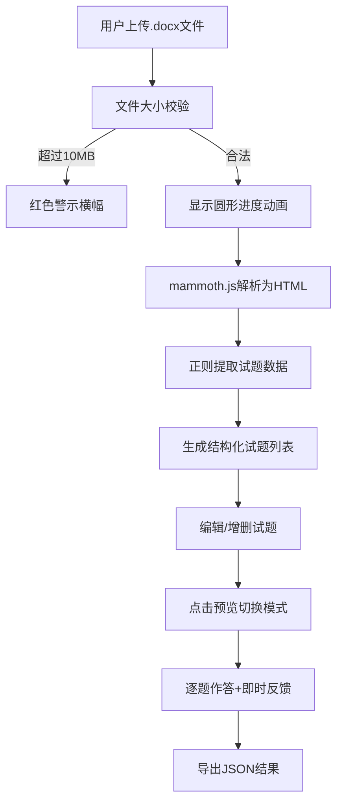

## 1. 产品概述

Word文档在线测验转换器，帮助线上教育机构的课程设计师快速将Word文档中的试题批量转换为格式统一、可交互的在线测验，大幅节省手动排版时间。

- 核心价值：自动化解析、结构化编辑、可视化预览、便捷导出
- 目标用户：线上教育课程设计师、教师、培训师

## 2. 核心功能

### 2.1 用户角色
| 角色 | 注册方式 | 核心权限 |
|------|----------|----------|
| 课程设计师 | 无需注册，本地使用 | 上传文档、编辑试题、预览测验、导出结果 |

### 2.2 功能模块
1. **文档上传模块**：拖拽/点击上传、进度动画、文件大小校验
2. **试题解析模块**：mammoth解析Word、正则提取题干/选项/答案、解析失败标记
3. **试题编辑模块**：可折叠卡片、编辑题干、调整选项、删除/新增试题
4. **测验预览模块**：分页展示、即时反馈、进度条、导航按钮
5. **结果导出模块**：JSON下载、通知条反馈

### 2.3 页面详情
| 页面名称 | 模块名称 | 功能描述 |
|----------|----------|----------|
| 主页面 | 顶部标题栏 | 固定顶部、墨绿渐变背景、白色文字、圆角阴影 |
| 主页面 | 文档上传区 | 虚线边框、拖拽高亮、进度动画、10MB限制警示 |
| 主页面 | 试题编辑列表 | 可折叠卡片、状态标签、编辑/删除/新增功能 |
| 预览页面 | 题目展示区 | 圆形题号徽章、选项按钮、即时对错反馈 |
| 预览页面 | 进度导航区 | 分段进度条、上一题/下一题、导出结果按钮 |

## 3. 核心流程

用户选择或拖拽Word文档上传 → mammoth.js解析为HTML → 正则提取结构化试题 → 编辑列表中调整试题 → 点击预览进行答题 → 即时反馈答题结果 → 导出JSON答题记录

## 4. 用户界面设计

### 4.1 设计风格
- 主色：#2B7A78（墨绿），辅色：#3AAFA9（浅青），错误色：#E74C3C（珊瑚红）
- 卡片式设计：白底灰边、16px间距、hover上浮3px+加深阴影
- 按钮样式：圆角、300ms ease-out过渡、颜色区分状态
- 字体：系统默认字体，移动端14px，桌面端正常
- 布局：顶部固定标题栏、卡片居中列表、最大宽度960px

### 4.2 页面设计概览
| 页面名称 | 模块名称 | UI元素 |
|----------|----------|--------|
| 主页面 | 标题栏 | 墨绿渐变背景、白色文字、5px圆角、盒阴影 |
| 主页面 | 上传区 | 虚线边框、拖拽时浅青背景#DEF2F1、圆形进度条动画 |
| 主页面 | 试题卡片 | 可折叠、状态标签（绿色成功/橙色失败+警告图标）、滑动删除动画 |
| 预览页面 | 题目展示 | 圆形题号徽章、选项按钮、绿色正确/红色闪烁错误 |
| 预览页面 | 进度条 | 分段色块（绿色答对/红色答错/灰色未答） |

### 4.3 响应式设计
- 宽屏(>1024px)：界面居中，最大宽度960px
- 移动端(<768px)：全宽显示，字体缩小至14px
- 所有切换动画：300ms ease-out过渡

## 5. 性能要求
- 30道选择题解析时间：< 2秒
- 动画帧率：60fps
- 题目切换时间：< 100ms
