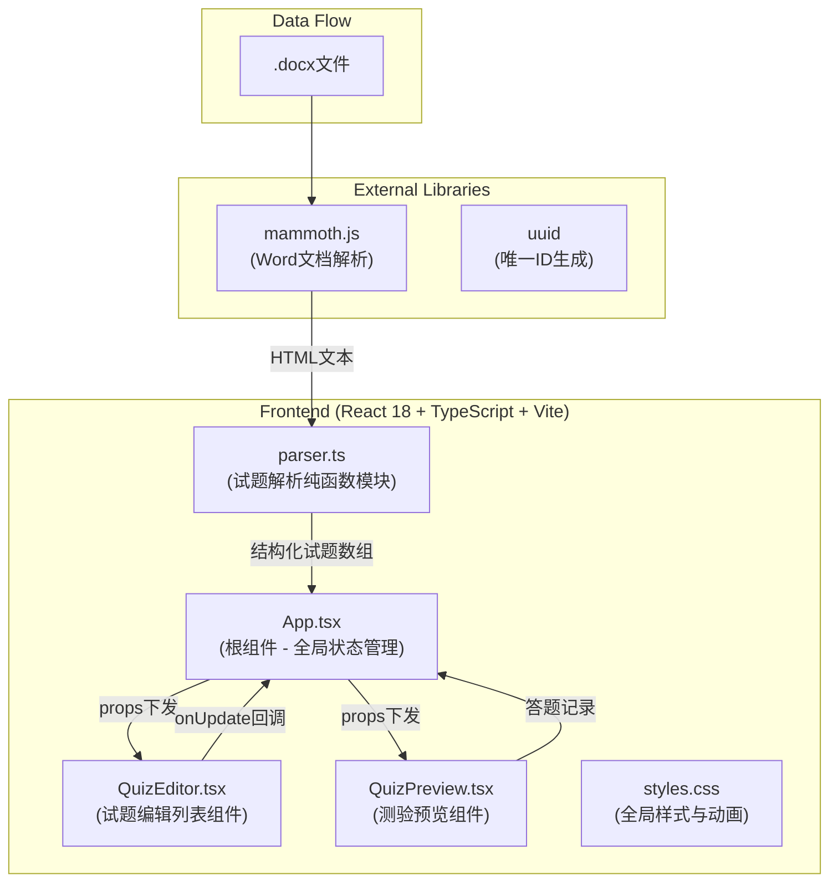
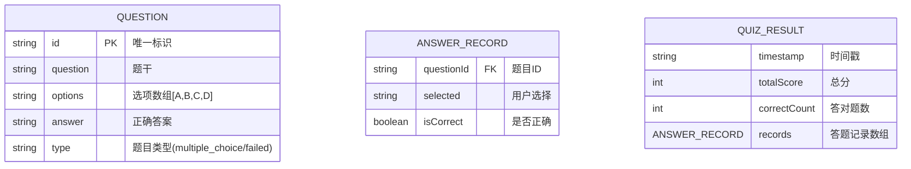

## 1. 架构设计



## 2. 技术说明

- 前端框架：React 18 + TypeScript
- 构建工具：Vite
- 文档解析：mammoth.js
- ID生成：uuid
- 状态管理：React useState/useCallback（无需额外状态管理库）
- 样式方案：原生CSS + CSS变量

## 3. 文件结构

```
project-root/
├── package.json
├── vite.config.js
├── tsconfig.json
├── index.html
└── src/
    ├── App.tsx          # 根组件，全局状态管理
    ├── parser.ts        # 纯函数解析模块
    ├── QuizEditor.tsx   # 试题编辑列表组件
    ├── QuizPreview.tsx  # 预览测验组件
    ├── main.tsx         # 应用入口
    └── styles.css       # 全局样式与动画
```

### 文件调用关系
- `main.tsx` → 渲染 `App.tsx`
- `App.tsx` → 调用 `parser.ts` 的 `parseQuestions(html)` 函数
- `App.tsx` → 通过props传递数据给 `QuizEditor.tsx` 和 `QuizPreview.tsx`
- `QuizEditor.tsx` → 通过 `onUpdate` 回调向 `App.tsx` 传回更新后的数据

## 4. 数据模型

### 4.1 数据模型定义



### 4.2 TypeScript 类型定义

```typescript
interface Question {
  id: string;
  question: string;
  options: string[];
  answer: string;
  type: 'multiple_choice' | 'failed';
}

interface AnswerRecord {
  questionId: string;
  selected: string;
  isCorrect: boolean;
}

interface QuizResult {
  timestamp: string;
  totalScore: number;
  correctCount: number;
  totalCount: number;
  records: AnswerRecord[];
}
```

## 5. 核心解析逻辑说明

### 5.1 正则表达式匹配规则
- 题干格式：`/^\d+[\.\、]\s*(.+?)(?:（\s*）|\(\s*\))?/` 匹配"1. 题干（ ）"格式
- 选项格式：`/^([A-D])[\.\、]\s*(.+)/` 匹配"A. 选项内容"格式
- 答案格式：`/答案[：:]\s*([A-D])/` 匹配"答案：A"格式

### 5.2 解析流程
1. mammoth将docx转换为HTML字符串
2. 去除HTML标签，提取纯文本
3. 按行或段落分割文本
4. 逐段匹配题干→选项→答案的模式
5. 匹配失败的段落标记为 `type: 'failed'`
6. 使用uuid为每道题生成唯一ID

## 6. 组件状态与Props

### App.tsx 状态
- `questions: Question[]` - 试题数组
- `isPreview: boolean` - 是否显示预览模式
- `isParsing: boolean` - 是否正在解析
- `showWarning: boolean` - 是否显示文件过大警示
- `showDownloadNotice: boolean` - 是否显示下载完成通知

### QuizEditor.tsx Props
- `questions: Question[]` - 试题列表
- `onUpdate: (questions: Question[]) => void` - 更新回调

### QuizPreview.tsx Props
- `questions: Question[]` - 试题列表
- `onBack: () => void` - 返回编辑回调
- `onExportResult: (result: QuizResult) => void` - 导出结果回调
