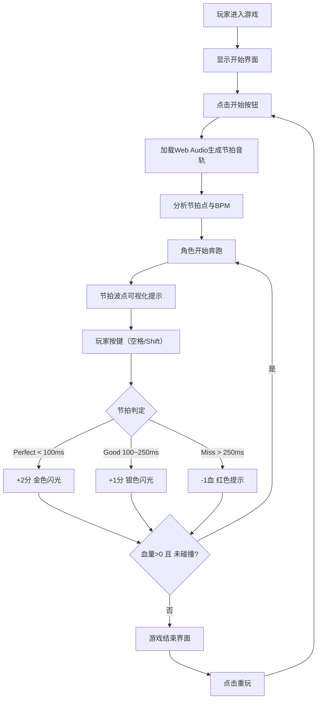

## 1. 产品概述

节奏跑酷是一款基于音乐节拍实时控制角色动作的网页游戏。玩家在无尽跑道上奔跑，跟随音乐节拍按下正确按键跳跃、滑铲躲避障碍物，追求高分数与完美节拍判定。

- 目标用户：喜欢音乐游戏与跑酷游戏的休闲玩家
- 产品价值：结合音乐节奏与跑酷玩法，提供沉浸式的赛博朋克风格视听体验

## 2. 核心功能

### 2.1 功能模块

1. **游戏主场景**：无尽跑道、角色奔跑、障碍物、节拍波点可视化
2. **音频分析系统**：MP3加载、Web Audio节拍检测、BPM计算
3. **角色动作系统**：奔跑/跳跃/滑铲三种动画，与节拍同步
4. **障碍物生成系统**：低障碍（跳跃）、高障碍（滑铲），难度随时间递增
5. **节拍判定系统**：Perfect/Good/Miss三级判定，分数与血量管理
6. **结果界面**：得分统计、判定统计、最高连击、重玩功能

### 2.2 页面详情

| 页面名称 | 模块名称 | 功能描述 |
|-----------|-------------|---------------------|
| 开始界面 | 开始按钮、操作说明 | 展示游戏标题、按键说明（空格跳跃/Shift滑铲）、开始按钮 |
| 游戏主场景 | 跑道、角色、障碍物、节拍波点、UI面板 | 核心游戏玩法区域，实时渲染所有游戏元素 |
| 游戏结束界面 | 得分统计、判定统计、重玩按钮 | 展示本次得分、Perfect/Good/Miss数量、最高连击，提供重新开始 |

## 3. 核心流程

玩家进入游戏 → 点击开始按钮 → 加载音频并分析节拍 → 角色开始奔跑 → 玩家根据节拍波点提示按键 → 系统判定准确度并计分 → 血量归零或碰撞障碍物 → 显示结果界面 → 点击重玩重新开始

## 4. 用户界面设计

### 4.1 设计风格

- **主色调**：深紫色(#1a0a2e)到深蓝色(#0a1628)渐变背景
- **跑道色**：发光青色(#00ffff)线条透视效果
- **角色色**：高饱和霓虹粉色(#ff00ff)
- **节拍波点**：黄色(#ffff00)与青色(#00ffff)交替闪烁
- **判定色**：金色(#ffd700)/银色(#c0c0c0)/红色(#ff0040)
- **按钮风格**：霓虹发光边框，圆角矩形，悬停放大效果
- **字体**：使用等宽数字字体显示分数，无衬线字体显示文字
- **布局**：Canvas全屏渲染，UI元素叠加在Canvas上层

### 4.2 页面设计概述

| 页面名称 | 模块名称 | UI元素 |
|-----------|-------------|-------------|
| 开始界面 | 标题区域 | 大标题"CYBER BEAT RUN"、霓虹发光效果、副标题 |
| 开始界面 | 操作说明 | 按键图标+文字说明（空格=跳跃，Shift=滑铲） |
| 开始界面 | 开始按钮 | 青色发光边框按钮，悬停放大，点击脉冲效果 |
| 游戏主场景 | 跑道 | 透视青色线条向远方汇聚，两侧节拍波点闪烁 |
| 游戏主场景 | 角色 | 霓虹粉色几何图形，跳跃/滑铲/奔跑动画 |
| 游戏主场景 | 障碍物 | 低障碍(青色方块需跳跃)、高障碍(粉色方块需滑铲) |
| 游戏主场景 | 顶部UI | 左上角血量(5颗心)、右上角分数、BPM显示 |
| 游戏主场景 | 判定特效 | 屏幕中央圆环扩散动画，颜色随判定等级变化 |
| 游戏主场景 | 粒子系统 | 背景缓慢飘动粒子流，角色跳跃光晕扩散 |
| 游戏结束界面 | 统计面板 | 半透明深色背景卡片，金色标题，各项统计数字 |
| 游戏结束界面 | 重玩按钮 | 粉色发光按钮，悬停效果 |

### 4.3 响应式设计

- 桌面端优先，移动端自适应
- Canvas采用弹性布局，始终保持屏幕宽高比
- 移动端添加虚拟按键（左下跳跃按钮、右下滑铲按钮）
- 触摸事件支持，按钮尺寸适配手指触控
