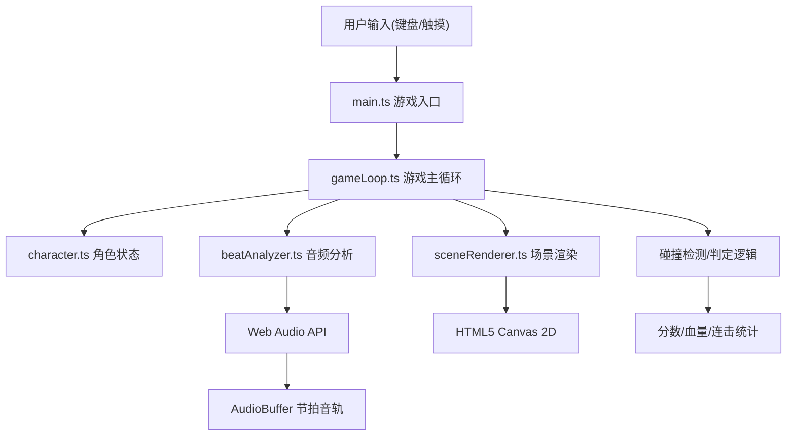

## 1. 架构设计



## 2. 技术栈说明

- **前端框架**：无原生框架，TypeScript + HTML5 Canvas
- **构建工具**：Vite 5.x（原生构建，无需框架插件）
- **语言**：TypeScript 5.x（严格模式，target ES2020）
- **音频处理**：Web Audio API（AudioContext、AnalyserNode、OfflineAudioContext）
- **渲染**：Canvas 2D Context
- **状态管理**：GameLoop类内部状态管理
- **后端服务**：无（纯前端项目）
- **数据库**：无

## 3. 项目结构

```
.
├── package.json
├── vite.config.js
├── tsconfig.json
├── index.html
└── src/
    ├── main.ts              # 游戏入口，初始化音频上下文、启动循环、场景切换
    ├── beatAnalyzer.ts      # 音频分析模块，BPM检测、节拍点提取
    ├── gameLoop.ts          # 游戏主循环，状态管理、碰撞、判定、分数
    ├── sceneRenderer.ts     # 绘图模块，所有Canvas2D绘制
    └── character.ts         # 角色类，位置、速度、动画、动作状态
```

## 4. 核心模块设计

### 4.1 beatAnalyzer.ts - 音频分析模块

**核心接口**：
```typescript
interface BeatAnalysisResult {
  beatTimes: number[];   // 节拍点时间数组(秒)
  bpm: number;           // 检测到的BPM
}

class BeatAnalyzer {
  constructor(audioContext: AudioContext);
  analyze(audioBuffer: AudioBuffer): Promise<BeatAnalysisResult>;
  generateSyntheticBeatTrack(bpm: number, duration: number): AudioBuffer;
}
```

**实现原理**：
- 使用Web Audio API生成合成节拍音轨（作为默认音频源）
- 通过能量峰值检测算法识别节拍点
- 计算节拍间隔得到BPM
- 可选：Web Worker进行离线分析避免阻塞主线程

### 4.2 character.ts - 角色模块

**核心接口**：
```typescript
type CharacterAction = 'run' | 'jump' | 'slide';

class Character {
  x: number;
  y: number;
  velocityY: number;
  action: CharacterAction;
  animationFrame: number;
  isGrounded: boolean;
  
  update(deltaTime: number, bpm: number): void;
  jump(): boolean;    // 返回是否成功触发跳跃
  slide(): boolean;   // 返回是否成功触发滑铲
  run(): void;
  getHitbox(): { x: number; y: number; w: number; h: number };
}
```

**状态机**：
- 奔跑状态：默认状态，可切换到跳跃或滑铲
- 跳跃状态：重力下落，落地后回到奔跑
- 滑铲状态：持续时间固定，结束后回到奔跑

### 4.3 sceneRenderer.ts - 场景渲染模块

**核心接口**：
```typescript
interface GameState {
  character: Character;
  obstacles: Obstacle[];
  beatDots: BeatDot[];
  particles: Particle[];
  score: number;
  health: number;
  bpm: number;
  currentTime: number;
  judgmentEffect: JudgmentEffect | null;
  phase: 'menu' | 'playing' | 'gameover';
  stats: GameStats;
}

class SceneRenderer {
  constructor(canvas: HTMLCanvasElement);
  render(state: GameState): void;
  resize(width: number, height: number): void;
}
```

**绘制内容**：
1. 背景：渐变背景 + 粒子流
2. 跑道：透视青色线条 + 节拍波点
3. 角色：几何图形 + 动画帧
4. 障碍物：低障碍/高障碍发光方块
5. 判定特效：圆环扩散动画
6. UI：血量、分数、BPM、文字叠加

### 4.4 gameLoop.ts - 游戏主循环

**核心接口**：
```typescript
type JudgmentType = 'perfect' | 'good' | 'miss';

interface GameStats {
  perfect: number;
  good: number;
  miss: number;
  maxCombo: number;
  currentCombo: number;
}

class GameLoop {
  constructor(
    beatTimes: number[],
    initialBpm: number,
    onStateChange: (state: GameState) => void,
    onGameOver: (stats: GameStats & { score: number }) => void
  );
  start(): void;
  stop(): void;
  handleJump(): void;
  handleSlide(): void;
  getState(): GameState;
}
```

**核心逻辑**：
- requestAnimationFrame 驱动60FPS主循环
- 跟踪当前音乐播放时间
- 障碍物生成：与节拍点错开半个节拍间隔
- 节拍判定：计算按键时间与最近节拍点的差值
- 难度递增：每10秒BPM提升5%
- 碰撞检测：角色与障碍物的AABB碰撞

### 4.5 main.ts - 入口模块

**职责**：
- 创建AudioContext（用户交互后）
- 生成或加载音频
- 调用BeatAnalyzer分析节拍
- 初始化GameLoop和SceneRenderer
- 绑定键盘/触摸事件
- 管理场景状态切换（menu → playing → gameover）
- 处理窗口大小变化

## 5. 数据结构定义

```typescript
interface Obstacle {
  x: number;           // 世界坐标x
  y: number;           // 地面高度(低障碍)或顶部高度(高障碍)
  width: number;
  height: number;
  type: 'low' | 'high';
  passed: boolean;
}

interface BeatDot {
  x: number;           // 屏幕x坐标
  y: number;           // 屏幕y坐标
  beatTime: number;    // 对应的节拍时间
  color: 'yellow' | 'cyan';
  scale: number;
  opacity: number;
}

interface Particle {
  x: number;
  y: number;
  vx: number;
  vy: number;
  life: number;
  maxLife: number;
  color: string;
  size: number;
}

interface JudgmentEffect {
  type: JudgmentType;
  startTime: number;
  duration: number;
  x: number;
  y: number;
}
```

## 6. 性能优化策略

1. **Canvas优化**：
   - 使用离屏Canvas预绘静态背景元素
   - 限制同时渲染的粒子数量（最多100个）
   - 对象池复用粒子和障碍物对象

2. **音频优化**：
   - 节拍分析使用OfflineAudioContext离线处理
   - 音频分析在用户等待开始界面时完成
   - 可选Web Worker进行节拍计算

3. **渲染优化**：
   - 仅绘制屏幕可见区域内的元素
   - 使用requestAnimationFrame确保60FPS
   - 避免每帧创建新对象，复用对象池

4. **内存管理**：
   - 及时回收已通过的障碍物
   - 粒子生命周期结束后回收到对象池
