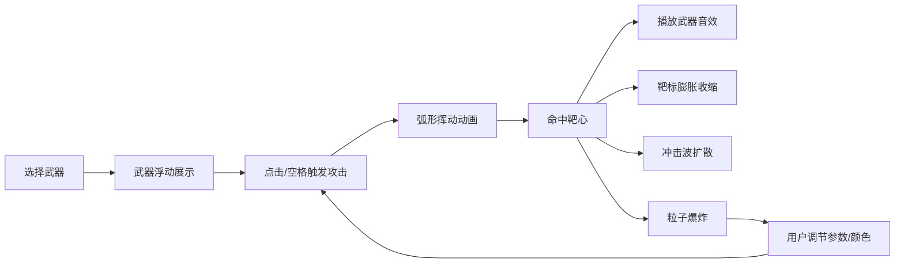

## 1. 产品概述

2D武器特效实验室是一款面向游戏开发者的可视化参数调试工具，用于快速原型测试和参数调优武器打击感的视觉效果与音效。通过实时调节粒子参数和主色调，开发者可以直观地对比不同武器配置的视觉反馈。

- 核心用户：独立游戏开发者、游戏特效设计师
- 核心价值：缩短特效调优周期，提供即时可视化反馈

## 2. 核心功能

### 2.1 功能模块

1. **主画布区域**：中央靶标、武器展示、攻击动画、粒子特效、冲击波
2. **武器选择栏**：4种武器（单手剑、战斧、长矛、流星锤）的像素图标选择
3. **参数调节面板**：粒子寿命、粒子速度、爆炸半径三个实时滑块
4. **颜色拾取器**：6种预设爆炸主色调切换
5. **音效系统**：基于Web Audio API的4种武器差异化实时音效

### 2.2 功能详情

| 页面/模块 | 子模块 | 功能描述 |
|-----------|--------|----------|
| 主画布 | 靶标系统 | 固定圆形靶标（半径40px），多层同心圆环，红色内环→蓝色外环渐变 |
| 主画布 | 武器展示 | 选中武器出现在靶标左侧，带缓慢上下浮动动画 |
| 主画布 | 攻击动画 | 点击/空格键触发，弧形挥动轨迹（0.3秒），命中靶心 |
| 主画布 | 粒子爆炸 | 命中时接触点产生爆炸粒子，按武器类型确定数量（剑15/斧30/矛20/锤40） |
| 主画布 | 粒子行为 | 随机方向飞散，速度20-80px/s，逐渐缩小淡出，持续1.5秒 |
| 主画布 | 靶标形变 | 命中时短暂膨胀收缩动画（放大至110%回弹，0.2秒） |
| 主画布 | 冲击波效果 | 白色半透明环形从中心扩散（0→150px，0.5秒消失） |
| 武器栏 | 武器选择 | 底部水平居中排列4个32x32像素风格武器图标，点击/拖拽选择 |
| 武器栏 | 交互反馈 | 悬停时背景白色半透明，选中时金色渐变背景+图标放大1.1倍+旋转5度 |
| 参数面板 | 粒子寿命滑块 | 0.5-3秒，默认1.5，实时更新后续攻击参数 |
| 参数面板 | 粒子速度滑块 | 20-200px/s，默认50，实时更新 |
| 参数面板 | 爆炸半径滑块 | 10-80px，默认30，实时更新 |
| 参数面板 | 滑块样式 | 蓝紫渐变背景，拖动时手柄变橙色并放大1.2倍 |
| 颜色拾取器 | 主色调切换 | 6种预设：橙红、紫蓝、翠绿、金黄、冰蓝、暗黑，Hue偏移±15度 |
| 音效系统 | 剑音效 | 800Hz正弦波，0.1秒，快速衰减（清脆金属叮当声） |
| 音效系统 | 斧音效 | 200Hz方波+混响，0.3秒（沉重撞击声） |
| 音效系统 | 矛音效 | 1200Hz锯齿波，0.08秒（尖锐穿刺声） |
| 音效系统 | 锤音效 | 80Hz正弦波+失真，0.4秒（低频轰鸣声） |

## 3. 核心流程

用户选择武器→武器展示在靶标旁→点击/空格触发攻击→武器弧形挥动→命中靶心→播放音效+靶标形变+冲击波+粒子爆炸→用户调节参数→再次攻击观察效果变化

## 4. 用户界面设计

### 4.1 设计风格

- **主色调**：深色背景渐变（#0a0a1a → #1a1a3a），金色高亮（#ffd700 → #ff8c00）
- **交互风格**：圆角矩形按钮，柔和过渡动画（transition: all 0.2s ease）
- **视觉层次**：半透明深色面板（rgba(0,0,0,0.7)），带阴影效果
- **靶标区域**：黑色半透明圆形区域（半径200px）作为视觉锚点

### 4.2 页面布局

| 区域 | 位置 | 尺寸/样式 |
|------|------|-----------|
| 参数面板 | 左侧固定 | 宽度250px，半透明深色背景，阴影 |
| 主画布 | 中央 | 自适应，包含靶标、武器、粒子 |
| 武器选择栏 | 底部水平居中 | 圆角矩形图标，32x32像素风 |
| 颜色拾取器 | 右侧 | 6个颜色方块 |

### 4.3 响应式适配

- 桌面端（≥768px）：参数面板固定展开在左侧
- 移动端（<768px）：参数面板折叠为图标按钮，点击展开

### 4.4 性能优化

- 粒子总数上限1000个，超过自动丢弃最老粒子
- 粒子超过500个时启用性能模式：每两帧更新一次位置，缩小粒子尺寸
- 主循环帧率目标≥55FPS（Chrome环境）
- 所有资源内存实时计算，不加载外部图片/音频文件
