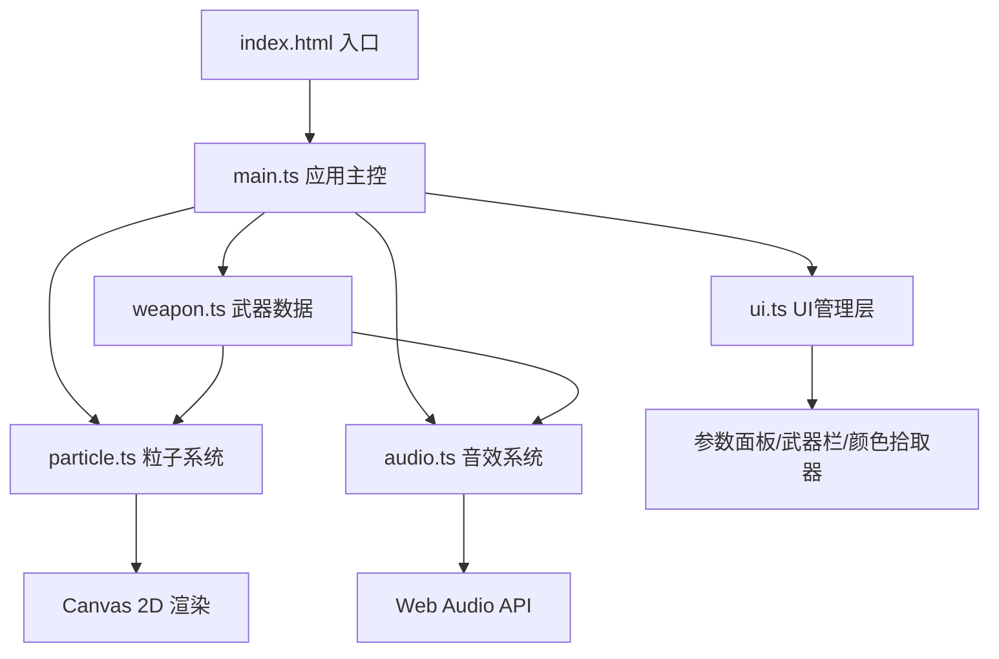

## 1. 架构设计

纯前端单页应用，采用模块化分层架构，所有渲染和计算均在浏览器端完成，无后端依赖。



## 2. 技术选型

- **前端框架**：无第三方框架，原生 TypeScript + Canvas 2D API
- **构建工具**：Vite 5.x（热更新、快速构建）
- **语言**：TypeScript 5.x（严格模式）
- **目标标准**：ES2020 + ESNext Module
- **音效引擎**：Web Audio API（实时合成，无外部音频文件）
- **渲染引擎**：HTML5 Canvas 2D Context

## 3. 模块文件结构

| 文件 | 职责 |
|------|------|
| `package.json` | 依赖声明（typescript, vite），启动脚本 |
| `vite.config.js` | Vite 基础配置，输出目录 dist，端口 5173 |
| `tsconfig.json` | TypeScript 严格模式配置 |
| `index.html` | 入口页面，Canvas 容器与基础样式 |
| `src/main.ts` | 应用主文件：Canvas 初始化、事件绑定、主循环 (requestAnimationFrame) |
| `src/weapon.ts` | 武器数据模型：4种武器定义、粒子数量、音效参数、图标绘制 |
| `src/particle.ts` | 粒子系统：Particle 类、爆炸生成、位置更新、渲染、性能优化（降采样/上限） |
| `src/audio.ts` | 音效模块：Web Audio API 封装，4种武器波形合成（正弦/方波/锯齿+混响/失真） |
| `src/ui.ts` | UI 管理：武器选择栏、参数滑块面板、颜色拾取器的 DOM 渲染与事件交互 |

## 4. 数据模型

### 4.1 武器数据定义

```typescript
interface WeaponConfig {
  id: string;
  name: string;
  iconColor: string;
  particleCount: number;       // 剑:15, 斧:30, 矛:20, 锤:40
  soundParams: SoundParams;    // 波形、频率、持续时间、效果器
}

interface SoundParams {
  type: OscillatorType;        // sine / square / sawtooth
  frequency: number;           // Hz
  duration: number;            // 秒
  reverb?: boolean;            // 混响（斧）
  distortion?: boolean;        // 失真（锤）
  attack: number;              // 起音
  decay: number;               // 衰减
}
```

### 4.2 粒子数据定义

```typescript
interface Particle {
  x: number;
  y: number;
  vx: number;
  vy: number;
  life: number;                // 剩余生命
  maxLife: number;             // 总寿命
  size: number;
  baseSize: number;
  hue: number;                 // 基础色相
  saturation: number;
  lightness: number;
}

interface ParticleParams {
  lifespan: number;            // 0.5-3s, default 1.5
  speed: number;               // 20-200px/s, default 50
  explosionRadius: number;     // 10-80px, default 30
  baseHue: number;             // 主色调色相
}
```

### 4.3 冲击波数据定义

```typescript
interface Shockwave {
  x: number;
  y: number;
  radius: number;
  maxRadius: number;           // 150px
  life: number;
  maxLife: number;             // 0.5s
}
```

## 5. 核心算法与流程

### 5.1 主循环 (main.ts)

```
requestAnimationFrame 驱动
  ├─ 更新武器浮动位置 (sin 函数)
  ├─ 更新攻击动画进度 (0.3s 弧形插值)
  ├─ 更新靶标形变 (0.2s 回弹动画)
  ├─ 更新冲击波半径
  ├─ 更新粒子位置/寿命
  │   └─ 性能模式(>500粒子): 每2帧更新一次
  ├─ 清理过期粒子 (FIFO 丢弃超过1000的最老粒子)
  ├─ 清空画布
  ├─ 绘制靶标背景区域
  ├─ 绘制靶标同心圆环
  ├─ 绘制武器
  ├─ 绘制冲击波
  └─ 绘制所有粒子
```

### 5.2 攻击动画算法

- 武器起始位置：靶心左侧 100px
- 挥动轨迹：使用二次贝塞尔曲线，控制点位于左上方形成弧形
- 时间插值：easeOutQuad 缓动函数
- 持续时间：0.3 秒
- 命中判定：动画进度达到 0.7 时触发命中事件

### 5.3 粒子系统性能优化

1. **数量上限**：数组维护 1000 上限，超过时 shift() 丢弃最早粒子
2. **降采样更新**：粒子数 > 500 时，奇数帧跳过位置计算
3. **尺寸缩减**：性能模式下粒子绘制尺寸 × 0.7
4. **对象复用**：粒子对象池模式（可选，视性能需求）

## 6. 性能指标

| 指标 | 目标 |
|------|------|
| 帧率 (Chrome) | ≥ 55 FPS |
| 最大粒子数 | 1000 |
| 性能模式触发阈值 | 500 粒子 |
| 音效延迟 | < 10ms |
| 外部资源加载 | 0（全部内存实时计算） |
