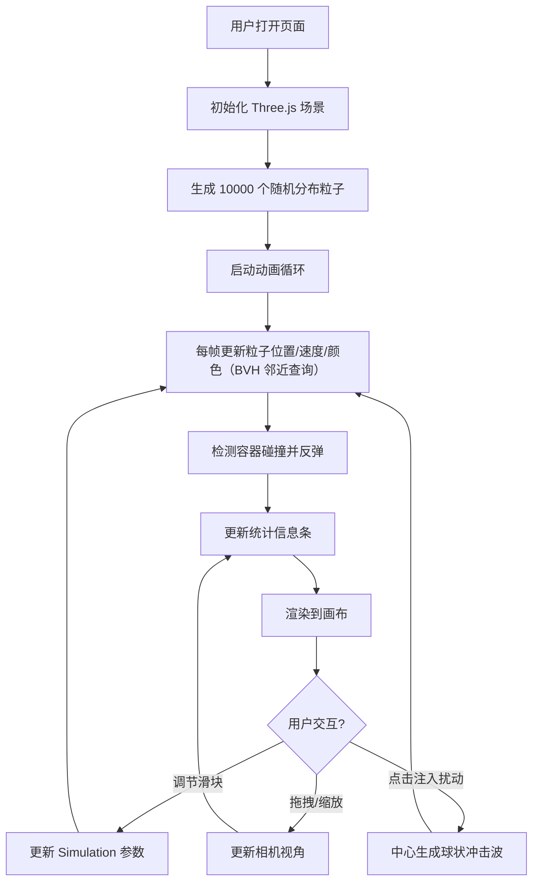

## 1. 产品概述

3D 流体流动实时交互可视化应用，面向流体力学教学场景，解决抽象物理概念难以直观展示、专业科学可视化工具使用门槛高的问题。通过数千个彩色粒子在三维容器中的运动，模拟流体粘性、压力和碰撞等物理现象，支持实时参数调节与交互观察。

## 2. 核心特性

### 2.1 用户角色
| 角色 | 注册方式 | 核心权限 |
|------|----------|----------|
| 访客用户 | 无需注册 | 直接访问并使用全部可视化与交互功能 |

### 2.2 功能模块
1. **3D 流体模拟场景**：粒子系统、BVH 空间加速、容器碰撞、冲击波扰动
2. **交互控制面板**：粘性系数、粒子数量、时间步长滑块、注入扰动按钮
3. **实时统计信息条**：FPS、总粒子数、平均速度颜色条、运行时间
4. **相机交互**：轨道旋转、滚轮缩放、方向指示器

### 2.3 页面详情
| 页面名称 | 模块名称 | 功能描述 |
|----------|----------|----------|
| 主页面 | 3D 渲染画布 | Three.js 渲染场景，支持 OrbitControls 拖拽旋转与缩放 |
| 主页面 | 控制面板 | 悬浮左上角，三个滑块与一个按钮，带悬停高亮与点击回弹动画 |
| 主页面 | 统计信息条 | 底部深色半透明条，等宽字体显示 FPS、粒子数、速度条、运行时间 |
| 主页面 | 方向指示器 | 相机拖拽时显示东南西北四个三角箭头 |

## 3. 核心流程

## 4. 用户界面设计

### 4.1 设计风格
- **主色调**：`#4a9eff`（科技蓝）
- **辅助色**：`#ff6b6b`（警示红）
- **文本色**：`#e0e0e0`（浅灰）
- **背景**：`#0a0a1a` 渐变至 `#1a1a2e`（深色科技风）
- **字体**：等宽字体（统计信息）+ 系统无衬线字体（UI 控件）
- **容器边框**：`#4a9eff` 半透明线框，线宽 2px
- **粒子效果**：发光光晕（PointsMaterial 透明度 + 尺寸衰减）
- **控制面板**：毛玻璃效果（半透明背景 + 10px 模糊 + 12px 圆角）
- **交互反馈**：控件悬停高亮、点击回弹动画

### 4.2 页面设计概览
| 页面名称 | 模块名称 | UI 元素 |
|----------|----------|---------|
| 主页面 | 3D 画布 | 全屏渲染，渐变背景，长方体线框容器，彩色粒子 |
| 主页面 | 控制面板 | 悬浮左上角，毛玻璃卡片，3 个滑块 + 1 个按钮，带标签与数值显示 |
| 主页面 | 统计条 | 底部固定，深色半透明条，FPS/粒子数/速度颜色条/运行时间 |
| 主页面 | 方向指示器 | 拖拽相机时场景边缘淡入三角箭头（东南西北） |

### 4.3 响应式
- 桌面端优先，画布自适应窗口尺寸
- 控制面板固定定位，不随缩放变化

### 4.4 3D 场景指引
- **环境**：深色渐变背景，无 HDRI，自发光粒子营造氛围
- **光照**：AmbientLight（环境光）保证粒子可见
- **相机**：PerspectiveCamera，初始位置 `(15, 10, 15)`，看向容器中心
- **相机控制**：OrbitControls，支持旋转/缩放/平移
- **容器**：BoxGeometry 线框 + LineSegments，半透明蓝色
- **粒子**：Points + BufferGeometry，PointsMaterial（顶点颜色、透明、尺寸衰减）
- **碰撞特效**：粒子反弹时生成小尺寸闪光粒子（短时存活、渐隐）
- **性能**：10000 粒子 ≥ 45 FPS，使用 BVH 空间加速邻近搜索
