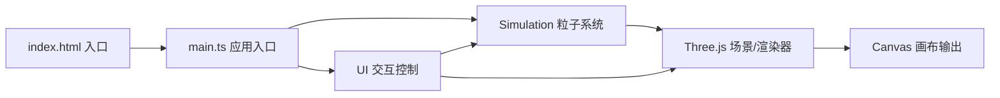

## 1. 架构设计



纯前端单页应用，无后端、无路由。TypeScript 源码编译后由 Vite 输出到浏览器。核心模块划分为：
- `main.ts`：场景、相机、渲染器、动画循环初始化
- `Simulation.ts`：粒子数据管理、BVH 邻近查询、物理规则更新、碰撞响应
- `UI.ts`：HTML 控制面板与统计条 DOM 创建、事件绑定、参数同步

## 2. 技术描述

- **前端框架**：无 UI 框架，原生 TypeScript + DOM 操作
- **3D 引擎**：Three.js（r160+）
- **构建工具**：Vite 5.x
- **语言**：TypeScript 5.x（strict 模式，target ES2020，module ESNext）
- **空间加速**：自定义 BVH（包围体层次树）实现半径内邻近粒子查询
- **无后端 / 无数据库**：全部逻辑运行于浏览器端

## 3. 目录结构

```
.
├── index.html
├── package.json
├── vite.config.js
├── tsconfig.json
└── src/
    ├── main.ts        # 入口：场景、相机、渲染器、动画循环
    ├── Simulation.ts  # 粒子系统、BVH、物理更新、碰撞
    └── UI.ts          # 控制面板、统计条、事件绑定
```

## 4. 核心类与接口（Simulation.ts）

```typescript
interface Particle {
  x: number; y: number; z: number;      // 位置
  vx: number; vy: number; vz: number;   // 速度
}

interface BvhNode {
  minX: number; minY: number; minZ: number;
  maxX: number; maxY: number; maxZ: number;
  left: BvhNode | null;
  right: BvhNode | null;
  start: number;   // 粒子索引起始
  count: number;   // 粒子数量
}

interface SimulationConfig {
  containerSize: { w: number; h: number; d: number };
  particleCount: number;
  viscosity: number;      // 0.1 - 5.0
  timeStep: number;       // 0.01 - 0.1
  neighborRadius: number; // 默认 2
  restitution: number;    // 默认 0.8
}

class Simulation {
  constructor(config: SimulationConfig, scene: THREE.Scene)
  update(): void                                    // 每帧调用
  setViscosity(v: number): void
  setTimeStep(dt: number): void
  setParticleCount(n: number): void
  injectShockwave(speed?: number): void             // 注入扰动
  getAverageSpeed(): number
  getParticleCount(): number
  dispose(): void
}
```

## 5. 物理更新算法

1. **构建 BVH**：每帧基于当前粒子位置自顶向下划分，递归分裂最长轴
2. **邻近查询**：对每个粒子，遍历 BVH 求半径 `neighborRadius` 内邻居
3. **速度平均（粘性）**：`v_i = v_i + viscosity * Σ(v_j - v_i) / N`
4. **位置校正（压力）**：根据邻居平均位置做轻微拉回
5. **积分**：`p += v * dt`
6. **边界碰撞**：超出容器则位置裁剪，法向速度取反 × restitution，触发闪光粒子
7. **颜色映射**：根据速度大小从蓝（0）到红（maxSpeed）做 HSL 插值

## 6. UI 模块职责（UI.ts）

- `createControlPanel(parent, onParamChange, onShockwave)`：创建三个滑块与按钮，绑定 `input`/`click` 事件，事件触发时回调参数
- `createStatsBar(parent)`：创建底部统计条 DOM
- `updateStats(fps, count, avgSpeed, elapsedSec)`：每帧更新统计文本与速度颜色条
- 样式通过内联 CSS 实现：毛玻璃 `backdrop-filter: blur(10px)`、圆角 12px、主色 `#4a9eff`

## 7. main.ts 流程

1. 创建 `THREE.WebGLRenderer` 并挂载到 body
2. 创建 `PerspectiveCamera` 与 `OrbitControls`，初始位置 `(15,10,15)`
3. 创建场景、AmbientLight、容器线框 `Box3Helper` 或自定义 `LineSegments`
4. 实例化 `Simulation` 与 `UI`
5. `requestAnimationFrame` 循环：`controls.update()` → `simulation.update()` → `ui.updateStats()` → `renderer.render()`
6. `window.resize` 监听，自适应相机与渲染器尺寸
7. 拖拽时显示东南西北方向指示器（四个 `THREE.Mesh`，`ConeGeometry`）

## 8. 性能预算

| 指标 | 目标 |
|------|------|
| 粒子数 5000 | 60 FPS |
| 粒子数 10000 | ≥ 45 FPS |
| 粒子数 20000 | ≥ 30 FPS |
| 内存 | < 200 MB |
| 构建产物体积 | < 500 KB gzipped |
