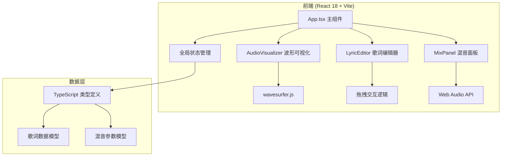
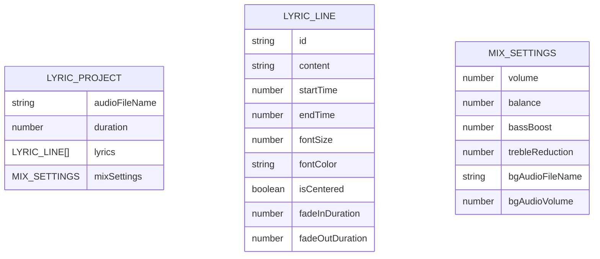

## 1. 架构设计



## 2. 技术描述

- **前端框架**：React 18 + TypeScript
- **构建工具**：Vite 5.x
- **状态管理**：React useState/useContext (轻量级场景，无需额外库)
- **音频可视化**：wavesurfer.js 7.x
- **歌词处理**：Web Audio API (原生)
- **样式方案**：原生 CSS + CSS 变量 (根据需求未使用Tailwind)

## 3. 路由定义

| 路由 | 用途 |
|-------|---------|
| / | 主应用页面（单页应用，无多路由） |

## 4. 数据模型

### 4.1 数据模型定义



### 4.2 TypeScript 类型定义

```typescript
interface LyricLine {
  id: string;
  content: string;
  startTime: number;
  endTime: number;
  fontSize: number;
  fontColor: string;
  isCentered: boolean;
  fadeInDuration: number;
  fadeOutDuration: number;
}

interface MixSettings {
  volume: number;
  balance: number;
  bassBoost: number;
  trebleReduction: number;
  bgAudioFileName: string | null;
  bgAudioVolume: number;
}

interface LyricProject {
  audioFileName: string;
  duration: number;
  lyrics: LyricLine[];
  mixSettings: MixSettings;
}

interface AppState {
  audioFile: File | null;
  audioUrl: string | null;
  duration: number;
  currentTime: number;
  isPlaying: boolean;
  lyrics: LyricLine[];
  mixSettings: MixSettings;
  bgAudioFile: File | null;
}
```

## 5. 项目文件结构

```
e:\solo\VersionFast\tasks\auto45\
├── package.json
├── vite.config.js
├── tsconfig.json
├── index.html
└── src/
    ├── App.tsx
    ├── types.ts
    ├── styles/
    │   └── globals.css
    ├── hooks/
    │   ├── useAudioEngine.ts
    │   └── useDragDrop.ts
    └── components/
        ├── AudioVisualizer.tsx
        ├── LyricEditor.tsx
        ├── MixPanel.tsx
        └── Toolbar.tsx
```

## 6. 核心技术方案

### 6.1 音频处理方案

- **wavesurfer.js**：负责音频加载、波形渲染、播放控制、进度跳转
- **Web Audio API**：创建 AudioContext，连接 GainNode（音量）、StereoPannerNode（平衡）、BiquadFilterNode（高低音调节）、AnalyserNode（频谱分析）
- **频谱分析**：AnalyserNode.getByteFrequencyData() + requestAnimationFrame 实时绘制 Canvas 频谱图

### 6.2 歌词拖拽方案

- **原生拖拽事件**：mousedown → mousemove → mouseup，计算时间轴像素与时间的映射比例
- **性能优化**：requestAnimationFrame 节流更新 UI，确保拖拽响应 ≤ 50ms

### 6.3 状态通信方案

- **App.tsx 作为状态中心**：通过 props 向下传递状态和回调函数
- **回调模式**：子组件通过回调函数更新父组件状态，避免状态冲突
