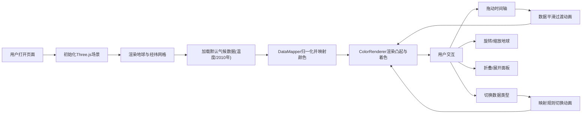

## 1. 产品概述
三维地球气候数据可视化沙盘，为地理空间数据分析师提供直观的全球气候变化数据交互可视化工具。通过三维地球表面映射、颜色渐变和动态时间轴，让用户实时观察温度、降水、风速等气候指标的趋势变化。

- 目标用户：地理空间数据分析师、气候研究员、数据可视化爱好者
- 产品价值：将抽象的气候数据转化为直观可交互的三维可视化，降低数据分析门槛，提升数据洞察效率

## 2. 核心功能

### 2.1 用户角色
| 角色 | 注册方式 | 核心权限 |
|------|----------|----------|
| 数据分析师 | 无需注册 | 使用全部可视化功能，调整参数，导出观察结果 |

### 2.2 功能模块
1. **三维地球场景**：半透明地球、经纬网格线、自转与交互控制
2. **气候数据图层**：半球形凸起数据点、颜色渐变映射、高度映射
3. **时间轴控制**：年份滑块、数据动画过渡、脉动光晕效果
4. **信息面板**：实时数据统计、折叠/展开功能
5. **数据类型切换**：温度/降水/风速三种数据模式、平滑切换动画

### 2.3 页面详情
| 页面名称 | 模块名称 | 功能描述 |
|-----------|-------------|---------------------|
| 主可视化页面 | 三维地球场景 | 半径5单位、64段细分的半透明蓝绿色地球，白色经纬网格线，缓慢自转(0.002rad/s)，鼠标拖拽旋转、滚轮缩放(3-15单位) |
| 主可视化页面 | 气候数据图层 | 5°×5°分辨率采样(约72×36数据点)，半球形凸起(高度0.1-0.5)，D3插值色带渐变着色 |
| 主可视化页面 | 时间轴滑块 | 底部80%视口宽度、半透明深色背景、白色圆形拖拽点，2000-2020年范围，刻度标记与年份标签 |
| 主可视化页面 | 信息面板 | 左上角半透明圆角面板，显示年份、数据均值、最高/最低值，右上角折叠按钮 |
| 主可视化页面 | 数据类型下拉菜单 | 右上角三个选项(温度/降水/风速)，切换时颜色与高度映射规则变化 |

## 3. 核心流程
用户打开页面 → 加载三维地球与默认气候数据(温度，2010年) → 通过时间轴滑块拖动查看不同年份数据变化 → 切换数据类型观察不同气候指标 → 折叠/展开信息面板调整视图 → 鼠标拖拽旋转地球、滚轮缩放观察细节

## 4. 用户界面设计

### 4.1 设计风格
- 主背景：#0a0a1a（深空主题），随机星空点缀
- 控制面板：半透明磨砂玻璃效果，rgba(20,20,40,0.8)背景，1px rgba(255,255,255,0.1)边框，10px圆角
- 交互元素：悬停放大1.05倍+阴影加深，点击0.1秒弹性按压动画(scale 0.95→1.0)
- 颜色渐变：
  - 温度：红色(暖) → 蓝色(冷)，使用d3.interpolateRdYlBu
  - 降水：深蓝 → 浅蓝
  - 风速：黄色 → 紫色
- 字体：白色，信息面板12px

### 4.2 页面设计概述
| 页面名称 | 模块名称 | UI元素 |
|-----------|-------------|-------------|
| 主可视化页面 | 三维地球 | 半透明蓝绿色球体、白色网格线、数据凸起带渐变颜色与光晕 |
| 主可视化页面 | 时间轴 | 底部居中，深色半透明背景条，白色圆形滑块，刻度与年份标签 |
| 主可视化页面 | 信息面板 | 左上角圆角矩形，深灰底色，白色文字，右上角折叠按钮 |
| 主可视化页面 | 下拉菜单 | 右上角，点击展开时选项从顶部滑入带淡入效果(0.2秒) |

### 4.3 响应式设计
- 桌面端(≥768px)：滑块宽度80%视口，缩放范围3-15单位，信息面板在左上角
- 移动端(<768px)：滑块宽度100%，缩放范围3-8单位，控制面板移至右上角并自动折叠

### 4.4 3D场景指引
- 环境：深空背景(#0a0a1a)，随机星点粒子
- 光照：环境光+方向光，突出数据凸起的立体感
- 相机：PerspectiveCamera，初始距离10单位，轨道控制器限制缩放
- 动画：地球缓慢自转，数据变化时凸起高度和颜色平滑过渡，脉动光晕效果
- 交互：OrbitControls拖拽旋转、滚轮缩放
