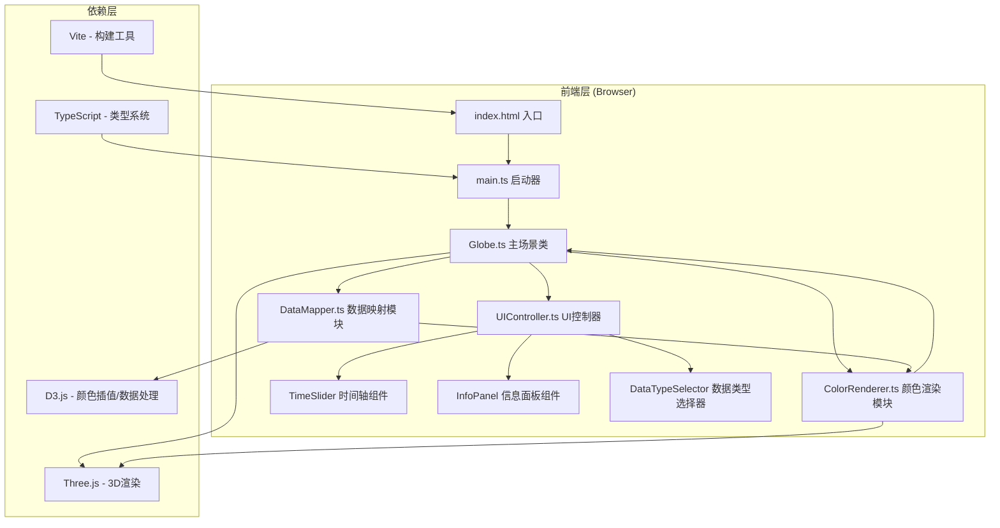

## 1. 架构设计



**调用关系与数据流向：**
1. `index.html` → 加载 `main.ts` → 实例化 `Globe` 类
2. `Globe` → 初始化Three.js场景/相机/控制器 → 创建地球网格
3. `Globe` → 生成模拟数据数组 → 传递给 `DataMapper`
4. `DataMapper` → 接收(经纬度+数值) → 归一化到0-1 → 映射为颜色数组 → 返回给 `Globe`
5. `Globe` → 将颜色数组传递给 `ColorRenderer`
6. `ColorRenderer` → 更新Mesh顶点颜色 → 生成时间轴动画 → 驱动UI更新
7. `UIController` → 监听用户交互 → 触发 `Globe` 更新数据/切换类型

## 2. 技术描述
- 前端框架：原生 TypeScript (无React/Vue框架，按用户需求)
- 3D渲染：Three.js @latest + @types/three
- 数据可视化：D3.js @latest + @types/d3
- 构建工具：Vite @latest
- 开发语言：TypeScript @latest (strict模式，target ES2020，module ESNext)
- 后端：无 (纯前端应用，使用模拟数据)
- 数据：内存中生成的模拟气候数据

## 3. 文件结构定义
| 文件路径 | 职责 |
|----------|------|
| `/package.json` | 依赖声明、启动脚本(npm run dev) |
| `/vite.config.js` | Vite配置：输出dist、端口5173、开启HMR |
| `/tsconfig.json` | TS配置：严格模式、ES2020目标、ESNext模块 |
| `/index.html` | 入口页面，全屏容器，加载main.ts |
| `/src/main.ts` | 应用启动入口，实例化Globe |
| `/src/Globe.ts` | 主场景类：创建场景/相机/控制器，协调DataMapper和ColorRenderer |
| `/src/DataMapper.ts` | 数据映射：归一化数值、颜色插值、色带切换 |
| `/src/ColorRenderer.ts` | 颜色渲染：顶点着色、凸起变形、时间动画、缓动效果 |
| `/src/UIController.ts` | UI控制器：时间轴、信息面板、下拉菜单的DOM操作与事件绑定 |
| `/src/styles.css` | 全局样式：深空主题、磨砂玻璃效果、响应式布局、交互动画 |
| `/src/types.ts` | 类型定义：ClimateDataPoint、DataType、ColorScheme等 |
| `/src/utils.ts` | 工具函数：经纬度转3D坐标、缓动函数、数据生成 |

## 4. 数据模型定义

### 4.1 核心类型

```typescript
// 单个气候数据点
interface ClimateDataPoint {
  lat: number;        // 纬度 -90 ~ 90
  lon: number;        // 经度 -180 ~ 180
  value: number;      // 原始数值
  normalizedValue?: number; // 归一化后 0~1
}

// 数据类型枚举
type DataType = 'temperature' | 'precipitation' | 'wind';

// 颜色方案
interface ColorScheme {
  name: DataType;
  interpolator: (t: number) => string; // D3插值函数
  heightRange: [number, number];       // 凸起高度范围 [min, max]
  label: string;                        // 中文标签
}

// 应用状态
interface AppState {
  year: number;           // 当前年份 2000-2020
  dataType: DataType;     // 当前数据类型
  isPanelCollapsed: boolean; // 面板是否折叠
}
```

### 4.2 数据流
1. **数据生成**：`utils.generateClimateData(year, dataType)` → 生成72×36个数据点
2. **数据归一化**：`DataMapper.normalize(data)` → 计算min/max，映射到0-1
3. **颜色映射**：`DataMapper.mapToColors(normalizedData, colorScheme)` → 输出RGB颜色数组
4. **3D渲染**：`ColorRenderer.updateGeometry(mesh, colors, heights)` → 更新顶点位置与颜色
5. **动画驱动**：`ColorRenderer.animateTransition(targetData, duration, easing)` → requestAnimationFrame驱动

## 5. 性能优化策略

| 优化点 | 策略 |
|--------|------|
| 渲染帧率 | 所有动画使用requestAnimationFrame，避免setTimeout/setInterval |
| 顶点更新 | 使用BufferGeometry，直接操作attribute数组而非逐顶点修改 |
| 材质复用 | 地球网格、数据凸起共享或复用材质实例 |
| 事件节流 | 时间轴拖动使用requestAnimationFrame节流，确保延迟<100ms |
| 布局优化 | CSS transform代替top/left定位，避免布局抖动 |
| 粒子系统 | 星点使用Points + BufferGeometry批量渲染 |
| 内存管理 | 旧的BufferGeometry和Material及时dispose |
