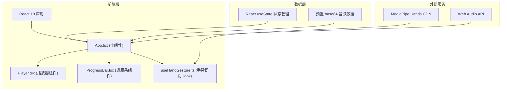

## 1. 架构设计



## 2. 技术说明

- **前端框架**：React 18 + TypeScript
- **构建工具**：Vite
- **手势识别**：MediaPipe Hands（通过 CDN 加载 @mediapipe/hands, @mediapipe/camera_utils）
- **辅助库**：@tensorflow/tfjs, @tensorflow-models/hand-pose-detection
- **音效**：Web Audio API 生成确认音效
- **状态管理**：React useState Hooks（无额外状态管理库）
- **样式方案**：CSS（内联样式 + CSS 变量，深色玻璃拟态风格）

## 3. 项目文件结构

```
├── index.html              # 入口HTML，加载 MediaPipe CDN
├── package.json            # 项目依赖与脚本
├── vite.config.js          # Vite 配置
├── tsconfig.json           # TypeScript 配置
└── src/
    ├── main.tsx            # React 入口
    ├── App.tsx             # 主组件，协调手势与播放逻辑
    ├── hooks/
    │   └── useHandGesture.ts  # 手势识别 Hook
    └── components/
        ├── Player.tsx      # 播放器 UI 组件
        └── ProgressBar.tsx # 可拖拽进度条组件
```

## 4. 核心数据类型

```typescript
// 手势类型
type GestureType = 'open_palm' | 'index_up' | 'index_down' | 'fist_right' | 'fist_left' | null;

// 歌曲信息
interface Song {
  id: string;
  title: string;
  artist: string;
  gradient: string;      // 专辑封面渐变配色
  duration: number;       // 秒
  audioData: string;      // base64 音频片段
}

// 播放器状态
interface PlayerState {
  isPlaying: boolean;
  currentSongIndex: number;
  volume: number;         // 0-100
  progress: number;       // 0-100
}
```

## 5. 组件与 Hook 职责

### 5.1 useHandGesture.ts
- 初始化 MediaPipe Hands 和摄像头
- 以 30 FPS 速率轮询检测手部关键点
- 根据 21 个关键点坐标识别手势类型
- 对连续帧相同手势做防抖处理（避免误触发）
- 手势切换时触发回调函数
- 返回当前手势名称字符串

### 5.2 ProgressBar.tsx
- 接收当前进度 (0-100) 和 onSeek 回调
- 渲染自定义圆角滑块
- 支持鼠标拖拽更新进度
- 拖拽时滑块放大并颜色渐变
- 进度更新带平滑动画

### 5.3 Player.tsx
- 接收播放状态、当前歌曲、音量、进度等 props
- 渲染毛玻璃风格播放器卡片
- 包含专辑封面（渐变几何图案）、歌曲名、歌手名
- 包含手势标签浮动显示（左上角，淡入淡出，毛玻璃背景）
- 底部控制按钮：上一首/暂停-播放/下一首/音量
- 按钮交互动画（悬停缩放、点击回弹）

### 5.4 App.tsx
- 管理播放器状态：isPlaying, currentSongIndex, volume, progress
- 调用 useHandGesture Hook 获取手势数据
- 根据手势类型触发对应控制逻辑
- 使用 Web Audio API 生成并播放确认音效（~200ms）
- 使用预置 base64 音频片段模拟媒体资源
- 渲染 Player 组件并传递 props
