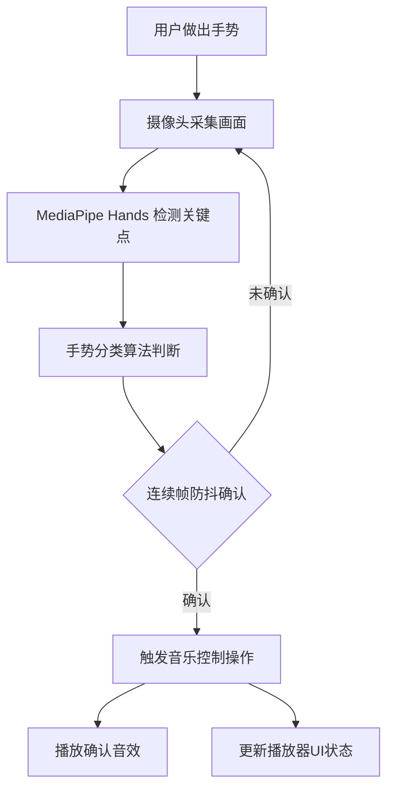

## 1. 产品概述

基于浏览器手势识别的音乐播放器交互应用，用户通过摄像头捕捉手部动作即可控制音乐播放（切换歌曲、调节音量、暂停/播放），无需接触键盘鼠标，特别适合做饭、健身等双手忙碌的场景。

## 2. 核心功能

### 2.1 功能模块
1. **手势识别模块**：通过 MediaPipe Hands 实时检测手部 21 个关键点，识别多种控制手势
2. **音乐播放器模块**：毛玻璃风格的音乐播放器，包含进度条、控制按钮、音量调节
3. **视觉反馈模块**：手势识别浮动标签、按钮交互动画、进度条拖拽效果
4. **音效反馈模块**：手势触发成功时播放短促确认音效

### 2.2 页面详情
| 页面名称 | 模块名称 | 功能描述 |
|-----------|-------------|---------------------|
| 主页面 | 摄像头预览区 | 实时显示摄像头画面，叠加手部关键点可视化 |
| 主页面 | 手势标签 | 画面左上角显示当前识别手势名称，带淡入淡出动画和毛玻璃背景 |
| 主页面 | 播放器卡片 | 毛玻璃风格音乐播放器，包含专辑封面、歌曲信息、进度条、控制按钮 |
| 主页面 | 底部控制栏 | 固定在视口底部的控制按钮栏（上一首/暂停/下一首/音量） |

## 3. 核心流程

### 3.1 手势控制流程
用户在摄像头前做出手势 → MediaPipe Hands 检测手部关键点 → 手势识别算法判断手势类型 → 防抖处理确认手势 → 触发对应音乐控制操作 → 播放确认音效 + 更新 UI 状态

### 3.2 支持的手势
- **张开手掌**：暂停/播放切换
- **食指朝上**：音量 +
- **食指朝下**：音量 -
- **握拳向右挥动**：下一首
- **握拳向左挥动**：上一首

## 4. 用户界面设计

### 4.1 设计风格
- **主色调**：深蓝紫色系（背景 #1a1a2e，卡片 #16213e，强调色 #0f3460，活跃色 #e94560）
- **视觉风格**：深色玻璃拟态（Glassmorphism），半透明毛玻璃卡片，圆角 16px，微弱白色内阴影，backdrop-filter: blur(12px)
- **按钮样式**：圆角按钮，悬停缩放 1.1 倍并改变背景色，点击时有弹性回弹动画（scale 0.95 → 恢复）
- **字体**：白色字体，字号渐变层级，现代无衬线字体
- **全局过渡**：统一 0.3s ease-in-out 过渡动画

### 4.2 页面设计概述
| 页面名称 | 模块名称 | UI 元素 |
|-----------|-------------|-------------|
| 主页面 | 摄像头预览区 | 全屏背景，居中显示，叠加手部关键点骨架 |
| 主页面 | 手势标签 | 左上角浮动，半透明毛玻璃背景，淡入淡出动画，显示当前手势名称 |
| 主页面 | 播放器卡片 | 居中显示，圆角 16px，毛玻璃效果，包含专辑封面（渐变几何图案）、歌曲名、歌手名 |
| 主页面 | 进度条 | 自定义圆角滑块，靛蓝到紫红渐变，拖拽时放大并变色 |
| 主页面 | 底部控制栏 | 固定底部，高度 80px，左右 20px 内边距，四个控制按钮 |

### 4.3 响应式
- 桌面端优先布局，最小宽度 900px
- 避免元素重叠，确保在 900px+ 宽度下正常显示

## 5. 性能需求
- 手势识别帧率 ≥ 25 FPS
- 播放器 UI 响应延迟 < 100ms
- 手势防抖处理，避免误触发
