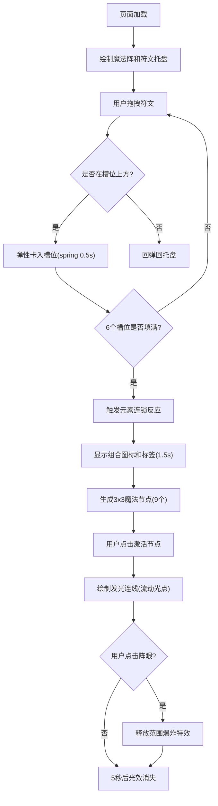

## 1. 产品概述

一个基于Canvas 2D的魔法阵符文排列模拟器，用户通过拖拽火、水、风、土四种符文到六芒星阵眼周围的槽位中，触发元素连锁反应，产生丰富的粒子特效和自定义魔法图案。

- 主要用途：交互式魔法阵模拟、元素组合探索、视觉特效展示
- 目标用户：魔法/炼金术爱好者、视觉效果设计师、互动游戏玩家
- 产品价值：提供沉浸式的元素组合体验，通过精美的粒子动画和连锁反应机制带来视觉愉悦

## 2. 核心特性

### 2.1 功能模块

1. **符文拖拽系统**：底部托盘提供4种可拖拽符文（火、水、风、土），拖拽时带拖尾粒子特效，弹性卡入/回弹动画
2. **六芒星魔法阵**：正六边形阵眼，周围6个符文槽位，带旋转光环和高亮脉冲动画
3. **元素连锁反应**：6个槽位填满后，根据符文排列顺序触发不同的元素融合效果（至少6种组合规则）
4. **魔法图案系统**：连锁反应后生成9个逻辑节点（3x3网格），点击激活节点形成自定义魔法图案，带流动光效
5. **范围爆炸特效**：魔法图案激活期间点击阵眼释放爆炸，100个粒子混合元素颜色
6. **状态信息面板**：左上角显示已放置符文、当前组合名称、可解锁组合提示

### 2.2 页面详情

| 页面名称 | 模块名称 | 功能描述 |
|----------|----------|----------|
| 主画布 | 六芒星魔法阵 | 正六边形，外接圆半径150px，白色线条带发光，中心阵眼 |
| 主画布 | 符文槽位 | 6个均匀分布的圆形槽位，默认灰色空心，带微弱旋转光环，高亮时放大1.2倍+脉冲光芒 |
| 主画布 | 符文托盘 | 底部横向排列4种符文，背景渐变(#2d2d44→#1a1a2e)，边缘发光边框 |
| 主画布 | 拖拽系统 | 符文跟随鼠标，拖尾粒子特效，弹性卡入/回弹(spring动画0.5秒) |
| 主画布 | 连锁反应 | 相邻相同符文强化、不同符文两两组合，阵眼显示组合图标+标签(缩放淡入1.5秒) |
| 主画布 | 魔法图案 | 9个节点3x3网格，点击激活收缩闪烁，发光连线带流动光点(2圈/秒)，持续5秒 |
| 主画布 | 爆炸特效 | 阵眼点击释放，100粒子混合颜色，最大半径250px，持续0.8秒 |
| 状态面板 | 信息展示 | 6个符文小图标矩阵、当前组合名称、3种推荐组合提示 |

## 3. 核心流程

## 4. 用户界面设计

### 4.1 设计风格

- **主色调**：深色背景 #1a1a2e，白色线条 #ffffff
- **符文颜色**：火-红色 #ff4444，水-蓝色 #4488ff，风-绿色 #44ff88，土-棕色 #aa7744
- **魔法阵发光**：白色带模糊光晕效果
- **托盘背景**：渐变色 从#2d2d44到#1a1a2e
- **状态面板**：半透明黑色背景(透明度0.3)，白色文字
- **字体**：14px，无衬线字体
- **动画**：所有过渡60fps，特效持续不超过2秒

### 4.2 页面设计概览

| 页面名称 | 模块名称 | UI元素 |
|----------|----------|--------|
| 主画布 | 魔法阵 | 正六边形、中心阵眼、6个槽位、周围散布闪烁光点 |
| 主画布 | 符文 | 40x40像素，火焰/水滴/旋风/岩石几何图标 |
| 主画布 | 粒子特效 | 拖尾粒子、爆炸粒子、流动光点、雾气/火花/藤蔓/沙尘 |
| 状态面板 | 信息展示 | 6个符文小图标矩阵、组合名称、3种推荐组合 |
| 底部托盘 | 符文选择 | 渐变背景、发光边框、4种符文横向排列 |

### 4.3 响应式设计

- 画布大小随窗口变化重新调整
- 魔法阵保持居中且比例不变
- 最小画面尺寸480x320像素
- 支持鼠标拖拽操作（桌面端）

## 5. 元素组合规则

| 组合 | 触发条件 | 效果描述 | 图标 |
|------|----------|----------|------|
| 烈焰 | 火+火 | 阵眼喷射大型火焰柱 | 红色火焰 |
| 洪流 | 水+水 | 阵眼涌出蓝色水流漩涡 | 蓝色水波 |
| 风暴 | 风+风 | 阵眼产生绿色旋风 | 绿色旋风 |
| 山岳 | 土+土 | 阵眼隆起棕色岩石 | 棕色岩石 |
| 蒸汽 | 水+火 | 白色雾气粒子向上升腾 | 白色雾气 |
| 星火 | 火+风 | 金色火花向四周爆裂 | 金色火花 |
| 植被 | 水+土 | 绿色藤蔓生长动画 | 绿色藤蔓 |
| 沙尘 | 风+土 | 棕色沙尘粒子旋风 | 棕色沙尘 |
