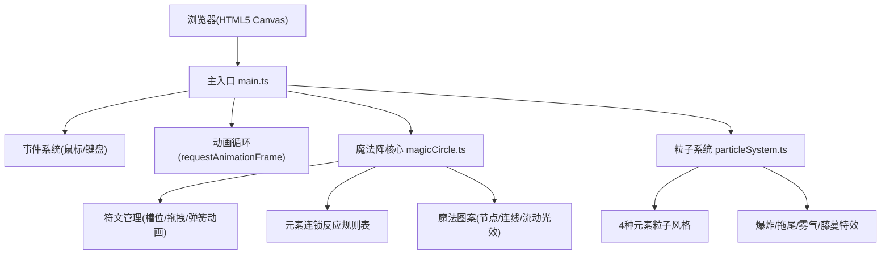

## 1. 架构设计



## 2. 技术描述

- **前端框架**: 原生 TypeScript + Canvas API (无React/Vue框架)
- **构建工具**: Vite 5.x
- **开发语言**: TypeScript (严格模式, target ES2020, module ESNext)
- **包管理器**: npm
- **启动方式**: npm run dev (Vite开发服务器, 端口5173)

## 3. 项目文件结构

| 文件路径 | 用途 |
|----------|------|
| /package.json | 项目依赖(vite, typescript)和脚本配置 |
| /vite.config.js | Vite配置：输出目录dist，端口5173 |
| /tsconfig.json | TypeScript配置：严格模式，target ES2020 |
| /index.html | 入口页面：Canvas容器 + 脚本引入 |
| /src/main.ts | 主入口：Canvas初始化、事件绑定、动画循环 |
| /src/core/magicCircle.ts | 核心逻辑：阵眼/符文/规则表/碰撞检测/渲染 |
| /src/core/particleSystem.ts | 粒子系统：4种风格粒子特效 |

## 4. 核心数据结构

### 4.1 符文类型

```typescript
type RuneType = 'fire' | 'water' | 'wind' | 'earth';

interface Rune {
    type: RuneType;
    x: number;
    y: number;
    targetX: number;
    targetY: number;
    velX: number;
    velY: number;
    isDragging: boolean;
    isAnimating: boolean;
    color: string;
}
```

### 4.2 槽位

```typescript
interface Slot {
    index: number;
    x: number;
    y: number;
    radius: number;
    rune: Rune | null;
    isHighlighted: boolean;
    pulsePhase: number;
}
```

### 4.3 粒子

```typescript
interface Particle {
    x: number;
    y: number;
    vx: number;
    vy: number;
    life: number;
    maxLife: number;
    color: string;
    size: number;
    type: 'fire' | 'water' | 'wind' | 'earth' | 'spark' | 'fog' | 'vine' | 'dust' | 'explosion';
}
```

### 4.4 魔法图案节点

```typescript
interface MagicNode {
    index: number;
    x: number;
    y: number;
    isActive: boolean;
    shrinkPhase: number;
    blinkPhase: number;
}
```

## 5. 元素组合规则表

```typescript
const COMBINATION_RULES = {
    'fire+fire': { name: '烈焰', icon: '🔥', effect: 'flamePillar', color: '#ff4444' },
    'water+water': { name: '洪流', icon: '💧', effect: 'waterVortex', color: '#4488ff' },
    'wind+wind': { name: '风暴', icon: '🌪️', effect: 'windStorm', color: '#44ff88' },
    'earth+earth': { name: '山岳', icon: '🪨', effect: 'rockRise', color: '#aa7744' },
    'water+fire': { name: '蒸汽', icon: '♨️', effect: 'steamFog', color: '#ffffff' },
    'fire+water': { name: '蒸汽', icon: '♨️', effect: 'steamFog', color: '#ffffff' },
    'fire+wind': { name: '星火', icon: '✨', effect: 'sparkBurst', color: '#ffd700' },
    'wind+fire': { name: '星火', icon: '✨', effect: 'sparkBurst', color: '#ffd700' },
    'water+earth': { name: '植被', icon: '🌿', effect: 'vineGrowth', color: '#22aa44' },
    'earth+water': { name: '植被', icon: '🌿', effect: 'vineGrowth', color: '#22aa44' },
    'wind+earth': { name: '沙尘', icon: '🌫️', effect: 'dustDevil', color: '#cc9966' },
    'earth+wind': { name: '沙尘', icon: '🌫️', effect: 'dustDevil', color: '#cc9966' },
};
```

## 6. 性能优化策略

- **粒子数量控制**：特效爆发时不超过200个粒子
- **特效持续时间**：单次特效不超过2秒
- **帧率目标**：常规≥60fps，特效密集≥30fps
- **Canvas渲染优化**：使用requestAnimationFrame，避免重绘未变化区域
- **响应式**：画布尺寸基于窗口大小，最小480x320，保持魔法阵居中
