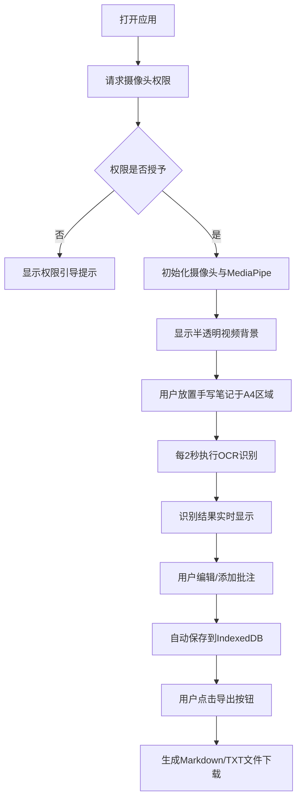

## 1. 产品概述

NoteSnap 是一款基于浏览器的实时手写笔记识别应用，通过摄像头捕捉用户手写内容并自动转换为可编辑数字文本，解决会议、课堂场景下纸质笔记手动转录的效率痛点。

- 核心目标：实现纸质手写笔记的"即写即数字化"，降低转录时间成本
- 目标用户：学生、职场人士、会议记录者等有大量手写笔记需求的群体
- 市场价值：纯前端轻量应用，无需安装，浏览器打开即用，数据本地存储保障隐私

## 2. 核心功能

### 2.1 功能模块

1. **实时摄像头背景层**：半透明画布铺满全屏，显示摄像头实时画面
2. **A4书写区域**：中央白色纸张区域，带纹理和阴影效果
3. **自动OCR识别**：每2秒对书写区域进行文字识别，使用Tesseract.js
4. **文字编辑与标注**：双击单词编辑、手势圈选添加批注
5. **本地持久化**：IndexedDB自动保存所有编辑和批注
6. **导出功能**：支持导出为Markdown和TXT格式

### 2.2 功能详情

| 页面名称 | 模块名称 | 功能描述 |
|---------|---------|---------|
| 主页 | 顶部导航栏 | Logo展示、设置按钮、导出按钮、清空按钮 |
| 主页 | 摄像头背景层 | 半透明实时视频流（60%透明度），铺满全屏 |
| 主页 | A4书写区域 | 中央白色区域，纸张纹理，圆角阴影 |
| 主页 | 识别文本框 | 书写区域下方，实时显示OCR结果，高度自适应，平滑过渡 |
| 主页 | 单词编辑浮层 | 双击单词弹出毛玻璃编辑框，回车确认更新 |
| 主页 | 手势圈选批注 | MediaPipe检测食指圈选，高亮区域，可拖动批注框 |
| 主页 | 导出功能 | Markdown/TXT导出，按钮弹性动画，成功音效 |

## 3. 核心流程

用户打开应用 → 授权摄像头权限 → 摄像头画面铺满半透明背景 → 将手写笔记置于A4区域 → 系统每2秒自动OCR识别 → 识别结果实时显示在下方文本框 → 用户可双击编辑单词/手势圈选添加批注 → 所有内容自动保存到IndexedDB → 用户点击导出按钮获取Markdown/TXT文件

## 4. 用户界面设计

### 4.1 设计风格

- **主色调**：深灰 #2D2D2D、柔白 #F5F0EB
- **强调色**：低饱和度蓝 #5B7FA5
- **字体**：Google Fonts，手写体Logo + 易读正文
- **导航栏**：固定高度56px，顶部悬浮
- **按钮风格**：圆角图标按钮，悬浮背景色渐变动画（0.2s过渡）
- **动画过渡**：所有交互元素显隐和位移使用0.3s ease-out缓动
- **设计风格**：极简主义，注重留白与精致细节

### 4.2 页面设计概览

| 页面名称 | 模块名称 | UI元素 |
|---------|---------|---------|
| 主页 | 导航栏 | Logo（手写体NoteSnap + 墨水飞溅动效）、设置图标、导出图标、清空图标 |
| 主页 | 摄像头层 | Canvas全屏，透明度60%，视频流实时渲染 |
| 主页 | A4书写区 | 白色背景、CSS纸张纹理（伪元素）、圆角、柔和阴影、居中定位 |
| 主页 | 识别文本框 | 白色背景、微蓝下划线光标指示、高度自适应扩展、平滑过渡动画 |
| 主页 | 单词编辑浮层 | 毛玻璃背景（backdrop-filter）、从单词位置弹出动画、输入框 |
| 主页 | 批注框 | 半透明蓝色边框、可拖动、支持输入备注 |
| 主页 | 导出按钮 | 按下收缩弹起弹性动画、成功提示短促和弦音效 |

### 4.3 响应式设计

- **桌面/平板（≥768px）**：布局一致，A4区域固定尺寸
- **移动端（<768px）**：A4区域缩放至90%宽度并居中，导航栏图标增加触摸反馈（点击缩放0.95）
- **触摸优化**：所有交互元素支持触摸操作，按钮最小触控区域44px

## 5. 性能要求

| 指标 | 要求 |
|-----|-----|
| 摄像头帧率 | ≥15fps |
| OCR单次识别耗时 | ≤3秒（平均2秒） |
| 编辑/批注响应时间 | <100ms |
| 连续运行30分钟内存占用 | ≤300MB |
