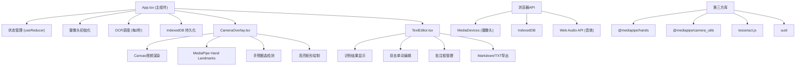

## 1. 架构设计



## 2. 技术选型说明

| 技术 | 版本 | 用途 |
|-----|-----|-----|
| React | 18.x | UI框架 |
| TypeScript | 5.x | 类型安全 |
| Vite | 5.x | 构建工具与开发服务器 |
| @mediapipe/hands | latest | 手部关键点检测 |
| @mediapipe/camera_utils | latest | 摄像头工具封装 |
| tesseract.js | latest | OCR文字识别（通过CDN加载） |
| uuid | latest | 唯一ID生成 |

## 3. 项目文件结构

```
/
├── index.html                    # 入口HTML，加载Google Fonts
├── package.json                  # 依赖管理
├── tsconfig.json                 # TypeScript配置
├── vite.config.js                # Vite配置
└── src/
    ├── main.tsx                  # React入口
    ├── App.tsx                   # 主组件（状态管理、调度中心）
    ├── styles.css                # 全局样式
    └── components/
        ├── CameraOverlay.tsx     # 摄像头画布组件
        └── TextEditor.tsx        # 文本编辑器组件
```

## 4. 状态管理设计

使用 `useReducer` 集中管理应用状态：

```typescript
interface AppState {
  cameraStream: MediaStream | null;
  isCameraReady: boolean;
  recognizedText: string;
  annotations: Annotation[];
  editedWords: EditedWord[];
  isOcrProcessing: boolean;
  lastOcrTime: number;
  selectedRegion: SelectionRegion | null;
}

interface Annotation {
  id: string;
  x: number;
  y: number;
  width: number;
  height: number;
  text: string;
}

interface EditedWord {
  id: string;
  wordIndex: number;
  originalText: string;
  editedText: string;
}

interface SelectionRegion {
  startX: number;
  startY: number;
  endX: number;
  endY: number;
}
```

## 5. 核心数据模型（IndexedDB）

### 数据库名称：`notesnap_db`

| Object Store | Key | 字段 |
|-------------|-----|-----|
| `documents` | `id` | id, text, annotations, editedWords, createdAt, updatedAt |
| `settings` | `key` | key, value |

### 数据结构

```typescript
interface StoredDocument {
  id: string;
  text: string;
  annotations: Annotation[];
  editedWords: EditedWord[];
  createdAt: number;
  updatedAt: number;
}
```

## 6. 关键技术实现方案

### 6.1 摄像头与MediaPipe集成
- 使用 `navigator.mediaDevices.getUserMedia` 获取视频流
- 通过 `@mediapipe/camera_utils` 的 Camera 类封装视频输入
- MediaPipe Hands 检测手部21个关键点，识别食指指尖位置
- 检测食指触摸状态（指尖与拇指距离阈值判断），触发圈选开始/结束

### 6.2 OCR识别调度
- 每2秒从Canvas截取A4书写区域图像
- 使用 Tesseract.js（CDN加载）识别中英文
- 识别过程不阻塞UI，异步更新状态
- 防抖处理：正在识别时跳过本次调度

### 6.3 文字编辑交互
- 识别文本按空格分词，每个单词渲染为可点击span
- 双击单词触发编辑浮层，定位到单词位置
- 浮层使用 `backdrop-filter: blur()` 实现毛玻璃效果
- 回车确认更新，ESC取消

### 6.4 手势圈选与批注
- MediaPipe检测食指按下状态（连续N帧指尖稳定）
- 记录起点，实时跟随指尖绘制高亮矩形
- 抬起时生成批注框，默认位置在圈选区域下方
- 批注框支持鼠标/触摸拖动，内容可编辑

### 6.5 导出功能
- **Markdown导出**：正文文本 + 批注以 `> ` 引用块形式嵌入对应位置
- **TXT导出**：纯文本 + 批注以 `【批注：xxx】` 形式插入
- 使用 Web Audio API 生成两个正弦波叠加的短促和弦音效
- 按钮使用 CSS `transform: scale()` 实现按下弹起动画

## 7. 性能优化策略

| 优化点 | 方案 |
|-------|-----|
| 摄像头帧率 | Canvas使用 `requestAnimationFrame` 渲染，目标30fps |
| OCR性能 | 只裁剪A4区域识别，Tesseract使用worker线程 |
| 内存管理 | OCR完成后及时释放canvas临时图像，MediaPipe结果不累积 |
| 渲染性能 | 使用CSS transform实现动画，避免重排重绘 |
| IndexedDB | 批量写入，防抖保存（300ms延迟合并多次变更） |
