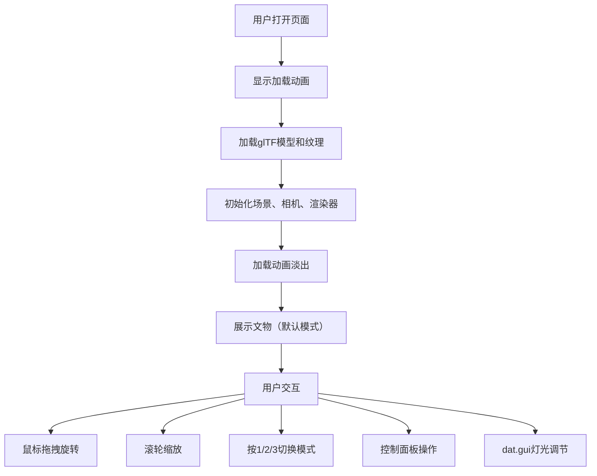

## 1. 产品概述
3D文物探微观察应用，为博物馆数字化展览提供沉浸式交互体验，让参观者能够从任意角度查看古代陶器上的纹理细节和岁月痕迹，无需实际接触文物。

- 目标用户：博物馆策展人、文物研究者、参观者
- 产品价值：保护文物的同时提供高清细节观察体验，支持多种专业观察模式

## 2. 核心功能

### 2.1 功能模块
1. **3D场景渲染模块**：古埃及彩陶罐模型、HDRI环境光照、PCF软阴影、深灰渐变背景
2. **交互控制模块**：鼠标拖拽旋转（角度限制）、滚轮缩放、法线悬停提示、平滑阻尼跟随
3. **观察模式模块**：表面微距模式（SSAO+相机拉近）、X光透视模式（半透明+线框）、年代演化模式（裂纹+粒子）
4. **灯光控制模块**：聚光灯调节（方位角、俯仰角、强度、色温），平滑过渡动画
5. **UI控制面板**：文物信息展示、拓片生成、模式切换、毛玻璃浮动面板
6. **加载动画模块**：环形进度条、渐变色、加载完成淡出

### 2.2 页面详情
| 页面名称 | 模块名称 | 功能描述 |
|-----------|-------------|---------------------|
| 主界面 | 3D渲染区 | 全屏canvas，展示文物3D模型，支持鼠标交互 |
| 主界面 | 标题区 | 左上角"文物探微"衬线字体标题，悬浮显示 |
| 主界面 | 控制面板 | 右上角毛玻璃面板，文物信息+拓片按钮+模式切换 |
| 主界面 | 加载层 | 居中环形进度条，显示"正在解析纹理..." |
| 主界面 | dat.gui面板 | 灯光参数实时调节 |

## 3. 核心流程

### 3.1 主要用户流程
用户打开页面 → 显示加载动画 → 模型加载完成动画淡出 → 默认模式展示文物 → 鼠标拖拽旋转/滚轮缩放观察 → 按1/2/3切换观察模式 → 使用控制面板功能 → 通过dat.gui调节灯光

### 3.2 流程图

## 4. 用户界面设计

### 4.1 设计风格
- 主色：#1a1a1a（深黑），辅色：#2d2d2d（深灰），强调色：#c9a84c（古铜色）
- 深色主题，博物馆展柜氛围
- 毛玻璃效果（backdrop-filter: blur(8px)），圆角16px
- 衬线字体用于标题，营造文化质感
- 快速弹性动画：cubic-bezier(0.34, 1.56, 0.64, 1)，250ms

### 4.2 页面设计概述
| 页面名称 | 模块名称 | UI元素 |
|-----------|-------------|-------------|
| 主界面 | 3D渲染区 | 全屏canvas，深灰渐变背景，HDRI光照，柔和阴影 |
| 主界面 | 标题区 | 衬线字体"文物探微"，白色半透明，左上角40px悬浮 |
| 主界面 | 控制面板 | 右上角固定，毛玻璃背景，圆角16px，文物信息卡片+按钮 |
| 主界面 | 加载层 | 居中环形进度条，渐变色#c9a84c→#e5d4a0，文字提示 |
| 主界面 | dat.gui | 标准dat.gui面板样式，灯光参数控制 |

### 4.3 响应式设计
- 桌面优先设计，适配1366x768至1920x1080分辨率
- 控制面板响应式调整宽度和位置
- 鼠标交互为主，支持基础触控

### 4.4 3D场景设计
- 环境：HDRI天空盒模拟博物馆射灯，深灰渐变背景模拟展柜内部
- 光照：聚光灯（4500K暖色，强度1.2，角度30度，右上方45度），环境光
- 相机：PerspectiveCamera，以文物为轴心圆周运动，阻尼系数0.15平滑跟随
- 构图：文物居中展示，底座柔和阴影，鼠标悬停法线提示箭头
- 后处理：SSAO（半分辨率）、年代演化粒子系统（≤2000粒子）
- 性能约束：60fps，模型≤3万面，响应延迟≤50ms
