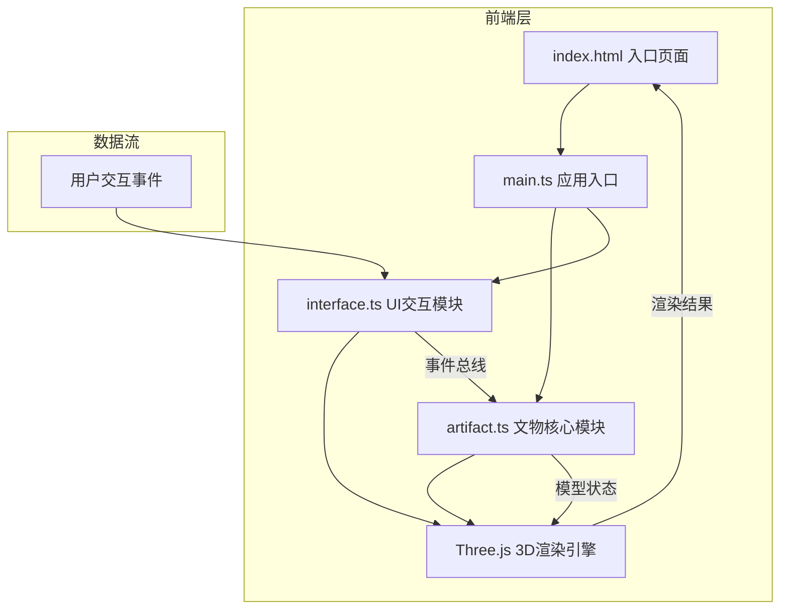

## 1. 架构设计



## 2. 技术描述
- 前端框架：原生TypeScript（无框架）
- 3D引擎：Three.js
- 构建工具：Vite
- UI组件：dat.gui（灯光参数）+ 原生HTML/CSS（控制面板）
- 后端：无（纯前端应用）

### 2.1 文件结构与职责
| 文件路径 | 职责 | 调用关系 |
|-----------|------|----------|
| package.json | 项目依赖与脚本配置 | - |
| vite.config.js | Vite构建配置（dist输出，端口5173，HMR） | - |
| tsconfig.json | TypeScript编译配置（严格模式，ES2020，ESNext模块） | - |
| index.html | 入口页面（全屏canvas容器，loading提示） | - |
| src/main.ts | 应用入口：初始化场景/相机/渲染器，加载模型，启动交互循环 | 调用artifact.ts加载模型，调用interface.ts初始化UI |
| src/artifact.ts | 文物核心模块：加载glTF模型，PBR材质，风化纹理，法线贴图，观察模式逻辑 | 被main.ts调用，通过事件总线与interface.ts通信 |
| src/interface.ts | UI交互模块：浮动控制面板，缩放/旋转/灯光调节，观察模式切换，拓片功能 | 被main.ts调用，通过事件总线与artifact.ts通信 |

### 2.2 数据流向
1. 初始化：main.ts → 创建Three.js场景/相机/渲染器
2. 模型加载：main.ts → artifact.ts.loadModel() → 加载glTF → 应用材质 → 返回模型对象
3. UI初始化：main.ts → interface.ts.initUI() → 创建DOM面板 → 绑定事件
4. 交互循环：用户事件 → interface.ts → 事件总线 → artifact.ts更新状态 → 渲染循环重绘
5. 渲染输出：Three.js渲染器 → canvas → DOM显示

## 3. 核心模块接口

### artifact.ts 导出接口
```typescript
export interface ArtifactState {
  mode: 'normal' | 'macro' | 'xray' | 'evolution';
  scale: number;
  rotation: { x: number; y: number };
  rubbingsMode: boolean;
}

export class Artifact {
  constructor(scene: THREE.Scene, camera: THREE.PerspectiveCamera);
  loadModel(onProgress?: (p: number) => void): Promise<THREE.Group>;
  setMode(mode: ArtifactState['mode']): void;
  setScale(scale: number): void;
  setRotation(x: number, y: number): void;
  toggleRubbings(): void;
  updateHoverNormal(intersect: THREE.Intersection | null): void;
  update(delta: number): void;
  dispose(): void;
}
```

### interface.ts 导出接口
```typescript
export interface UIEventMap {
  modeChange: 'normal' | 'macro' | 'xray' | 'evolution';
  scaleChange: number;
  rotationChange: { x: number; y: number };
  rubbingsToggle: boolean;
  lightChange: { azimuth: number; polar: number; intensity: number; temp: number };
}

export class UIInterface {
  constructor();
  init(artifact: Artifact, gui: dat.GUI): void;
  on<K extends keyof UIEventMap>(event: K, handler: (data: UIEventMap[K]) => void): void;
  showLoading(progress: number): void;
  hideLoading(): void;
  dispose(): void;
}
```

## 4. 性能优化策略
- 使用renderer.setAnimationLoop控制渲染，保持60fps
- SSAO使用半分辨率渲染
- 粒子系统粒子数限制≤2000
- 模型面数控制≤3万面
- 平滑动画使用requestAnimationFrame+缓动函数
- 材质切换使用材质克隆避免重编译
