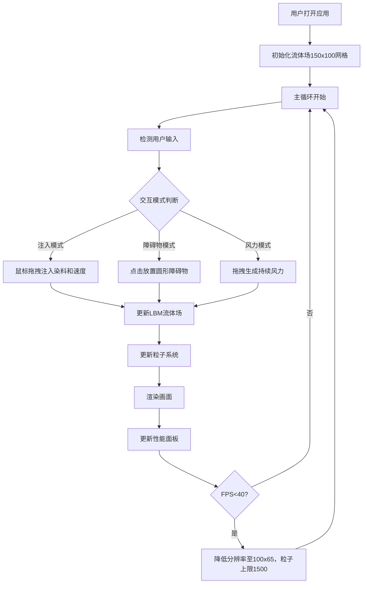

## 1. 产品概述

基于HTML5 Canvas的实时二维流体力学沙盒应用，用户可通过鼠标和键盘与流体场进行交互，观察流体流动、混合和绕流等物理现象。适用于物理模拟爱好者和游戏开发者。

- 核心目标：在浏览器中实现高性能、可交互的LBM流体模拟，呈现直观的物理视觉效果
- 目标用户：物理模拟爱好者、游戏开发者、教育场景

## 2. 核心功能

### 2.1 功能模块

1. **流体模拟主画布**：LBM算法流体场、粒子染料系统、障碍物渲染、风力效果
2. **交互系统**：注入模式、障碍物模式、风力模式切换
3. **UI控制面板**：性能面板、设置面板、模式提示、清空画布

### 2.2 页面详情

| 页面名称 | 模块名称 | 功能描述 |
|-----------|-------------|---------------------|
| 主界面 | 流体画布 | 150x100网格LBM流体模拟，dt=0.02s，粘度0.01，不可压缩 |
| 主界面 | 粒子系统 | 染料粒子半径2px，半透明0.6，上限3000个，HSV色轮循环 |
| 主界面 | 交互模式 | 注入模式(I)/障碍物模式(O)/风力模式(W)切换 |
| 主界面 | 性能面板 | FPS、粒子数量、模拟耗时，磨砂玻璃背景 |
| 主界面 | 设置面板 | 粒子衰减(0.8-1.0)、粘度(0.001-0.1)、重力方向、清空画布 |

## 3. 核心流程

## 4. 用户界面设计

### 4.1 设计风格

- **主色调**：背景 #0a0a1a，控件渐变 #2a2a4e → #4a4a6e，激活色 #00d4ff，文字 #e0e0ff
- **整体风格**：暗色科幻风格，网格背景，发光效果
- **字体**：Orbitron（标题）
- **按钮风格**：圆角矩形，hover时scale 1.05+发光，点击时scale 0.95弹性反馈
- **背景**：深色半透明网格（网格间距10px，#1a1a2e，透明度0.3）

### 4.2 页面设计概览

| 页面名称 | 模块名称 | UI元素 |
|-----------|-------------|-------------|
| 主界面 | 标题区域 | 左上角"流体沙盒"文字 + SVG流量波纹icon（12s旋转） |
| 主界面 | 性能面板 | 左下角，磨砂玻璃(blur 8px)，显示FPS/粒子数/耗时 |
| 主界面 | 设置面板 | 右上角齿轮图标展开，滑出动画0.3s |
| 主界面 | 模式提示 | 屏幕中央，图标+文字，渐入渐出1.5s |
| 主界面 | 画布 | 全屏Canvas，深色网格背景 |

### 4.3 响应式设计

- 桌面端优先（desktop-first）
- 当视口高度 < 600px时，隐藏侧边面板，底部固定栏显示精简信息（仅FPS和粒子数量）
