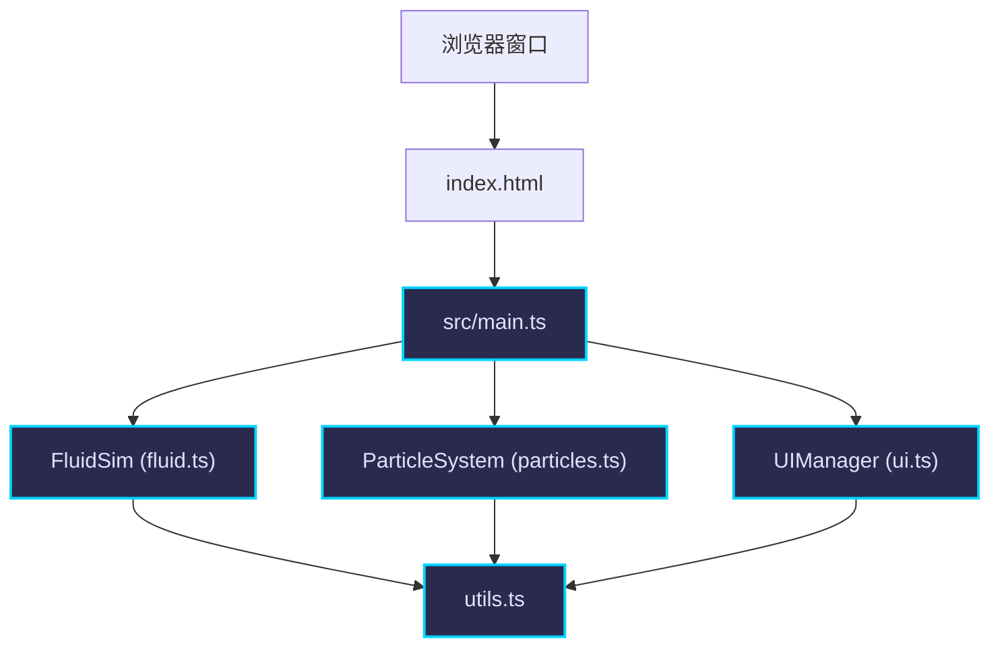

## 1. 架构设计



## 2. 技术描述

- **前端框架**：纯TypeScript + HTML5 Canvas（无需React/Vue，按用户要求）
- **构建工具**：Vite 5.x
- **语言**：TypeScript（严格模式，target ES2020，module ESNext）
- **字体**：Google Fonts - Orbitron
- **物理算法**：格子玻尔兹曼方法(LBM)求解纳维-斯托克斯方程

## 3. 项目文件结构

| 文件路径 | 用途 |
|---------|------|
| /package.json | 项目配置，依赖vite, typescript |
| /vite.config.js | Vite配置，端口5173，输出dist |
| /tsconfig.json | TypeScript严格模式配置 |
| /index.html | 入口页面，全屏Canvas，引入字体 |
| /src/main.ts | 主入口，初始化、事件绑定、主循环 |
| /src/fluid.ts | FluidSim类，LBM流体模拟核心 |
| /src/particles.ts | ParticleSystem类，染料粒子系统 |
| /src/ui.ts | UIManager类，UI渲染和交互 |
| /src/utils.ts | 工具函数：HSV转RGB、向量运算等 |

## 4. 核心数据结构

### 4.1 流体网格数据

```typescript
interface FluidCell {
  vx: number;      // x方向速度
  vy: number;      // y方向速度
  density: number; // 密度
  pressure: number; // 压力
}
```

### 4.2 粒子数据

```typescript
interface Particle {
  x: number;     // 位置x
  y: number;     // 位置y
  vx: number;    // 速度x
  vy: number;    // 速度y
  life: number;  // 生命值 0-1
  color: { r: number; g: number; b: number };
  size: number;  // 半径
}
```

### 4.3 障碍物数据

```typescript
interface Obstacle {
  x: number;
  y: number;
  radius: number;
}
```

### 4.4 风力数据

```typescript
interface Wind {
  x: number;
  y: number;
  vx: number;
  vy: number;
  life: number;    // 剩余时间
  maxLife: number; // 总时间
}
```

## 5. 性能优化策略

- **自适应分辨率**：FPS < 40时，网格从150x100降至100x65
- **粒子池限制**：初始上限3000，降帧后减至1500
- **requestAnimationFrame**：与浏览器刷新率同步
- **TypedArray**：使用Float32Array存储网格数据提高性能
- **离屏渲染**：静态元素预渲染减少重复绘制
