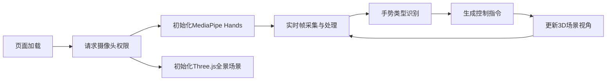

## 1. 产品概述
基于浏览器摄像头的手势控制全景地图浏览应用，用户通过自然手势（举手、握拳、滑动、捏合）实现360度全景场景的旋转、缩放和平移交互。
- 目标用户：需要沉浸式全景浏览体验的用户，对新颖交互方式感兴趣的技术爱好者
- 产品价值：提供零接触、直观自然的全景浏览交互方式，无需鼠标键盘即可操控3D场景

## 2. 核心功能

### 2.1 功能模块
1. **全景浏览主界面**：360度全景场景渲染、手势名称显示、摄像头预览窗口、底部手势提示栏
2. **手势识别模块**：MediaPipe Hands手部关键点检测、多种手势类型识别（张开手掌、握拳、滑动、捏合缩放）
3. **3D场景控制模块**：全景场景旋转控制、缩放控制、平移控制、自动浏览模式、快照旋转效果

### 2.2 页面详情
| 页面名称 | 模块名称 | 功能描述 |
|-----------|-------------|---------------------|
| 主页面 | 全景场景 | Three.js球体纹理渲染360度城市夜景全景，支持旋转、缩放、平移 |
| 主页面 | 手势识别 | 实时识别张开手掌、握拳、左右滑动、捏合缩放等手势 |
| 主页面 | 摄像头预览 | 右下角150x100像素小窗显示摄像头画面（移动端左上角120x90） |
| 主页面 | 手势名称标签 | 左上角显示当前识别手势名称，毛玻璃背景+淡入淡出动画 |
| 主页面 | 底部提示栏 | 半透明控制提示栏，显示三种手势图标及说明，点击播放演示动画 |

## 3. 核心流程
页面加载 → 请求摄像头权限 → 初始化MediaPipe Hands和Three.js场景 → 实时采集摄像头帧 → 手势识别分析 → 手势指令驱动全景场景更新

## 4. 用户界面设计

### 4.1 设计风格
- **主色调**：背景色 #0a0a12（深暗色），强调色 #4fc3f7（浅蓝）
- **字体**：使用现代无衬线字体，标签文字白色+浅蓝描边
- **毛玻璃效果**：手势名称标签使用 rgba(10,10,18,0.6) 背景 + 8px 模糊
- **图标风格**：线性图标（白色，1.5px描边）

### 4.2 交互效果
- **张开手掌保持3秒**：进入自动浏览模式（每秒10度缓慢旋转），画面四周出现渐变暗角（边缘亮度降低20%）
- **握拳移动**：场景水平旋转，速度与拳头移动速度成正比（最大60度/秒），停止后惯性持续1秒衰减
- **捏合缩放**：双手食指拇指捏合后拉开，平滑缩放（0.5x-2.0x，指数插值0.3秒），中心半透明焦点圆点
- **快速滑动**：水平速度>150px/秒触发90度快照旋转（0.4秒动画+镜头模糊效果）

### 4.3 响应式设计
- **桌面端**：摄像头小窗右下角150x100像素
- **移动端（竖屏）**：摄像头小窗移至左上角，尺寸缩小为120x90像素
- **所有界面元素**：自适应布局，适配各种屏幕尺寸

### 4.4 3D场景指引
- **环境**：球体内部映射360度城市夜景纹理
- **相机**：PerspectiveCamera，位于球体中心，支持Y轴旋转和FOV缩放
- **动画**：所有动画以60fps平滑插值，旋转惯性、缩放过渡、快照旋转效果
- **后处理**：暗角效果（自动浏览模式）、镜头模糊（快照旋转时）

### 4.5 性能要求
- 3D场景渲染帧率：55-60FPS
- 手势识别延迟：≤50ms
- 摄像头预览帧率：≥20FPS
