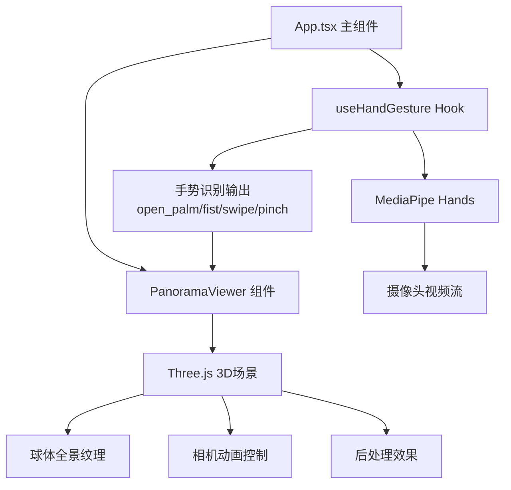

## 1. 架构设计



## 2. 技术描述
- **前端框架**：React 18 + TypeScript
- **构建工具**：Vite 5
- **3D渲染**：Three.js（原生three库，非@react-three/fiber）
- **手势识别**：MediaPipe Hands + @mediapipe/camera_utils（通过CDN加载WASM）
- **状态管理**：React Hooks（useState/useRef/useEffect），无需额外状态库

## 3. 项目文件结构
```
auto54/
├── package.json
├── vite.config.js
├── tsconfig.json
├── index.html
└── src/
    ├── App.tsx
    ├── hooks/
    │   └── useHandGesture.ts
    └── components/
        └── PanoramaViewer.tsx
```

## 4. 核心模块说明

### 4.1 useHandGesture Hook
职责：封装MediaPipe Hands初始化、帧处理、手势识别逻辑
- 输入：无（内部调用getUserMedia获取摄像头）
- 输出：
  - `gesture: string` - 当前手势类型（open_palm/fist/swipe_left/swipe_right/pinch）
  - `handLandmarks: NormalizedLandmark[]` - 手部21个关键点坐标
  - `handVelocity: {x:number, y:number}` - 手部移动速度（px/s）
  - `pinchDistance: number` - 拇指食指捏合距离（像素）
  - `videoRef: React.RefObject<HTMLVideoElement>` - 视频元素引用

### 4.2 PanoramaViewer 组件
职责：Three.js 3D全景渲染与手势驱动控制
- Props：
  - `gesture: string` - 当前手势
  - `handData: Object` - 手部数据（位置、速度、捏合距离等）
- 内部状态：
  - 相机旋转角度（目标值+当前插值）
  - 缩放FOV（目标值+当前插值）
  - 自动浏览模式开关
  - 旋转角速度（含惯性衰减）
- 渲染效果：
  - 球体全景纹理（城市夜景base64）
  - 暗角效果（自动浏览模式）
  - 镜头模糊（快照旋转）
  - 中心焦点圆点（缩放时）

### 4.3 App.tsx 主组件
职责：整合各模块，管理UI界面
- 协调摄像头初始化和MediaPipe启动
- 将useHandGesture输出传递给PanoramaViewer
- 渲染UI：手势名称标签、摄像头预览窗、底部提示栏
- 响应式布局适配

## 5. 手势识别算法
基于MediaPipe Hands 21个关键点计算：
- **张开手掌(open_palm)**：五指均伸直，指尖与手掌距离>阈值
- **握拳(fist)**：五指均弯曲，指尖靠近掌心
- **滑动(swipe_left/right)**：fist状态下水平速度>150px/s
- **捏合(pinch)**：拇指尖(4)与食指尖(8)距离<30px

## 6. 动画与插值
- 所有相机参数使用 requestAnimationFrame + 线性/指数插值平滑过渡
- 旋转惯性：停止移动后角速度线性衰减（1秒内归零）
- 缩放过渡：指数插值 easeOutExpo，过渡时间0.3秒
- 快照旋转：90度目标角度，easeInOutQuad插值0.4秒
