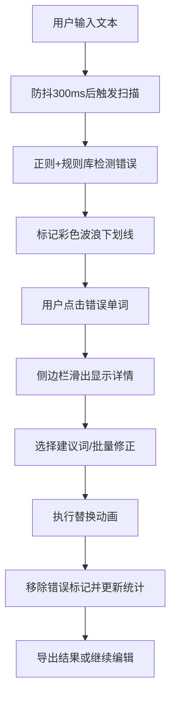

## 1. 产品概述

交互式英语写作批改工作台，专为在线英语教师设计，提供实时拼写纠错和语法建议功能。支持交互式逐词点选、错误统计展示和批量修正，解决传统在线批改工具无法在课堂上直观展示常见错误类型的痛点。

- 目标用户：在线英语教师及学生
- 核心价值：通过可视化错误标记和交互式批改，提升英语写作教学效率和学习体验

## 2. 核心功能

### 2.1 用户角色

| 角色 | 注册方式 | 核心权限 |
|------|----------|----------|
| 教师用户 | 无需注册，直接使用 | 输入文本、标记错误、批量修正、导出结果 |
| 学生用户 | 无需注册，直接使用 | 查看错误标记、接受建议、学习改进 |

### 2.2 功能模块

1. **主编辑器页面**：文本输入区域、错误实时标记、浮动工具栏
2. **错误详情侧边栏**：错误列表、替换建议、错误统计、饼图展示
3. **工具栏操作区**：批量修正、导出功能、手动标记

### 2.3 页面详情

| 页面名称 | 模块名称 | 功能描述 |
|-----------|-------------|---------------------|
| 主编辑器页面 | 文本编辑区 | 支持中英文混合输入，仅检测英文单词错误 |
| 主编辑器页面 | 错误标记层 | 彩色波浪下划线标识不同错误类型，支持点击选择 |
| 主编辑器页面 | 浮动工具栏 | 选中文本后出现，支持手动标记为错误 |
| 错误详情侧边栏 | 错误列表 | 展示所有错误，支持点击跳转和高亮 |
| 错误详情侧边栏 | 替换建议 | 每条错误显示3-5条建议词，点击即可替换 |
| 错误详情侧边栏 | 统计图表 | Canvas环形饼图展示错误分布，实时更新 |
| 工具栏操作区 | 批量修正 | 一键应用所有错误的首条建议，带进度动画 |
| 工具栏操作区 | 导出功能 | 导出为带标记HTML或纯文本TXT |

## 3. 核心流程

用户在主文本区域输入英文作文 → 系统自动扫描并标记疑似错误（彩色波浪下划线）→ 用户点击错误单词查看详情 → 侧边栏滑出显示替换建议 → 用户选择建议词或手动编辑 → 错误被修正并从列表移除 → 统计图表实时更新 → 用户可批量修正或导出批改结果

## 4. 用户界面设计

### 4.1 设计风格

- **主色调**：米白色背景 #faf8f5，纸张纹理质感
- **错误颜色编码**：
  - 拼写错误：红色 #e74c3c
  - 语法错误：橙色 #e67e22
  - 用词不当：蓝色 #3498db
  - 标点错误：紫色 #9b59b6
  - 自定义标记：紫粉色虚线 #e91e63
- **侧边栏**：毛玻璃效果 backdrop-filter: blur(10px)，背景 rgba(255,255,255,0.85)
- **标题条**：蓝色渐变 #4a90d9 → #5ba3e6
- **按钮风格**：圆角设计，悬停放大，过渡动画
- **字体**：优雅的衬线体用于编辑器，现代无衬线体用于UI
- **动画缓动**：cubic-bezier(0.4, 0, 0.2, 1)，持续0.3-0.5秒

### 4.2 页面设计概述

| 页面名称 | 模块名称 | UI元素 |
|-----------|-------------|-------------|
| 主编辑器页面 | 文本编辑区 | 米白背景+横线纹理、单词悬停高亮、波浪线CSS动画 |
| 主编辑器页面 | 浮动工具栏 | 选中文本上方悬浮、标记图标、三种错误类型快捷按钮 |
| 错误详情侧边栏 | 错误列表 | 毛玻璃面板、原文+建议+类型标签、弹性滑入动画 |
| 错误详情侧边栏 | 替换建议 | 圆角背景按钮、悬停放大效果、点击替换动画 |
| 错误详情侧边栏 | 统计图表 | Canvas环形饼图、扇区悬停提示、颜色对应错误类型 |
| 工具栏操作区 | 批量修正 | 闪电图标的圆形按钮、进度条展示、打字机式逐个替换 |
| 工具栏操作区 | 导出功能 | 下拉菜单、HTML/TXT选项、绿色Toast成功提示 |

### 4.3 响应式设计

- **桌面端（>768px）**：编辑器占左侧约65%宽度，右侧边栏固定320px
- **平板/移动端（≤768px）**：编辑器占满全宽，侧边栏收起为底部可拖起抽屉面板，带手柄图标和可调高度

### 4.4 动画与微交互

- 波浪下划线：CSS动画，1秒循环
- 侧边栏滑入：0.4秒弹性缓动
- 单词替换：旧词淡出变绿→新词淡入，0.3秒
- 批量替换：100ms间隔逐个执行，打字机效果
- 数字变化：计数滚动动画
- 饼图更新：扇区旋转和大小变化过渡
