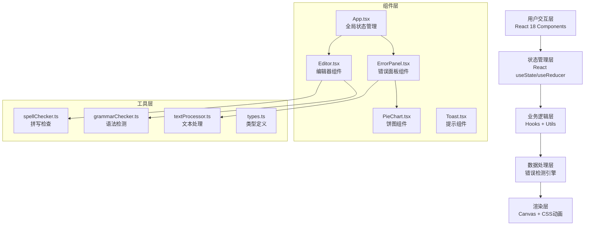

## 1. 架构设计



## 2. 技术描述

- **前端框架**：React 18 + TypeScript
- **构建工具**：Vite 5.x
- **状态管理**：React useState/useCallback（轻量级，无需额外状态库）
- **样式方案**：原生CSS + CSS Modules（避免额外依赖，符合用户要求）
- **图标方案**：内联SVG图标（无需额外图标库）
- **图表绘制**：原生Canvas API（环形饼图）
- **动画方案**：CSS Animations + Transitions + requestAnimationFrame
- **工具库**：uuid（生成唯一ID）

## 3. 文件结构与调用关系

```
src/
├── App.tsx                 # 主组件（全局状态：text, errors, selectedErrorId）
│                           # 提供：addError(), clearError(), replaceWord(), fixAll()
│                           # 数据流：向下传递给 Editor 和 ErrorPanel
├── types.ts                # 类型定义（ErrorMarker, ErrorType等）
├── utils/
│   ├── spellChecker.ts     # 拼写检查器（词库匹配、正则规则）
│   ├── grammarChecker.ts   # 语法检测器（动词时态、主谓一致等规则）
│   ├── textProcessor.ts    # 文本处理（分词、替换、导出）
│   └── dictionary.ts       # 内置词典数据
├── components/
│   ├── Editor.tsx          # 编辑器（接收 text, errors props）
│   │                       # 渲染：可编辑区域 + 错误标记层
│   │                       # 回调：onErrorClick(), onTextChange(), onSelection()
│   ├── ErrorPanel.tsx      # 错误面板（接收 errors, selectedErrorId props）
│   │                       # 渲染：错误列表 + 替换建议 + 统计
│   │                       # 回调：onFixWord(), onFixAll(), onHighlightError()
│   ├── PieChart.tsx        # Canvas饼图（接收 errors prop）
│   ├── FloatingToolbar.tsx # 选中文本浮动工具栏
│   └── Toast.tsx           # Toast提示组件
├── hooks/
│   ├── useDebounce.ts      # 防抖Hook（300ms延迟）
│   ├── useErrorScanner.ts  # 错误扫描Hook
│   └── useReplacement.ts   # 替换动画Hook
├── styles/
│   ├── global.css          # 全局样式（变量、字体、重置）
│   ├── editor.css          # 编辑器样式（纸张纹理、波浪线动画）
│   └── panel.css           # 面板样式（毛玻璃、滑入动画）
└── main.tsx                # 入口文件
```

## 4. 数据模型

### 4.1 核心类型定义

```typescript
// 错误类型枚举
type ErrorType = 'spelling' | 'grammar' | 'wording' | 'punctuation' | 'custom';

// 错误标记接口
interface ErrorMarker {
  id: string;              // uuid
  type: ErrorType;         // 错误类型
  word: string;            // 原词
  suggestions: string[];   // 建议替换词（3-5个）
  start: number;           // 起始位置
  end: number;             // 结束位置
  description?: string;    // 错误描述
  isCustom?: boolean;      // 是否自定义标记
}

// 编辑器状态
interface EditorState {
  text: string;
  errors: ErrorMarker[];
  selectedErrorId: string | null;
  isPanelOpen: boolean;
}

// 错误统计
interface ErrorStats {
  type: ErrorType;
  count: number;
  percentage: number;
  examples: string[];
}
```

### 4.2 数据流

1. **输入流**：用户输入文本 → `useDebounce` 防抖300ms → `useErrorScanner` 执行扫描 → 更新 `errors` 状态 → Editor 和 ErrorPanel 重新渲染
2. **选择流**：用户点击错误单词 → Editor 触发 `onErrorClick` → App 更新 `selectedErrorId` → ErrorPanel 高亮对应项并滚动定位
3. **替换流**：用户点击建议词 → ErrorPanel 触发 `onFixWord` → `textProcessor.replaceWord()` 更新文本 → 移除对应 error → 更新统计 → 播放替换动画
4. **批量流**：用户点击"全部修正" → 逐个遍历 errors → 每100ms执行一次替换 → 更新进度条 → 完成后Toast提示
5. **导流出**：用户点击导出 → `textProcessor.exportHTML()` 或 `exportTXT()` → 生成Blob → 触发下载 → 显示成功Toast

## 5. 性能优化策略

- **防抖输入**：useDebounce Hook，300ms延迟避免频繁扫描
- **Web Worker**：错误扫描逻辑可放入Web Worker（如复杂度提升），不阻塞主线程
- **增量更新**：仅更新发生变化的错误标记，而非全部重建
- **CSS硬件加速**：动画使用 transform 和 opacity，触发GPU加速
- **requestAnimationFrame**：替换动画和数字滚动使用RAF保证60fps
- **Canvas优化**：饼图仅在数据变化时重绘，使用离屏Canvas预渲染

## 6. 错误检测规则引擎

| 规则类型 | 检测方式 | 示例 |
|----------|----------|------|
| 拼写错误 | 词典匹配 + 常见拼写错误模式 | "teh" → "the", "recieve" → "receive" |
| 语法错误 | 正则匹配动词时态、主谓一致 | "he go" → "he goes", "I is" → "I am" |
| 用词不当 | 常见搭配词库 + 上下文检测 | "make a homework" → "do homework" |
| 标点错误 | 标点符号正则检测 | 缺失句号、双空格、中英文标点混用 |
