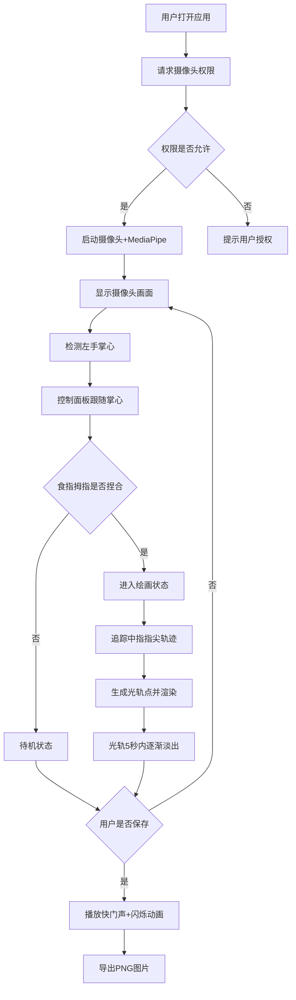

## 1. 产品概述

光影涂鸦交互项目是一个基于浏览器摄像头的创意艺术应用，用户通过手势在空中绘制发光轨迹，模拟长时间曝光摄影效果。

- **核心目的**：让用户无需专业设备即可体验光绘摄影的乐趣，通过自然的手势交互创造视觉艺术
- **目标用户**：创意爱好者、艺术创作者、教育场景中的师生
- **市场价值**：浏览器端零门槛的光绘创作工具，融合AR交互与艺术创作

## 2. 核心功能

### 2.1 功能模块

1. **实时手势识别**：MediaPipe Hands检测手部21个关键点，识别捏合/散开手势和指尖位置
2. **光轨绘制系统**：轨迹点管理、颜色渐变、透明度衰减、离屏渲染
3. **悬浮控制面板**：跟随左手掌心的毛玻璃圆盘，色环取色+粗细滑块
4. **画布保存功能**：PNG导出、快门音效、闪烁动画
5. **性能自适应**：帧率检测、动态采样率、FIFO光轨淘汰

### 2.2 页面详情

| 页面名称 | 模块名称 | 功能描述 |
|-----------|-------------|---------------------|
| 主画布页 | 摄像头画面层 | 全屏摄像头采集，16:9比例，黑边填充 |
| 主画布页 | 光轨渲染层 | Canvas离屏渲染，半透明叠加，支持5秒淡出 |
| 主画布页 | 控制面板 | 跟随左手掌心，手势展开/收缩，色环+粗细滑块 |
| 主画布页 | 状态指示灯 | 右下角，绿色绘制中/灰色待机，脉冲呼吸动画 |
| 主画布页 | 保存按钮 | 快捷键或按钮触发，PNG导出+音效+闪烁 |

## 3. 核心流程

### 3.1 主要用户流程

用户打开应用后，系统请求摄像头权限，启动MediaPipe手部追踪。用户将左手掌心对准摄像头，控制面板会跟随移动。捏合食指和拇指进入绘画状态，移动中指指尖绘制光轨；散开手指停止绘画。通过左手操作控制面板切换颜色和笔刷粗细。创作完成后，点击保存或使用快捷键导出PNG图片。

### 3.2 流程图

## 4. 用户界面设计

### 4.1 设计风格

- **主色调**：深空黑背景 (#0a0a0f)，霓虹色彩环（HSL全色相循环）
- **辅助色**：毛玻璃白 rgba(255,255,255,0.15)，边框辉光 rgba(255,255,255,0.2)
- **按钮风格**：圆形玻璃态按钮，带 subtle 阴影和辉光
- **字体**：现代无衬线字体，纤细轻盈
- **布局风格**：全屏沉浸式，悬浮元素，负空间充足
- **动效风格**：缓出曲线(ease-out)，0.3-0.5秒过渡，脉冲呼吸，平滑跟随

### 4.2 页面设计概览

| 页面名称 | 模块名称 | UI元素 |
|-----------|-------------|-------------|
| 主画布页 | 摄像头画面 | 全屏居中，object-fit:contain，16:9黑边 |
| 主画布页 | 光轨层 | Canvas叠加，lighter混合模式，渐变发光 |
| 主画布页 | 控制面板 | 直径120px圆盘，毛玻璃，跟随掌心，展开/收缩动画 |
| 主画布页 | 色环 | 环形HSL渐变色谱，点击取色，选中色高亮 |
| 主画布页 | 粗细滑块 | 1-15px范围，阻尼感拖动，预览笔刷大小 |
| 主画布页 | 状态指示灯 | 右下角圆形指示灯，绿色/灰色，脉冲呼吸 |
| 主画布页 | 保存按钮 | 左上角或快捷键(空格/S)，快门图标 |

### 4.3 响应式

- 桌面端优先，全屏沉浸式体验
- 移动端自动适配屏幕尺寸，触控友好
- 控制面板最小触控区域44x44px
- 支持横屏模式，摄像头画面保持16:9比例

### 4.4 视觉细节

- **氛围**：星空调感，光轨如流星划过，余辉消散
- **光轨效果**：多层模糊叠加，核心亮白+外层彩色辉光
- **面板效果**：backdrop-filter: blur(20px)，边框半透明，微浮起阴影
- **微交互**：悬停时辉光增强，点击时轻微缩放，滑块阻尼回馈
