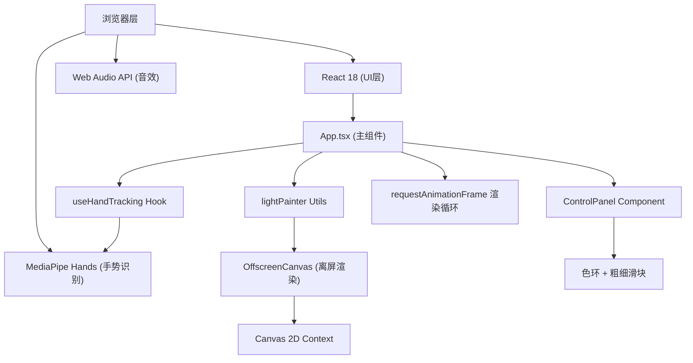

## 1. 架构设计



## 2. 技术说明

- **前端框架**: React 18 + TypeScript + Vite
- **手势识别**: @mediapipe/hands + @mediapipe/camera_utils (CDN加载)
- **渲染**: Canvas 2D + OffscreenCanvas 离屏渲染
- **音效**: Web Audio API 动态生成快门声
- **构建工具**: Vite 5.x
- **路径别名**: @ -> src
- **开发端口**: 5173

## 3. 路由定义

| 路由 | 用途 |
|-------|---------|
| / | 主画布页面，唯一页面，包含全部功能 |

## 4. 项目文件结构

```
e:\solo\VersionFast\tasks\auto58\
├── index.html                 # 入口HTML
├── package.json               # 项目配置
├── vite.config.js             # Vite配置
├── tsconfig.json              # TypeScript配置
└── src/
    ├── App.tsx                # 主组件
    ├── main.tsx               # 入口文件
    ├── hooks/
    │   └── useHandTracking.ts # 手势追踪Hook
    ├── utils/
    │   └── lightPainter.ts    # 光轨渲染工具类
    └── components/
        └── ControlPanel.tsx   # 悬浮控制面板
```

## 5. 核心数据结构

### 5.1 光轨点数据

```typescript
interface LightPoint {
  x: number;           // X坐标（基于画布尺寸）
  y: number;           // Y坐标
  timestamp: number;   // 创建时间戳(ms)
  color: string;       // HSL颜色值
  size: number;        // 笔刷大小
}

interface LightTrail {
  id: string;          // 唯一标识
  points: LightPoint[]; // 轨迹点数组
  createdAt: number;   // 创建时间
}
```

### 5.2 手势状态

```typescript
interface HandState {
  isPinching: boolean;        // 食指拇指是否捏合（绘画状态）
  middleFingerTip: { x: number; y: number } | null; // 中指指尖坐标（笔位置）
  leftPalm: { x: number; y: number } | null;        // 左手掌心坐标（面板位置）
  isLeftHandDetected: boolean;
  isRightHandDetected: boolean;
}
```

### 5.3 笔刷配置

```typescript
interface BrushConfig {
  hue: number;      // 色相 0-360
  saturation: number; // 饱和度 0-100
  lightness: number;  // 明度 0-100
  size: number;     // 笔刷大小 1-15
  autoColorCycle: boolean; // 是否自动色相循环
}
```

## 6. 核心算法

### 6.1 捏合手势检测
- 计算食指指尖(landmark 8)与拇指指尖(landmark 4)的欧氏距离
- 计算手掌参考距离（如手腕0到中指根部9的距离）
- 距离比 < 0.15 判定为捏合

### 6.2 光轨淡出算法
- 每帧计算：`opacity = max(0, 1 - (now - timestamp) / 5000)`
- 透明度线性衰减，5秒后完全消失

### 6.3 FIFO淘汰机制
- 光轨数量上限500条
- 超出时移除最早创建的250条
- 每帧清理所有已完全透明的光轨点

### 6.4 帧率自适应
- 记录最近30帧的渲染时间，计算平均帧率
- FPS < 45时，采样率降为每2帧取1点
- FPS >= 45时恢复每帧采样

### 6.5 色相循环
- 每生成一个新点，hue = (hue + 0.5) % 360
- 形成彩虹渐变流光效果

## 7. 性能优化

1. **分层渲染**：摄像头画面 <video> 层 + Canvas光轨层分离，减少重绘
2. **离屏Canvas**：光轨在 OffscreenCanvas 渲染，主线程只做合成
3. **增量渲染**：不清空整个画布，仅叠加新绘制点（通过透明度衰减自然消失）
4. **对象池**：复用LightPoint对象，减少GC压力
5. **requestAnimationFrame**：使用浏览器原生渲染循环，自动与显示器同步
6. **节流采样**：低帧率下降低采样率，保证交互流畅度
