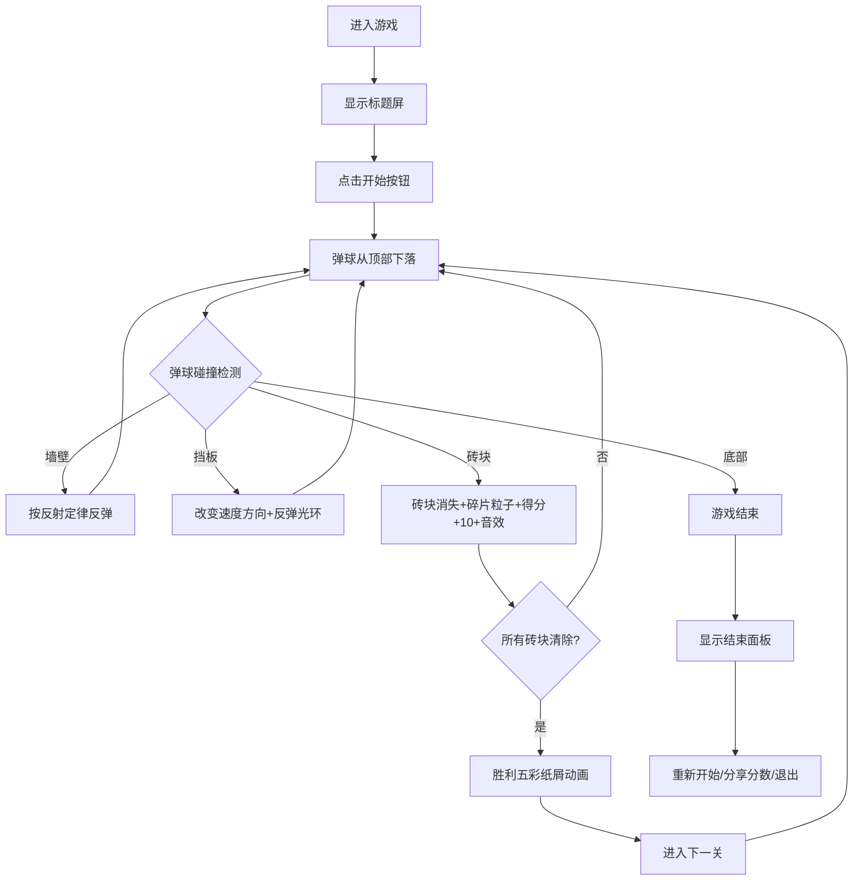

## 1. 产品概述

本项目是一个基于Canvas的二维弹球游戏应用，用于游戏开发中弹球物理系统调试和玩家排行榜实时反馈。玩家通过控制底部挡板反弹弹球，击碎顶部砖块获得分数，挑战高分排行榜。

- 核心目标：提供流畅的弹球物理碰撞体验和实时排行榜反馈
- 目标用户：游戏开发者和休闲玩家
- 市场价值：可作为弹球类游戏的物理引擎调试工具，也可作为独立休闲游戏

## 2. 核心功能

### 2.1 用户角色
| 角色 | 注册方式 | 核心权限 |
|------|----------|----------|
| 普通玩家 | 无需注册 | 进行游戏、查看本地排行榜、分享分数 |

### 2.2 功能模块
1. **游戏主界面**：Canvas画布、实时分数显示、游戏状态面板
2. **物理系统**：弹球运动、墙壁反弹、挡板碰撞、砖块碰撞检测
3. **特效系统**：碰撞光环、砖块碎片粒子、胜利五彩纸屑
4. **音效系统**：砖块击中音效、游戏结束音效
5. **排行榜系统**：本地存储分数记录、玩家姓名编辑、前三名高亮

### 2.3 页面详情
| 页面名称 | 模块名称 | 功能描述 |
|----------|----------|----------|
| 游戏主界面 | 标题屏 | 半透明渐变标题、呼吸动画开始按钮 |
| 游戏主界面 | Canvas游戏区 | 800x600画布、深色渐变背景、白色边框 |
| 游戏主界面 | 挡板控制 | 鼠标拖拽/触摸控制、渐变色挡板、圆弧过渡 |
| 游戏主界面 | 弹球系统 | 红色圆形弹球、随机初始速度、物理反弹 |
| 游戏主界面 | 砖块系统 | 5行8列彩色砖块、渐变颜色、击中消失 |
| 游戏主界面 | 实时分数 | 左上角白色描边文字显示当前分数 |
| 游戏主界面 | 游戏结束面板 | 底部滑入、最终分数、重新开始/分享/退出按钮 |
| 排行榜 | 排行榜列表 | localStorage存储、最多10条、淡入动画、前三名高亮 |
| 排行榜 | 玩家姓名编辑 | 可编辑输入框、默认Anonymous |

## 3. 核心流程

玩家进入游戏 → 点击标题屏开始按钮 → 弹球从顶部随机下落 → 玩家控制挡板反弹弹球 → 弹球击碎砖块获得分数 → 所有砖块清除 → 胜利动画 → 进入下一关 → 弹球落出底部 → 游戏结束面板 → 重新开始/分享分数到排行榜/退出

## 4. 用户界面设计

### 4.1 设计风格
- **主色调**：深色主题，背景#0a0a23，画布渐变#1a1a2e到#16213e
- **强调色**：挡板渐变#4facfe到#00f2fe，弹球#ff6b6b，砖块从#ff4757渐变到#5352ed
- **按钮样式**：圆角按钮、深色背景、白色文字、悬停高亮
- **字体**：无衬线字体，标题48px带文字阴影渐变，分数20px白色带黑色描边
- **布局**：画布居中，宽800px高600px，带1px白色半透明边框和圆角
- **视觉效果**：砖块和弹球带发光效果，挡板两端圆弧过渡

### 4.2 页面设计概览
| 页面名称 | 模块名称 | UI元素 |
|----------|----------|--------|
| 游戏主界面 | 标题屏 | 半透明遮罩、渐变标题"弹球挑战"、呼吸动画"点击开始"按钮 |
| 游戏主界面 | Canvas游戏区 | 深色渐变背景、白色圆角边框、800x600固定尺寸 |
| 游戏主界面 | 挡板 | 渐变色、两端圆弧、拖拽光标grab/grabbing、位于底部 |
| 游戏主界面 | 弹球 | 红色圆形、发光效果、半径8px |
| 游戏主界面 | 砖块 | 5行8列、80x20px、间隔4px、从下到上红到紫渐变、发光效果 |
| 游戏主界面 | 分数显示 | 左上角、白色20px、黑色描边 |
| 游戏主界面 | 结束面板 | 从底部滑入、最终分数显示、三个操作按钮 |
| 排行榜 | 排行榜列表 | 淡入效果、排名+姓名+分数、前三名金/银/铜高亮 |

### 4.3 响应式设计
- 桌面优先设计，画布最大宽度800px
- 移动端画布宽度随屏幕宽度自适应缩放
- 挡板支持触摸事件控制移动
- 游戏循环稳定60fps，帧率低于55fps时自动降低粒子特效

### 4.4 性能优化
- 砖块碰撞检测使用空间分割优化
- 粒子系统使用对象池，上限100个粒子
- 帧率监测，低帧率时自动降级特效（50%粒子数量）
