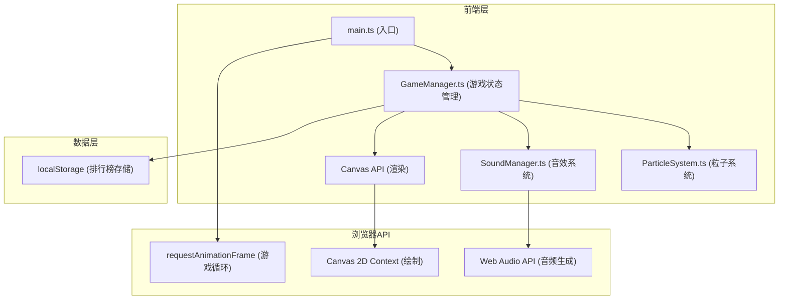

## 1. 架构设计



## 2. 技术说明

- **前端框架**: TypeScript + Canvas API + Vite
- **构建工具**: Vite 5.x
- **编程语言**: TypeScript (严格模式, target ES2020, module ESNext)
- **后端**: 无
- **数据存储**: localStorage (本地排行榜存储)
- **音频**: Web Audio API (程序化生成音效)
- **渲染**: HTML5 Canvas 2D Context

## 3. 路由定义

本项目为单页游戏应用，无路由系统。

| 路由 | 用途 |
|------|------|
| / | 游戏主页面 |

## 4. 文件结构

```
e:\solo\VersionFast\tasks\auto59\
├── package.json          # 项目依赖配置
├── vite.config.js        # Vite构建配置
├── tsconfig.json         # TypeScript编译配置
├── index.html            # 入口HTML页面
├── src/
│   ├── main.ts           # 应用入口，初始化Canvas和游戏循环
│   ├── GameManager.ts    # 游戏管理器，状态机、碰撞检测、得分
│   ├── ParticleSystem.ts # 粒子系统，对象池、特效生成
│   └── SoundManager.ts   # 音效管理器，Web Audio API封装
└── .trae/
    └── documents/
        ├── prd.md        # 产品需求文档
        └── tech.md       # 技术架构文档
```

## 5. 核心类设计

### 5.1 GameManager
游戏状态管理核心类，包含以下状态：
- `start`: 开始标题屏
- `playing`: 游戏进行中
- `paused`: 暂停
- `gameOver`: 游戏结束
- `victory`: 关卡胜利

核心属性：
- `ball: Ball` - 弹球对象 {x, y, vx, vy, radius}
- `paddle: Paddle` - 挡板对象 {x, y, width, height}
- `bricks: Brick[]` - 砖块数组
- `score: number` - 当前分数
- `level: number` - 当前关卡
- `gameState: string` - 当前游戏状态
- `particleSystem: ParticleSystem` - 粒子系统引用
- `soundManager: SoundManager` - 音效系统引用

核心方法：
- `init()` - 初始化游戏对象
- `update()` - 每帧更新游戏状态
- `render(ctx)` - 渲染游戏画面
- `checkCollisions()` - 碰撞检测（空间分割优化）
- `createBricks()` - 生成砖块网格
- `gameOver()` - 处理游戏结束
- `victory()` - 处理关卡胜利
- `restart()` - 重新开始游戏

### 5.2 ParticleSystem
粒子系统类，使用对象池管理粒子：

核心属性：
- `particles: Particle[]` - 活跃粒子数组
- `MAX_PARTICLES: number` - 最大粒子数(100)
- `lowPerformance: boolean` - 低性能模式标志

粒子对象结构：
```typescript
interface Particle {
  x: number;
  y: number;
  vx: number;
  vy: number;
  life: number;
  maxLife: number;
  color: string;
  size: number;
  type: 'brick' | 'ring' | 'confetti';
}
```

核心方法：
- `createBrickParticle(x, y, color)` - 创建砖块碎片粒子(10个)
- `createBounceRing(x, y)` - 创建反弹光环(3个)
- `createVictoryParticles(x, y)` - 创建胜利五彩纸屑
- `update()` - 更新所有粒子
- `render(ctx)` - 渲染所有粒子

### 5.3 SoundManager
音效管理类，使用Web Audio API：

核心方法：
- `playHitSound()` - 播放击中砖块音效 (440Hz正弦波, 100ms, 快速衰减)
- `playGameOverSound()` - 播放游戏结束音效 (220Hz方波, 500ms, 衰减)

## 6. 数据模型

### 6.1 排行榜数据结构
```typescript
interface LeaderboardEntry {
  rank: number;
  name: string;
  score: number;
}
```

### 6.2 localStorage 存储键
- 键名: `breakout_leaderboard`
- 格式: JSON数组，最多10条记录，按分数降序排列

## 7. 性能优化策略

1. **空间分割碰撞检测**: 将画布划分为网格，砖块按网格存储，减少碰撞检测次数
2. **粒子对象池**: 预分配粒子对象，避免频繁GC
3. **帧率监测**: 记录最近10帧的渲染时间，平均帧率<55fps时自动减少50%粒子生成
4. **Canvas渲染优化**: 使用离屏画布预渲染砖块，减少每帧绘制调用
5. **事件节流**: 挡板移动事件使用requestAnimationFrame同步，避免过度重绘
