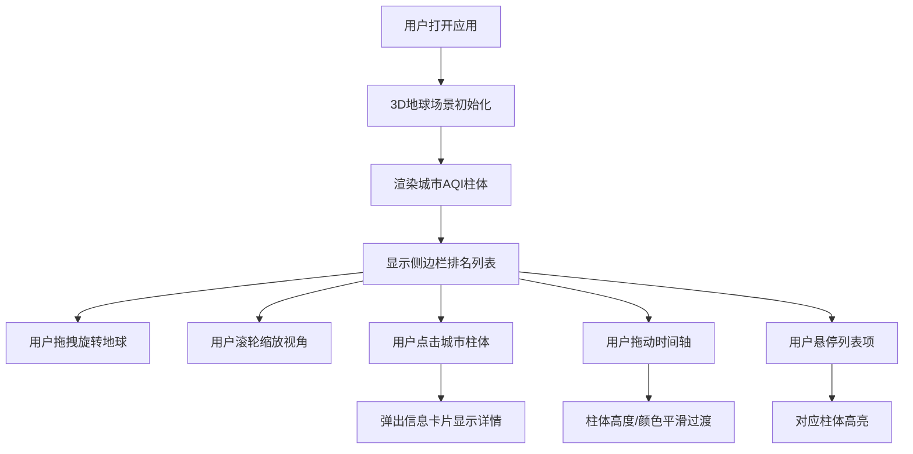

## 1. 产品概述

全球空气质量交互式3D地球可视化应用，通过直观的三维可视化方式展示全球主要城市的空气质量指数（AQI），解决环保数据枯燥难懂的问题，让用户直观感受不同地区的空气污染差异。

- 目标用户：环保工作者、学生、数据可视化爱好者、普通大众
- 产品价值：以交互式3D地球为载体，将抽象的空气质量数据转化为直观的视觉体验，提升环保意识

## 2. 核心功能

### 2.1 用户角色

| 角色 | 注册方式 | 核心权限 |
|------|----------|----------|
| 普通用户 | 无需注册 | 浏览数据、交互操作、查看城市详情 |

### 2.2 功能模块

1. **3D地球主场景**：地球球体渲染、城市坐标投影、星空背景
2. **AQI柱体系统**：20+城市标记、高度/颜色映射、脉动光晕动画
3. **交互系统**：鼠标拖拽旋转、滚轮缩放、点击城市查看详情
4. **侧边栏列表**：城市AQI排名、悬停联动高亮
5. **时间轴系统**：24小时模拟数据、平滑过渡动画
6. **信息卡片**：城市详情展示、毛玻璃风格

### 2.3 页面详情

| 页面名称 | 模块名称 | 功能描述 |
|----------|----------|----------|
| 主界面 | 3D地球场景 | 高分辨率蓝白纹理地球，支持拖拽旋转和滚轮缩放 |
| 主界面 | AQI柱体标记 | 20+城市位置标记，柱体高度与AQI正相关，颜色分级显示 |
| 主界面 | 脉动光晕效果 | 柱体顶部呼吸动画，模拟污染物扩散，颜色随AQI变化 |
| 主界面 | 信息卡片 | 点击柱体弹出毛玻璃风格卡片，显示城市名、AQI、污染物、等级 |
| 主界面 | 侧边栏列表 | 右侧城市列表按AQI排序，悬停高亮对应柱体 |
| 主界面 | 时间轴滑动条 | 底部24小时时间轴，拖动时数据平滑过渡 |
| 主界面 | 星空背景 | 深蓝色星空+星星粒子效果 |

## 3. 核心流程

用户打开应用 → 查看3D地球与城市AQI柱体 → 拖拽旋转/缩放地球 → 点击柱体查看城市详情 → 拖动时间轴查看不同时段数据 → 在侧边栏浏览城市排名

## 4. 用户界面设计

### 4.1 设计风格

- **主色调**：深蓝色（#0a1628）星空背景，科技感暗色调
- **辅助色**：
  - 优（绿色）：#00e400（0-50）
  - 良（黄色）：#ffff00（51-100）
  - 轻度污染（橙色）：#ff7e00（101-150）
  - 中度污染（红色）：#ff0000（151-200）
  - 重度污染（紫色）：#8f3f97（201-300）
  - 严重污染（褐红色）：#7e0023（300+）
- **字体**：使用 Orbitron（科技感标题）+ Roboto（正文）
- **布局风格**：全屏沉浸式3D场景，右侧侧边栏，底部时间轴
- **图标风格**：简约线性图标，科技感发光效果

### 4.2 页面设计概述

| 页面名称 | 模块名称 | UI元素 |
|----------|----------|--------|
| 主界面 | 3D地球场景 | 蓝白地球纹理、大气辉光、星空粒子背景、fadeIn进入动画 |
| 主界面 | AQI柱体 | 半透明渐变光泽柱体、顶部脉动光晕、颜色分级、呼吸动画 |
| 主界面 | 信息卡片 | 毛玻璃（backdrop-filter: blur）、圆角、白色半透明背景、slideUp动画 |
| 主界面 | 侧边栏 | 深色半透明背景、城市列表、AQI数值标签、悬停高亮效果 |
| 主界面 | 时间轴 | 深色轨道、发光滑块、24小时刻度标记、平滑过渡 |

### 4.3 响应式设计

- **桌面端**（1366x768+）：全屏Canvas，右侧固定侧边栏（约280px宽），底部时间轴
- **移动端竖屏**（375x812）：全屏Canvas，侧边栏折叠为底部可展开抽屉，时间轴适配宽度，信息卡片自适应

### 4.4 3D场景指导

- **环境/HDRI**：深蓝色星空背景，微弱环境光，方向性主光源模拟太阳光
- **光照设置**：环境光（强度0.3）+ 方向光（强度0.8，从右上方照射）+ 点光源补光
- **相机设置**：透视相机，初始距离3.5倍地球半径，支持OrbitControls交互
- **构图与焦点元素**：地球居中央，城市柱体从地球表面向外延伸，视觉重心在柱体密集区域
- **交互与动画**：地球缓慢自转（无操作时），柱体脉动呼吸动画，时间轴拖动时平滑过渡
- **后处理效果**：轻微Bloom发光效果增强科技感（性能允许情况下）
- **资源来源**：使用Three.js内置程序化生成纹理，避免外部资源依赖，保证加载速度
