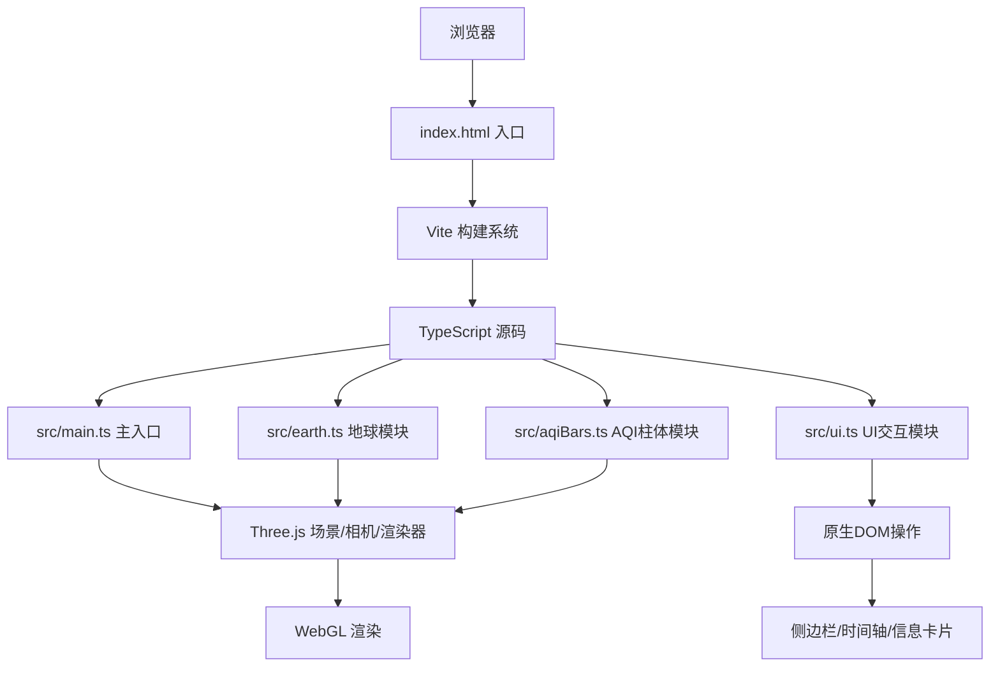
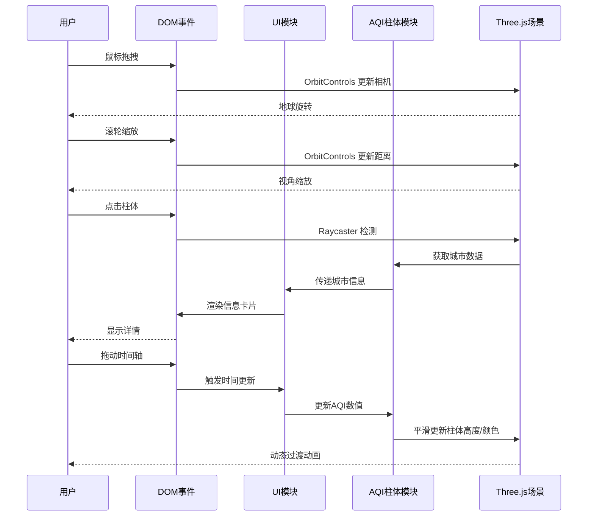

## 1. 架构设计



## 2. 技术说明

- **前端框架**：原生 TypeScript（无 React/Vue）+ Three.js
- **构建工具**：Vite 5.x
- **包管理器**：npm
- **核心依赖**：
  - three@^0.160.0：WebGL 3D渲染引擎
  - @types/three@^0.160.0：Three.js类型定义
  - vite@^5.0.0：开发服务器和构建工具
  - typescript@^5.3.0：类型系统

## 3. 模块文件结构

```
auto6/
├── package.json          # 项目依赖和脚本配置
├── vite.config.js        # Vite构建配置
├── tsconfig.json         # TypeScript编译配置
├── index.html            # HTML入口文件
└── src/
    ├── main.ts           # 应用入口，场景初始化与动画循环
    ├── earth.ts          # 地球球体、纹理、坐标投影
    ├── aqiBars.ts        # 城市柱体管理、动画、交互
    └── ui.ts             # 侧边栏、时间轴、信息卡片DOM操作
```

## 4. 核心数据模型

### 4.1 城市数据类型

```typescript
interface CityData {
  name: string;
  nameEn: string;
  lat: number;      // 纬度
  lon: number;      // 经度
  hourlyAqi: number[];  // 24小时AQI数据 [0-23]
  primaryPollutant: string; // 主要污染物
}
```

### 4.2 AQI等级映射

```typescript
interface AqiLevel {
  range: [number, number];
  color: string;
  level: string;  // 优/良/轻度污染/中度污染/重度污染/严重污染
}
```

### 4.3 预设城市列表（20+城市）

北京、上海、广州、深圳、成都、重庆、武汉、西安、南京、杭州、
东京、首尔、新加坡、悉尼、洛杉矶、纽约、伦敦、巴黎、柏林、莫斯科、新德里、开罗

## 5. 性能优化策略

- **几何复用**：所有柱体共享 CylinderGeometry
- **材质复用**：相同AQI等级共享 MeshPhongMaterial
- **动画优化**：使用 requestAnimationFrame，避免不必要的重绘
- **点击检测**：使用 Three.js Raycaster，批量检测
- **DOM更新**：时间轴拖动时节流处理，确保16ms内完成
- **纹理优化**：使用程序化生成纹理，减少网络请求

## 6. 交互事件流


