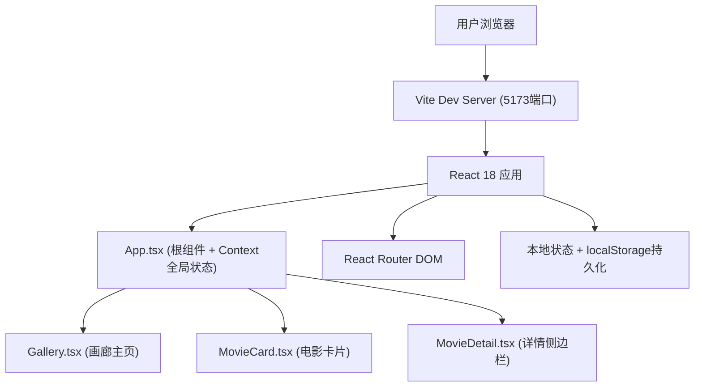
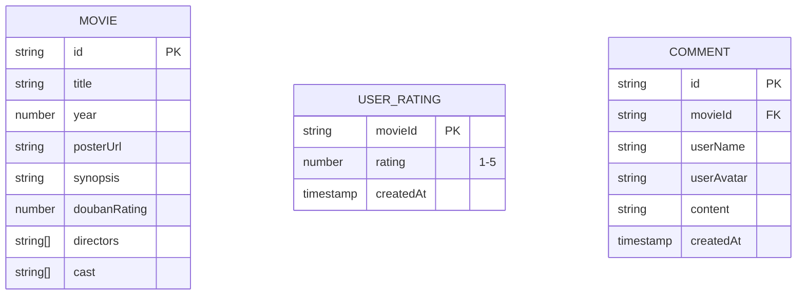

## 1. 架构设计



## 2. 技术描述
- **前端框架**：React 18 + TypeScript
- **构建工具**：Vite 5.x
- **路由**：react-router-dom 6.x
- **工具库**：uuid（生成唯一ID）
- **状态管理**：React Context + useReducer（全局状态），localStorage（持久化评分和卡片顺序）
- **样式方案**：原生CSS + CSS Modules（组件级样式隔离）
- **动画**：CSS Transitions/Animations + requestAnimationFrame

## 3. 路由定义
| 路由 | 用途 |
|-------|---------|
| / | 画廊主页（默认路由） |
| /movie/:id | 电影详情（可通过URL直接访问，侧边栏模式） |

## 4. 文件结构与调用关系

```
src/
├── types/
│   └── index.ts           # 全局类型定义（Movie, Comment, Rating等）
├── data/
│   └── movies.ts          # 预置20部电影数据
├── context/
│   └── AppContext.tsx     # 全局Context（电影列表、选中电影、评分数据）
├── hooks/
│   ├── useInfiniteScroll.ts  # IntersectionObserver无限滚动Hook
│   ├── useDragAndDrop.ts     # 拖拽排序Hook
│   └── useSearch.ts          # 搜索过滤Hook
├── components/
│   ├── MovieCard.tsx         # 电影卡片（3D翻转+评分+拖拽）
│   ├── Gallery.tsx           # 画廊主视图（网格+搜索+无限滚动）
│   ├── MovieDetail.tsx       # 详情侧边栏
│   ├── SearchBar.tsx         # 搜索栏组件
│   ├── StarRating.tsx        # 星级评分组件
│   └── CommentSection.tsx    # 评论区组件
├── styles/
│   ├── global.css            # 全局样式（重置、变量、动画）
│   └── variables.css         # CSS变量（颜色、间距、动画时长）
├── utils/
│   └── animations.ts         # 动画工具函数（Ripple效果等）
├── App.tsx                   # 根组件
├── main.tsx                  # 入口文件
└── vite-env.d.ts
```

### 数据流向
1. **App.tsx** → 通过Context Provider向子组件注入：`movies`（电影列表）、`selectedMovie`（选中电影）、`userRatings`（用户评分）、`comments`（评论数据）
2. **Gallery.tsx** → 从Context获取电影列表，调用useSearch进行过滤，调用useInfiniteScroll实现无限加载，渲染MovieCard列表
3. **MovieCard.tsx** → 接收movie对象，内部使用StarRating组件，长按触发useDragAndDrop，点击触发打开MovieDetail
4. **MovieDetail.tsx** → 从Context获取selectedMovie，使用CommentSection展示和添加评论

## 5. 数据模型

### 5.1 数据模型定义



### 5.2 TypeScript类型定义

```typescript
interface Movie {
  id: string;
  title: string;
  year: number;
  posterUrl: string;
  synopsis: string;
  doubanRating: number; // 0-10
  directors: string[];
  cast: string[];
}

interface UserRating {
  movieId: string;
  rating: number; // 1-5
  createdAt: number;
}

interface Comment {
  id: string;
  movieId: string;
  userName: string;
  userAvatar: string;
  content: string;
  createdAt: number;
}

interface AppState {
  movies: Movie[];
  displayCount: number;
  selectedMovieId: string | null;
  userRatings: Record<string, UserRating>;
  comments: Record<string, Comment[]>;
  cardOrder: string[];
}
```

## 6. 性能优化策略
- **首次加载**：仅渲染初始8部电影，使用CSS硬件加速（transform: translateZ(0)）
- **搜索过滤**：使用useMemo缓存过滤结果，确保响应时间<50ms
- **拖拽排序**：使用requestAnimationFrame驱动位置更新，保持55fps+
- **动画优化**：优先使用transform和opacity属性（触发GPU合成），避免触发layout/paint
- **图片加载**：海报使用loading="lazy"，加载前显示占位背景
