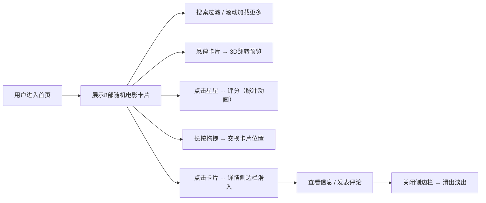

## 1. 产品概述
电影卡片画廊与评分互动平台，为独立影评社区提供沉浸式的电影浏览、评分与评论体验。
- 目标用户：电影爱好者、影评社区用户
- 核心价值：通过视觉化卡片交互，让用户快速浏览电影信息并进行打分和评论

## 2. 核心功能

### 2.1 功能模块
1. **画廊主页**：响应式电影卡片网格、顶部搜索栏、无限滚动加载
2. **电影卡片**：3D翻转效果、星级评分、拖拽排序、悬停预览
3. **详情侧边栏**：电影完整信息展示、评论输入、评论列表

### 2.3 页面详情
| 页面名称 | 模块名称 | 功能描述 |
|-----------|-------------|---------------------|
| 画廊主页 | 搜索栏 | 毛玻璃背景、实时模糊匹配搜索、自动完成建议、无结果空状态 |
| 画廊主页 | 电影网格 | CSS Grid响应式布局（手机2列/平板3列/桌面4列）、IntersectionObserver无限滚动 |
| 画廊主页 | 电影卡片 | CSS 3D翻转动画、豆瓣星级展示、用户可点击评分（脉冲动画）、长按拖拽排序 |
| 详情侧边栏 | 电影信息 | 大尺寸海报、完整简介、导演/主演flex-wrap排列 |
| 详情侧边栏 | 评论系统 | 多行评论输入（200字限制、实时字数统计）、评论列表（时间倒序、滑入动画） |

## 3. 核心流程
用户进入首页 → 浏览随机8部电影卡片 → 可通过搜索栏实时过滤电影 → 滚动加载更多（每次8部）→ 悬停卡片查看3D翻转效果 → 点击星星进行评分 → 长按卡片拖拽排序 → 点击卡片打开详情侧边栏 → 查看完整信息并发表评论 → 关闭侧边栏返回画廊

## 4. 用户界面设计

### 4.1 设计风格
- 主色调：深色主题，#0f0c29 → #302b63 → #24243e 径向渐变背景
- 卡片底色：#1e1b3a，白色文字，圆角12px
- 强调色：金色渐变用于评分星星（#FFD700 → #FFA500）
- 搜索栏：毛玻璃背景、聚焦时金色光晕边框
- 阴影：深色卡片阴影，悬停时加深并上移4px
- 字体：选择现代无衬线字体，建立清晰的层级

### 4.2 页面设计概述
| 页面名称 | 模块名称 | UI元素 |
|-----------|-------------|-------------|
| 画廊主页 | 整体布局 | 深色径向渐变背景、顶部固定搜索栏、居中响应式网格 |
| 画廊主页 | 电影卡片 | 3D翻转容器、正面海报+评分、背面简介+主演、底部渐变阴影、金色星级 |
| 画廊主页 | 搜索栏 | 毛玻璃效果、半透明输入框、清除按钮、自动完成下拉（匹配文字高亮） |
| 详情侧边栏 | 面板 | 右侧滑入（40%屏宽，400-600px）、深色半透明模糊背景、右上角关闭按钮 |
| 详情侧边栏 | 评论区 | 多行文本框、剩余字数提示、提交按钮、评论列表（头像+用户名+时间+内容） |

### 4.3 响应式
- 桌面端（≥1024px）：4列网格，间距20px
- 平板端（768-1023px）：3列网格，间距16px
- 手机端（<768px）：2列网格，间距12px
- 所有交互元素适配触屏操作
