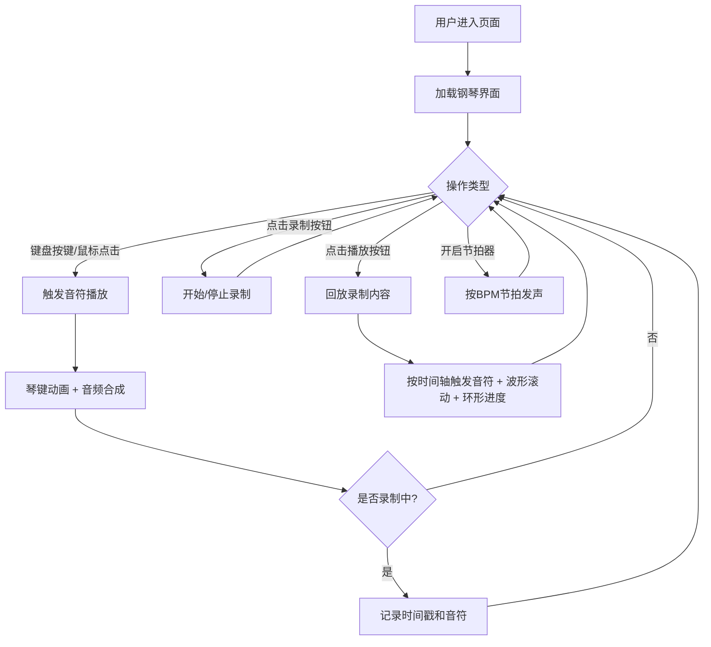

## 1. 产品概述

虚拟钢琴合成器是一个基于Web Audio API的在线音乐工具，让用户无需真实钢琴即可通过键盘按键或鼠标点按琴键演奏音乐。

- 主要用途：在线钢琴演奏、旋律创作、节奏练习
- 目标用户：音乐爱好者、钢琴初学者、音乐创作者
- 产品价值：随时随地进行音乐创作与练习，支持录制回放便于复盘

## 2. 核心功能

### 2.1 功能模块

1. **钢琴演奏模块**：24个琴键（C3到B4两个八度），支持键盘快捷键和鼠标点按
2. **音频合成模块**：Web Audio API实现钢琴音色（基频+谐波叠加）
3. **录制回放模块**：录制演奏并回放，波形可视化
4. **节拍器模块**：可调BPM（60-200）的节拍辅助工具
5. **响应式布局**：适配桌面端和移动端

### 2.2 功能详情

| 模块名称 | 功能描述 |
|---------|---------|
| 钢琴键盘 | 24键（C3-B4），白键50x200px，黑键30x120px，渐变色背景 |
| 音频合成 | 基频f + 2f/0.5 + 3f/0.3 + 4f/0.1 谐波叠加，1秒持续，松键即停 |
| 交互反馈 | 按键下沉动画、悬停光晕、音符标签弹出 |
| 键盘映射 | 白键A/S/D/F/G/H/J/K/L/;（对应C3到B4白键），黑键W/E/T/Y/U/O/P（对应黑键） |
| 录制功能 | 记录时间戳+音符对，精度1ms |
| 回放功能 | 按原时间间隔触发音符，环形进度显示 |
| 波形可视化 | Canvas绘制振幅轮廓，动态滚动 |
| 节拍器 | 60-200 BPM可调，默认120，"嘀嗒"声提示 |

## 3. 核心流程

## 4. 用户界面设计

### 4.1 设计风格

- **主色调**：深灰蓝渐变背景（#2c3e50 → #3498db），整体深色主题
- **琴键颜色**：白键#f0f0f0（按下#dcdcdc），黑键#1a1a1a（按下#333）
- **按钮颜色**：录制红色渐变、播放绿色渐变、节拍器蓝色切换
- **布局风格**：居中钢琴键盘，底部毛玻璃控制条
- **字体**：无衬线字体，按键标签10px白色小字

### 4.2 页面设计

| 区域 | UI元素 | 样式描述 |
|------|--------|---------|
| 背景 | 整页背景 | #1a1a2e 深色背景 |
| 键盘区域 | 24个琴键 | 渐变背景，白/黑键交替，悬停光晕，按下下沉动画 |
| 音符标签 | 动态弹出标签 | 10px白色，淡入淡出 |
| 波形显示 | Canvas | 30px高度，动态振幅波形 |
| 控制面板 | 毛玻璃条 | rgba(255,255,255,0.15)，圆角12px |
| 录制按钮 | 圆形按钮 | 红色渐变，按下变暗 |
| 播放按钮 | 圆形按钮 | 绿色渐变，三角形/暂停图标，环形进度 |
| 节拍器 | 切换按钮+滑块 | 正方形开关，60-200 BPM滑块 |

### 4.3 响应式设计

- **桌面端（≥600px）**：琴键完整显示，控制条居中
- **移动端（<600px）**：琴键区域横向滚动，控制条固定底部，高度自适应
- **性能要求**：所有动画和音效延迟≤16ms

