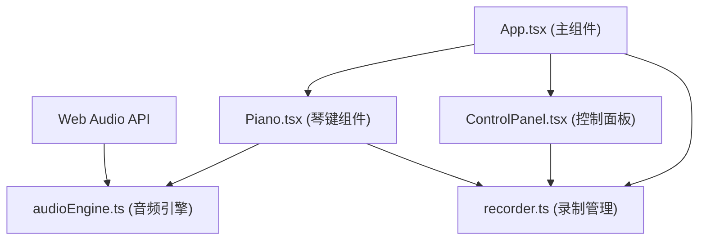

## 1. 架构设计



## 2. 技术栈说明

- **前端框架**：React 18 + TypeScript
- **构建工具**：Vite 5.x
- **状态管理**：React useState/useRef（轻量级场景，无需额外状态库）
- **音频技术**：Web Audio API（原生浏览器支持）
- **绘图技术**：Canvas API（波形可视化）
- **依赖包**：
  - react, react-dom
  - typescript
  - vite, @vitejs/plugin-react
  - uuid

## 3. 项目文件结构

```
e:\solo\VersionFast\tasks\auto63\
├── package.json
├── vite.config.js
├── tsconfig.json
├── index.html
└── src/
    ├── App.tsx
    ├── components/
    │   ├── Piano.tsx
    │   └── ControlPanel.tsx
    └── utils/
        ├── audioEngine.ts
        └── recorder.ts
```

## 4. 模块设计

### 4.1 音频引擎 (audioEngine.ts)

```typescript
interface AudioEngine {
  playNote(note: string, duration?: number): void;
  stopNote(note: string): void;
}
```

- 维护 OscillatorNode 池，避免重复创建
- 每个音符使用4个振荡器（基频+3个谐波）
- 使用 GainNode 控制音量包络（ADSR简化版）
- 钢琴音色：f + 2f(0.5) + 3f(0.3) + 4f(0.1)

### 4.2 录制管理 (recorder.ts)

```typescript
interface RecordedNote {
  time: number;
  note: string;
}

interface Recorder {
  startRecording(): void;
  stopRecording(): void;
  getRecording(): RecordedNote[];
  playRecording(replayFn: (note: string) => void, onProgress: (progress: number) => void, onEnd: () => void): void;
  isRecording: boolean;
  isPlaying: boolean;
}
```

- 记录 { time, note } 数组，精度1ms
- 播放时按原始时间间隔触发回调
- 支持进度回调和结束回调

### 4.3 Piano 组件 (Piano.tsx)

- Props: isRecording, isPlaying, onNotePlay
- 24个琴键（C3-B4）：14个白键 + 10个黑键
- 键盘事件监听（keydown/keyup）
- 鼠标事件监听（mousedown/mouseup/mouseleave）
- Web Audio API 音符播放
- 视觉反馈：按下动画、悬停光晕、音符标签
- 白键宽50px高200px，黑键宽30px高120px

### 4.4 ControlPanel 组件 (ControlPanel.tsx)

- Props: isRecording, isPlaying, playbackProgress, metronomeBPM, isMetronomeOn, hasRecording
- 控制回调：onToggleRecord, onTogglePlay, onToggleMetronome, onChangeBPM
- 毛玻璃效果背景（backdrop-filter: blur）
- 录制按钮：红色圆形渐变
- 播放按钮：绿色圆形渐变 + SVG环形进度条
- 节拍器：方形切换按钮 + 范围滑块（60-200 BPM）

### 4.5 App 主组件 (App.tsx)

- 全局状态管理：isRecording, isPlaying, recordedNotes, playbackProgress, metronome状态
- 波形Canvas渲染
- 各组件状态传递与回调协调

## 5. 琴键与频率映射

| 音符 | 频率(Hz) | 键盘映射 | 键类型 |
|------|---------|---------|--------|
| C3 | 130.81 | A | 白 |
| C#3 | 138.59 | W | 黑 |
| D3 | 146.83 | S | 白 |
| D#3 | 155.56 | E | 黑 |
| E3 | 164.81 | D | 白 |
| F3 | 174.61 | F | 白 |
| F#3 | 185.00 | T | 黑 |
| G3 | 196.00 | G | 白 |
| G#3 | 207.65 | Y | 黑 |
| A3 | 220.00 | H | 白 |
| A#3 | 233.08 | U | 黑 |
| B3 | 246.94 | J | 白 |
| C4 | 261.63 | K | 白 |
| C#4 | 277.18 | O | 黑 |
| D4 | 293.66 | L | 白 |
| D#4 | 311.13 | P | 黑 |
| E4 | 329.63 | ; | 白 |
| F4 | 349.23 | Z | 白 |
| F#4 | 369.99 | X | 黑 |
| G4 | 392.00 | C | 白 |
| G#4 | 415.30 | V | 黑 |
| A4 | 440.00 | B | 白 |
| A#4 | 466.16 | N | 黑 |
| B4 | 493.88 | M | 白 |

## 6. 性能优化

- 振荡器池复用，避免频繁创建/销毁
- 事件节流：键盘/鼠标事件处理避免重渲染
- requestAnimationFrame 用于波形动画
- CSS transform 动画而非 top/left，启用GPU加速
- 音符标签使用 React 条件渲染 + CSS 动画

