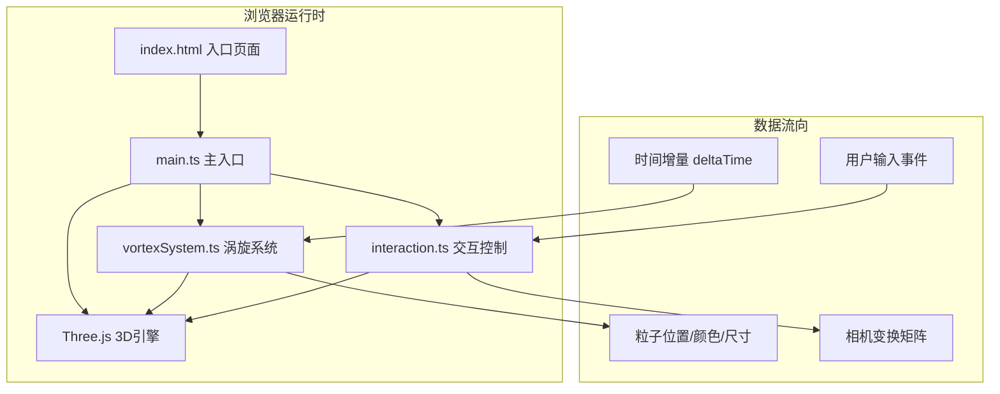

## 1. 架构设计



## 2. 技术描述

- **前端框架**：原生 TypeScript + Three.js（无React/Vue，用户明确要求）
- **构建工具**：Vite 5.x
- **编程语言**：TypeScript 5.x（严格模式，target ES2020，module ESNext）
- **3D渲染**：Three.js 最新版 + @types/three 类型定义
- **初始化方式**：手动创建项目结构（用户指定精确文件结构）

## 3. 文件结构定义

| 文件路径 | 职责 | 数据流向 |
|-------|------|---------|
| `package.json` | 依赖声明与脚本配置 | 配置 three, @types/three, vite, typescript |
| `vite.config.js` | Vite构建配置 | 输出目录 dist，开发端口 5173 |
| `tsconfig.json` | TypeScript编译配置 | 严格模式，ES2020 |
| `index.html` | 应用入口 | 全屏Canvas容器、CSS样式、UI占位 |
| `src/main.ts` | 主程序入口 | 初始化场景/相机/渲染器 → 调用vortexSystem和interaction → 启动RAF循环 → 每帧调用update/render |
| `src/vortexSystem.ts` | 涡旋粒子系统核心 | 接收deltaTime → 更新粒子螺旋位置/颜色/透明度 → 输出粒子几何体数据供渲染 |
| `src/interaction.ts` | 交互控制模块 | 监听鼠标/键盘事件 → 计算相机球坐标偏移 → 阻尼平滑 → 更新相机位置 → 点击检测涡旋中心 → 触发消散动画 |

## 4. 核心数据模型

### 4.1 粒子数据结构

```typescript
interface Particle {
  angle: number;          // 当前极角（螺旋旋转角度）
  radius: number;         // 当前螺旋半径（0.5 → 2.5）
  height: number;         // 当前高度（y轴位置）
  baseHeight: number;     // 初始高度偏移
  opacity: number;        // 当前透明度
  size: number;           // 当前粒子大小
  vortexIndex: number;    // 所属涡旋编号
}
```

### 4.2 涡旋状态结构

```typescript
interface VortexState {
  id: number;
  centerX: number;        // x,z平面中心位置
  centerZ: number;
  rotationSpeed: number;  // 旋转速度（0.5-1.5 转/秒）
  isDissolving: boolean;  // 是否正在消散
  dissolveProgress: number; // 消散进度 0-1
  particles: Particle[];  // 粒子数组
}
```

### 4.3 相机控制状态

```typescript
interface CameraState {
  targetTheta: number;    // 目标方位角
  targetPhi: number;      // 目标极角
  targetRadius: number;   // 目标距离（5-20）
  currentTheta: number;   // 当前方位角
  currentPhi: number;     // 当前极角
  currentRadius: number;  // 当前距离
  damping: number;        // 阻尼系数 0.95
}
```

## 5. 核心算法

### 5.1 螺旋运动公式

每个粒子每帧更新：
```
angle += rotationSpeed * deltaTime * 2π
height += 0.3 * deltaTime
radius = 0.5 + (height / maxHeight) * 2.0
x = centerX + cos(angle) * radius
y = height
z = centerZ + sin(angle) * radius
```

### 5.2 高度颜色渐变

```typescript
// 底部橙色 #FF8C00 → 顶部浅蓝 #87CEEB
const t = height / maxHeight;
r = lerp(0xFF, 0x87, t) >> 8 ? 0xFF8C00 : 0x87CEEB;  // 实际使用线性插值
```

### 5.3 阻尼平滑算法

```typescript
current += (target - current) * (1 - damping);
```

### 5.4 消散动画

粒子位置从螺旋线向涡旋外球面扩散：
```
dissolveT = progress / 2.0s
particle.x = lerp(helixX, explodeX, dissolveT)
opacity = lerp(1, 0, dissolveT)
```

## 6. 性能优化策略

1. **单个BufferGeometry**：所有涡旋粒子共用一个Points几何体，避免多Draw Call
2. **TypedArray直接操作**：使用Float32Array更新位置/颜色缓冲区
3. **按需更新**：仅标记needsUpdate = true时才上传GPU
4. **响应式降级**：<768px宽度时粒子数从400降至300
5. **尺寸限制**：总粒子数上限1500（3 × 500）
