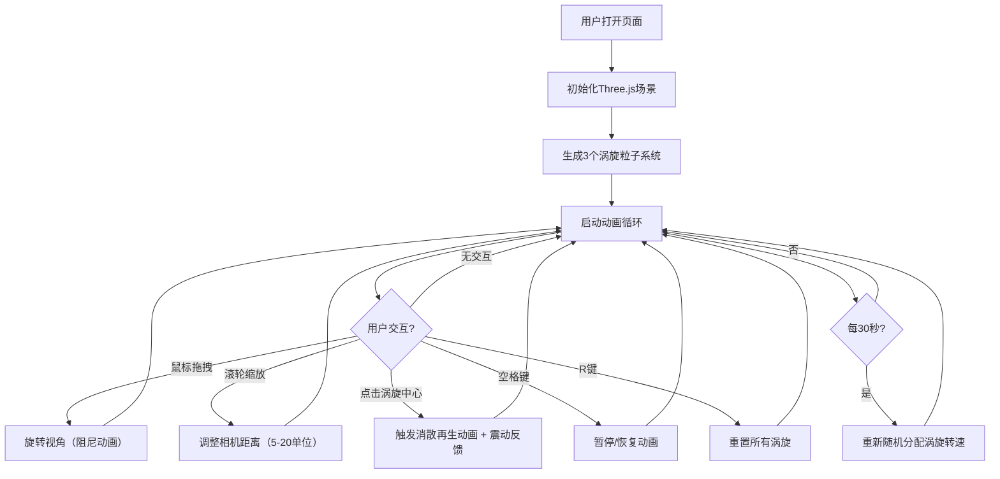

## 1. 产品概述

三维大气涡旋模拟演示应用是一款面向气象科普教育的交互式3D可视化工具，通过直观的三维粒子动画展示不同高度层大气涡旋的生成与演变过程，将抽象的科里奥利力和气压梯度力转化为可交互的可视化体验。

- 目标用户：气象科普教育者、学生、气象爱好者
- 核心价值：解决现有教学工具无法支持多层级涡旋同时对比展示的问题，提供沉浸式的大气动力学可视化教学体验

## 2. 核心功能

### 2.1 功能模块

1. **三维涡旋粒子系统**：3个独立涡旋同时展示，每个由400+彩色粒子构成上升螺旋运动
2. **交互控制系统**：鼠标拖拽旋转视角、滚轮缩放、点击涡旋触发消散动画
3. **键盘控制系统**：空格键暂停/恢复、R键重置所有涡旋
4. **参考网格系统**：半透明极坐标网格平面辅助观察流场
5. **信息展示系统**：FPS计数器、操作提示、涡旋信息标签

### 2.2 页面详情

| 页面名称 | 模块名称 | 功能描述 |
|-----------|-------------|---------------------|
| 主场景页 | 3D涡旋渲染区 | 全屏3D场景，展示3个独立涡旋的实时粒子动画 |
| 主场景页 | 极坐标网格 | 半径8的24分格极坐标参考平面，淡青色半透明 |
| 主场景页 | FPS计数器 | 右上角绿色实时帧率显示 |
| 主场景页 | 操作提示面板 | 左下角毛玻璃效果操作说明 |
| 主场景页 | 涡旋信息标签 | 点击涡旋中心时弹出信息标签 |

## 3. 核心流程

用户进入应用后，场景自动初始化3个涡旋开始运动。用户可通过鼠标拖拽旋转视角、滚轮缩放观察涡旋细节；点击涡旋中心触发消散再生动画；按空格键可暂停/恢复动画，按R键重置所有涡旋。系统每30秒自动重新分配涡旋转速，模拟大气环流的不稳定性。

## 4. 用户界面设计

### 4.1 设计风格
- **主色调**：深空渐变背景（#0B0C10 → #1F2833），营造宇宙空间感
- **强调色**：橙色（#FF8C00）底部粒子、浅蓝（#87CEEB）顶部粒子、淡青（#64C8FF）网格
- **UI元素**：毛玻璃效果（rgba(255,255,255,0.1)背景，8px模糊，8px圆角，1px半透明白边）
- **字体**：系统sans-serif字体族，绿色FPS文字（14px）

### 4.2 页面设计概述

| 页面名称 | 模块名称 | UI元素 |
|-----------|-------------|-------------|
| 主场景页 | 3D渲染区 | 全屏Canvas，深空渐变背景，3个彩色粒子涡旋 |
| 主场景页 | 极坐标网格 | 淡青色半透明24格极坐标平面，随场景旋转 |
| 主场景页 | FPS计数器 | 右上角，绿色文字14px，毛玻璃容器 |
| 主场景页 | 操作提示 | 左下角，毛玻璃面板，白色文字说明操作方式 |
| 主场景页 | 涡旋标签 | 点击时弹出，毛玻璃效果信息提示 |

### 4.3 响应式
- 桌面优先设计，最小支持宽度768px
- 屏幕宽度低于768px时，每个涡旋粒子数自动减少至300个以保证性能
- 全屏自适应，窗口大小变化时自动调整渲染分辨率

### 4.4 3D场景指导
- **环境氛围**：深空暗色渐变背景，无外部HDRI，通过粒子色彩提供视觉焦点
- **光照设置**：基础环境光 + 粒子自发光效果，无需复杂光照
- **相机设置**：默认俯视45度，距离原点10单位，鼠标拖拽OrbitControls式旋转，滚轮缩放5-20单位，阻尼系数0.95
- **构图焦点**：3个涡旋呈等边三角形分布（x,z平面间隔6单位），极坐标网格提供参考
- **交互动画**：粒子螺旋上升运动、点击消散扩散、平滑阻尼相机运动
- **后处理**：无额外后处理，通过粒子透明度和尺寸渐变实现深度感
- **性能预算**：总粒子数≤1500，1080p分辨率下帧率≥50FPS
